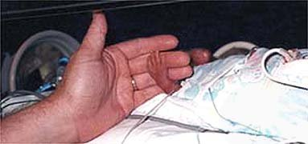

import FAQAccordion from '../../components/FAQAccordion.astro';

export const faqItems = [
  {
    question: "23. haftada bebek neler yapar?",
    answer: "Boyu: 29 cm   Ağırlığı: 500 gr. Bu dönemde bebeğinizin organ sistemleri olgunlaşmaya ve yeni yetenekler kazanmaya devam eder."
  },
  {
    question: "Bu hafta için en önemli tavsiye nedir?",
    answer: "Mide yanmasına yol açan en önemli nedenlerden biri de fazla yemek ya da yatmadan hemen önce yemektir"
  }
];

  

    📅
    

      <strong>Durum</strong>
      
2. Trimester

    

  

  

    🌱
    

      <strong>Gelişim</strong>
      
Boyu: 29 cm   Ağırlığı: 500 gr

    

  

  

    💊
    

      <strong>Önemli</strong>
      
Düzenli Takip

    

  

Bebeğiniz artık tamamen minyatür bir insan görünümündedir. Kulak içinde yer alan minik kemikler tamamen sertleştiği için bebek çok iyi duyabilir. Dudakları iyice belirginleşir, ultrasonografide gülümsemesi fark edilebilir. Boyu 17-18 santimetre kadar olmuştur; kilosu ise 600 gram civarındadır. Gözleri tamamen gelişmiş olmasına rağmen renkli kısmı olan iris henüz pigmente değildir, yani göz rengi belli değildir. Pankreas tam manası ile olmasa bile insülin salgılamaya başlamıştır.

Sizde ise yavaş ama sürekli bir kilo artışı söz konusudur. Bu dönemde aşerme adı verilen olay hızlanır. Fazla abartıya kaçmadan ufak tefek kaçamaklara izin verilebilir. Bacak krampları yirmili haftalarını yaşayan gebelerde nadir görülmeyen olaylardır. Kalsiyum ve magnezyum alımı, şikayetlerin ve krampların sıklığını azaltacaktır. Kramp girdiğinde bacağınızı düz uzatarak eşinizden masaj yapmasını isteyebilirsiniz.

Bir başka güzel olay ise artık bebeğinizin hareketlerini eşinizin de hissedebilecek olmasıdır. Eşiniz elini karnınıza koyduğunda bebeğinizin hareketlerini çok rahat hissedebilir, hatta bu hareketler dışarıdan gözle bile fark edilebilir. Bunun nedeni bebeğin içinde bulunduğu amniyon sıvısının göreceli olarak fazla olmasıdır. Yani bebeğin hareket etmesi için çok geniş bir alan vardır. Bebeğiniz sanki içeride taklalar atarmışçasına özgürce hareket eder! Hareketler bebeğin motor gelişimi, yani kas güçlenmesi için çok önemlidir. Bu haftalarda yapılan ultrason incelemelerinde bebek makat gelişken çok kısa bir süre sonra baş gelişe dönebilir. Bebeğin ters durması fazlaca önemli değildir.

  
23 haftalık doğan bir bebek

## Sıkça Sorulan Sorular

<FAQAccordion items={faqItems} />

---

> **Yasal Uyarı:** Bu sayfada yer alan bilgiler yalnızca genel bilgilendirmeyi amaçlamaktadır ve tıbbi tavsiye niteliği taşımaz. Her gebelik süreci kişiye özeldir. Belirtileriniz, test sonuçlarınız veya tedavi sürecinizle ilgili en doğru kararı sizi takip eden kadın hastalıkları ve doğum uzmanı vermelidir.
