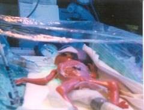

Bebeğinizin akciğerlerinde hava kesecikleri oluşmaya başladı. Doğumdan hava solumayı sağlamak için akciğerler sürfaktan adı verilen bir madde üretirler. Bu madde, minik hava keseciklerinin çeperlerinin birbirine yapışmasına engel olur. Bu sayede her nefes alışda kesecikler hava ile dolar. Bu haftada bebeğinizin akciğerleri sürfaktan üretmeye başladı, ancak miktarları tabii ki yeterli değil. Erken doğum tehdidi yaşayan anne adaylarına yapılan bazı enjeksiyonlar ile bu maddenin yapımı hızlandırılmaya çalışılır. Amaç erken doğum olur ise bebeğin solunum problemi yaşamasını engellemeye çalışmakdır.

Yapılan çalışmalarda 26 haftalık bebeklerin beyin dalgaları incelendiğinde dokunmaya beyin dalgaları ile cevap verdiği saptanmıştır. Ayrıca ilginç bir bulgu da karnınıza kuvvetli bir ışık kaynağı dayadığınızda bebeğin kafasını o yöne çevirmesidir.

Bu haftalarda birden bire ve durup dururken karnızında bir sertleşme hissedebilirsiniz. Endişelenmeyin. Bu gebe rahimde, normalde görülen ve Braxton-Hicks olarak isimlendirilen kasılmalardır. Erken doğum tehtidinde ise kasılmalar sürekli ve belirli aralıklarla gelir. Düzenli kasılmaları saptamak için eşinizden yardım isteyebilirsiniz. Eşiniz, elinin ayasını uterusunuzun tam tepe noktasına yerleştirerek beklemeli. Bu haftada uterusun tepe noktası göbek deliğinin yaklaşık 5 santimetre yukarısındadır. Eşiniz 20 dakika kadar bu şekilde bekleyerek kasılmaların varlığını ve sıklığını saptayabilir. Bu işlemi kendiniz de yapabilirsiniz, ancak objektif olarak değerlendiremeyebileceğiniz için eşinizden istemenizde yarar var. Kasılmaları siz ağrı olarak hissetmeyebilirsiniz ya da çok hafif adet sancısı şeklinde fark edebilirsiniz. Eğer bunların sıklığı konusunda endişeleriniz varsa hemen doktorunuz ile temasa geçiniz.

  
26 Haftalık doğan bir bebek

\[third\]

**Bebeğinizin Büyüklüğü**  
Boyu: 33.5 cm  
Ağırlığı : 760 gr

\[/third\]

\[third\]

 

\[/third\]

\[third\_last\]

**Öneri:**  Hala daha bulmadıysanız çocuk doktoru için araştırmaya başlayabilirsiniz. Çocuk doktorunuz doğumdan sonra sizin en büyük yardımcınız olacaktır. Tıpkı doğum doktorunuz gibi seçeceğiniz çocuk doktorunuzun da beklentilerinize cevap veriyor olmasına ve aklınıza takılan tüm soruları rahatlıkla tartışabileceğiniz bir hekim olmasına dikkat edin..\[/third\_last\]

\[box\] _Bu sayfada yer alan bilgiler ortalama değerler olup size bir fikir verebilir ancak her bebeğin gelişimi birbirinden farklıdır. Bebeğinizin gelişimi ile ilgili en doğru bilgiyi size gebeliğinizi takip eden doktorunuz verebilir._\[/box\]
