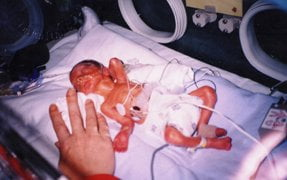

import FAQAccordion from '../../components/FAQAccordion.astro';

export const faqItems = [
  {
    question: "27. haftada bebek neler yapar?",
    answer: "Boyu: 36. Bu dönemde bebeğinizin organ sistemleri olgunlaşmaya ve yeni yetenekler kazanmaya devam eder."
  },
  {
    question: "Bu hafta için en önemli tavsiye nedir?",
    answer: "Hala yapılmadıysa Hepatit B taramasını yaptırın"
  }
];

  

    📅
    

      <strong>Durum</strong>
      
2. Trimester

    

  

  

    🌱
    

      <strong>Gelişim</strong>
      
Boyu: 36.5 cm   Ağırlığı: 8...

    

  

  

    💊
    

      <strong>Önemli</strong>
      
Şeker yükleme testi

    

  

Eğer rahim içine bir kamera yerleştirmek ya da direkt olarak gözlemek mümkün olabilseydi, bebeğinizin gözlerini görebilirdiniz. Çünkü onun göz rengi artık belli ve sıkı durun: Size göz kırpabilir. Bu haftaya gelindiğinde bebeğiniz gözünü açıp kapamaya başlıyor. Beyin olgunlaşması hızla devam ediyor ve sese verdiği tepkiler iyice arttı. Boyu 25 santimetreye yaklaştı ve kilosu 1000 gram civarında.

İkinci trimesterın sonu olan 27. haftada solunum ve uyku problemleri yaşayabilirsiniz. Özellikle yattığınız zamanlarda nefes darlığı ortaya çıkabilir. Bu durum bebeğinize herhangi bir zarar vermez ancak siz daha rahat edebilmek için, geceleri yatarken kullandığınız yastık sayısını arttırmalısınız. Çoğu anne adayı bu dönemlerde uykunun dinlenmeden çok sıkıntı yarattığını söylemekteler. Bilinç altında yaşanan endişeler uykuda kabus olarak kendini gösterebilir. Hatta uykuya dalmada büyük zorluklar yaşayabilirsiniz. Tecrübeli anne adayları yatmadan önce yarım saatlik bir yürüyüşün oldukça faydalı olduğunu iddia ediyorlar.

Dikkat etmeniz gereken bir diğer nokta da kan basıncınız. Gerçi doktorunuz her kontrolünüzde tansiyonunuzu ölçüyor ancak siz de 3-4 günde bir bunu tekrarlasanız yararlı olur. Zira halk arasında gebelik zehirlenmesi olarak da bilinen preeklampsi için riskli döneme girdiniz.

Rutin kontrollerinizde yapılan ultrason incelemelerinde artık bebeğinizi bir bütün olarak göremediğinizi fark etmişsinizdir. Artık bebek bütün olarak değil kısım kısım incelenmekte. Yapılan ölçümler ile kilosu gerçeğe yakın ölçülerde tahmin edilebilmekte.

Bu hafta ile birlikte gebeliğinizin ikinci trimester’ı sona erdi. Yolun büyük kısmı aşıldı.

27 haftalıkken doğan bir bebek

## Sıkça Sorulan Sorular

<FAQAccordion items={faqItems} />

---

> **Yasal Uyarı:** Bu sayfada yer alan bilgiler yalnızca genel bilgilendirmeyi amaçlamaktadır ve tıbbi tavsiye niteliği taşımaz. Her gebelik süreci kişiye özeldir. Belirtileriniz, test sonuçlarınız veya tedavi sürecinizle ilgili en doğru kararı sizi takip eden kadın hastalıkları ve doğum uzmanı vermelidir.
