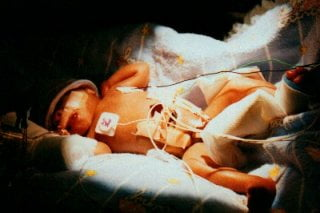

import FAQAccordion from '../../components/FAQAccordion.astro';

export const faqItems = [
  {
    question: "28. haftada bebek neler yapar?",
    answer: "Boyu: 37. Bu dönemde bebeğinizin organ sistemleri olgunlaşmaya ve yeni yetenekler kazanmaya devam eder."
  },
  {
    question: "Bu hafta için en önemli tavsiye nedir?",
    answer: "Bu haftada eğer kan grubunuz Rh negatif ise Rhogam (kan uyuşmazlığı iğnesi) yapılmalıdır"
  }
];

  

    📅
    

      <strong>Durum</strong>
      
3. Trimester

    

  

  

    🌱
    

      <strong>Gelişim</strong>
      
Boyu: 37.5 cm   Ağırlığı: 1...

    

  

  

    💊
    

      <strong>Önemli</strong>
      
Düzenli Takip

    

  

Bu hafta ile birlikte gebeliğin en zor dönemlerinden biri olan üçüncü trimester yani son üç aya girmiş oluyorsunuz. Bu haftada bebeğiniz hızla büyümeye devam edecek ve rahim içini mümkün olduğunca dolduracak. Rahim büyüklüğünüz neredeyse kaburgalarınızın seviyesine ulaştı. Bu haftada bacaklarınızdaki varislerde artış ve şişme fark edebilirsiniz. Yine hemoroid probleminiz varsa bu kötüleşebilir ya da bacaklarınızda sık sık kramplar yaşayabilirsiniz. 28. haftada doktorunuz sizden glukoz yükleme testi isteyecektir. Bu testin amacı gebelikte ortaya çıkan şeker hastalığını yani gestasyonel diyabeti araştırmaktır. Yine bu haftada kan uyuşmazlığınız varsa doktorunuza bunu hatırlatın.

28. haftada dünyaya gelen bebeklerin yaklaşık %90’ı yaşatılmaktadır. Ancak bu bebeklerde yoğun bakım şartlarında solunum desteği gerekmektedir. Bebeğiniz sürekli uyuma ve uyanma dönemleri geçirmektedir. Zaman zaman gözlerini açıp kapayabilir. Kaşları gelişimini tamamlamıştır. Vücudu yağ depolamaya devam etmektedir. Bu yağlar doğduktan sonra kendi vücut ısısını ayarlamada oldukça önemlidir.

Bu haftada bebeğinizle rahatça konuşabilirsiniz, çünkü artık sizin sesinizi tanıyor!

  
28 haftalık doğan bir bebek

## Sıkça Sorulan Sorular

<FAQAccordion items={faqItems} />

---

> **Yasal Uyarı:** Bu sayfada yer alan bilgiler yalnızca genel bilgilendirmeyi amaçlamaktadır ve tıbbi tavsiye niteliği taşımaz. Her gebelik süreci kişiye özeldir. Belirtileriniz, test sonuçlarınız veya tedavi sürecinizle ilgili en doğru kararı sizi takip eden kadın hastalıkları ve doğum uzmanı vermelidir.
