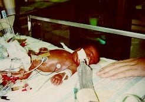

import FAQAccordion from '../../components/FAQAccordion.astro';

export const faqItems = [
  {
    question: "29. haftada bebek neler yapar?",
    answer: "Boyu: 38. Bu dönemde bebeğinizin organ sistemleri olgunlaşmaya ve yeni yetenekler kazanmaya devam eder."
  },
  {
    question: "Bu hafta için en önemli tavsiye nedir?",
    answer: "Artık yatarken sağ yanınıza yatmamaya alışmanız gerekir"
  }
];

  

    📅
    

      <strong>Durum</strong>
      
3. Trimester

    

  

  

    🌱
    

      <strong>Gelişim</strong>
      
Boyu: 38.6 cm   Ağırlığı: 1...

    

  

  

    💊
    

      <strong>Önemli</strong>
      
Düzenli Takip

    

  

Bebeğiniz doğum gününe hazırlanmaya devam ediyor. Artık kafası ve gövdesi arasındaki oran normale yakın. Artık kendi vücut ısısını ayarlayabilme yeteneğine sahip. Kemik iliği de sürekli kırmızı kan hücreleri yani alyuvar üretiyor. Gözleri ise hareket etmeye başladılar bile. Bu arada unutmadan, zaman zaman içinizde aniden bir hareket hissederseniz sakın şaşırmayın ve korkmayın çünkü bebeğiniz hıçkırıyor!

29. haftaya gelindiğinde hamileliğinizi artık iyice hissetmeye başladığınız fark edeceksiniz. Bu haftalarda karın cildinizde kaşınmalar hissetmeniz normaldir. Bunun yanı sıra karın içi basıncındaki ve dolaşım sistemindeki değişikliklerin sonucunda hemoroid (basur) problemi görülebilir. Ayrıca nefes darlığı, midede yanma, bacaklarda kramplar gibi yakınmalar ortaya çıkabilir. Bu yakınmaların sizi hamileliğinizden soğutmasına izin vermeyin. Bunların hepsi geçici ve tedavi ile üstesinden gelinebilecek şikayetlerdir. Yakınmak yerine hamileliğinizin pozitif yönlerini görmeye ve keyfini çıkarmaya çalışın.

  
29 haftalık doğan bir bebek

## Sıkça Sorulan Sorular

<FAQAccordion items={faqItems} />

---

> **Yasal Uyarı:** Bu sayfada yer alan bilgiler yalnızca genel bilgilendirmeyi amaçlamaktadır ve tıbbi tavsiye niteliği taşımaz. Her gebelik süreci kişiye özeldir. Belirtileriniz, test sonuçlarınız veya tedavi sürecinizle ilgili en doğru kararı sizi takip eden kadın hastalıkları ve doğum uzmanı vermelidir.
