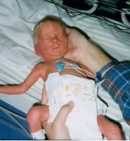

Bebeğinizin cildini kaplayan ve lanugo adı verilen ince tüyler artık yavaş yavaş kaybolmaya başlarken el ve ayak tırnakları yavaş yavaş uzuyor. Kemik iliği kan hücresi üretimini tamamen karaciğerden devaraldı. Öte yandan bebek artık etrafının farkına varmaya başlar. Rahimin içi genellikte zifiri karanlık gibi düşünülse de anne adayının bulunduğu çevreye bağlı olarak aydınlık ya da karanlık olabilir ve bebek bunun ayrımını yapabilir. Erkek bebeklerde testisler torbaya iniş sürecini tamamlamak üzeredir. Bebeğin ağrılığı doğumda olacağı ağırlığın üçte ikisine ulaşmıştır.

Bu haftalarda anne adayı artık hamilelikten iyice sıkılmaya başlar. Uyuyamamak ve mide yanmaları sık görülen problemlerdir. Zaman zaman kasıklarınızda bir ağrı ya da kasılma hissedebilirsiniz. Bunlar rahimin gerginliğini sağladığı küçük ve önemsiz kasılmalardır ve Braxton Hicks kontraksiyonları olarak adlandırılırlar.

 30 haftalıkken doğan bir bebek

\[third\]

**Bebeğinizin Büyüklüğü**  
Boyu: 40 cm  
Ağırlığı : 1300 gr

\[/third\]

\[third\]

\[/third\]

\[third\_last\]

**Öneri**  
Eğer yatarken rahatsız oluyorsanız ya da nefes alamamaktan yakınıyorsanız yastık sayınızı arttırmayı deneyin. Bazı durumlarda rahat uyuyabilmek için yarı oturur pozisyonda olmak gerekebilir

\[/third\_last\]

\[box\] _Bu sayfada yer alan bilgiler ortalama değerler olup size bir fikir verebilir ancak her bebeğin gelişimi birbirinden farklıdır. Bebeğinizin gelişimi ile ilgili en doğru bilgiyi size gebeliğinizi takip eden doktorunuz verebilir._\[/box\]
