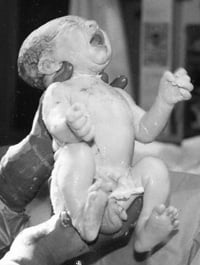

Eğer hala daha doğum yapmadıysanız iyice sıkılmaya ve sabırsızlanmaya başladınız demektir.

Sizden salgılanan hormonların bebeğinizin dolaşımında da bulunması nedeniyle erkeklerde torbalar, kızlarda da labiumlar normalden daha büyük görünecektir. Hatta doğum sonrası memelerinden süt dahi gelebilir. Bu hem kız hem de erkek bebeklerde rastlanabilen bir durumdur ve bir kaç gün içinde kendiliğinden kaybolur.

Bu hafta size çok uzun gelebilir. Sabırlı olmaya açalışmalısınız. Siz herhangi bir ağrı hissetmeseniz bile rahim ağzınız yavaş yavaş açılmaya başlamış olabilir. Normal sancıların başlaması ile rahim ağzındaki açıklık ve incelme de artmaya başlar. Açıklık 10 santimetre olduğunda doğumun ilk evresi tamamlanmıştır. Daha sonra ikinci evre yaşanır ve bebeğiniz dünyaya ve size merhaba der. Vajinal doğumda kafa doğduktan hemen sonra doktorunuz bebeğinizin ağzını siler ve ilk ağlaması odada yankılanmaya başlar. Bu aşamada daha göbek kordonu kesilmeden bebeğinizin kucağınıza verilmesi ilk temasın daha sıcak yaşanmasını sağlar.

Hamilelik ve doğum anılarınızı bizimle ve diğer anne adayları ile paylaşmaya ne dersiniz?

Size bebeğinizle ve tüm sevdiklerinizle mutlu bir hayat dilerim.

\[third\]

**Bebeğinizin Büyüklüğü**  
Boyu: 50-51 cm  
Ağırlığı : 3450

\[/third\]

\[third\]

**Bu haftada yapılacak testler**  
NST ve ultrason

\[/third\]

\[third\_last\]

**Öneri**  
Bu haftada hala daha doğum yapmadıysanız endişelenmenize gerek yoktur. Sakin olun ve bol bol dinlenmeye bakın. Doğum sonrası en çok gereksinim duyacağınız şeylerin başında zaman gelecek

\[/third\_last\]

\[box\] _Bu sayfada yer alan bilgiler ortalama değerler olup size bir fikir verebilir ancak her bebeğin gelişimi birbirinden farklıdır. Bebeğinizin gelişimi ile ilgili en doğru bilgiyi size gebeliğinizi takip eden doktorunuz verebilir._\[/box\]
