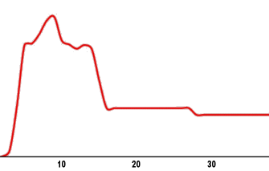

Yumurta hücresi sperm tarafından döllendikten sonra hücreler hızla bölünerek çoğalmaya başlarlar. Geçen zaman içinde hücre sayısı artıp embryo büyüdükçe hücreler de farklılaşmaya başlarlar. Bu hücrelerden bir kısmı plasentayı oluşturmak üzere değişime uğrarken diğerleri bebeği oluşturur. Plasentayı oluşturan hücreler embryonun rahime tutunduğu günlere denk gelen dönemde kadın vücudunun belki de ilk kez tanıştığı bir hormonu üretmeye başlarlar. Bu hormonun adı human chorionic gonadotropin (hCG) ya da bilinen adı ile gebelik hormonudur?

**hCG nasıl bir hormondur?**  
hCG trofoblast adı verilen hücreler tarafından üretilerek kadının dolaşımına salınan protein yapısında bir hormondur. Temel olarak alfa ve beta olarak adlandırılan iki alt grubu vardır. Bu iki grubun biraraya gelmesi ile hCG ortaya çıkar. Daha küçük olan alfa alt grubu Luteinizan Hormon (LH) başta olmak üzere diğer bazı hormonlar ile aynı yapıdadır. hCG’yi diğer hormonlardan ayıran ve ona biyolojik özelliklerini veren ise beta alt grubudur.

Normalde bu iki alt grup birarada bulunur ve kanda bu şekilde dolaşırlar. Birbirine bağlanmamış haldeki alfa ve beta üniteleri ise serbest beta-hCG ya da serbest alfa-hCG olarak isimlendirilirler. Dolaşımda bulunan serbest ünitelerin kaynağı üretimdeki herhangi bir nedene bağlı dengesizlik olabileceği gibi bazı kanser türlerinde olduğu gibi diğer alt ünite ile birleşme yeteneğinden yoksun hale gelmiş ünite varlığı da olabilir. Yine bazı genetik hastalıklarda özellikle serbest beta-hCG kanda artabilir. İkili test adı verilen tarama testinde hamile kadının kanındaki serbest beta hCG düzeyleri ölçülmektedir.

**hCG’nin fonksiyonu nedir?**  
hCG’nin temel görevi plasenta tam anlamıyla fonksiyonel hale gelip hormon üretimine başlayana kadar yumurtalıklardan progesteron hormonu üretiminin devam etmesini sağlamaktır. Progesteronun görevi gebeliğin yerleştiği zar tabakası olan endometriumu desteklemek ve gebeliğin düşükle sonuçlanmasına engel olmaktır.  
Ayrıca erkek bebekte testis gelişimini ve erkeklik hormonu yapımını uyarır.

**Normal gebelikte hCG düzeyleri nasıldır?**  
Döllenmeyi takip eden 8-9. günde hCG salınmaya başlar. Bu dönemden sonra kandaki düzeyi giderek artar. hCG’nin kan düzeyinin iki katına çıkması için geçen süre “ikiye katlanma süresi” (doubling time) olarak adlandırılır. Bu süre erken hamilelikte 2-3 gün iken daha ileri dönemlerde artış yavaşlar ve süre 4 güne kadar uzayabilir.

**_HCG düzeyi_**

**_İkiye katlanma  
süresi_**

_< 1200_

48-72 saat

_1200 -6000 arası_

72-96 saat

_\> 6000_

\>96 saat

 

**hCG düzeyinin hamilelik haftasına göre değişimi**

Normal bir gebeliğin çok erken dönemlerinde kandaki beta-hCG değerlerinin alt ve üst sınırları yaklaşık şu şekildedir:

_Yumurtlamadan sonra geçen süre (gün)_

_En düşük_

_En yüksek_

_Ortalama_

12

17

119

48

13

17

147

59

14

33

223

95

15

17

429

132

16

70

758

292

17

111

514

303

18

135

1690

522

19

324

4310

1061

20

185

3279

1287

21

506

4660

2034

22

540

10.000

2637

Yine normal bir gebelikte haftalara göre ortalama beta-hCG düzeleri ise şöyledir.

**Son adet tarihinden itibaren geçen hafta sayısı**

**HCG (mIU/ml)  
(INCIID)**

**3 hafta**

5 – 50

**4 hafta**

3 – 426

**5 hafta**

19 – 7,340

**6 hafta**

1,080 – 56,500

**7 – 12 hafta**

7,650 – 288,000

**13 – 16 hafta**

13,300 – 254,000

**17 – 24 hafta**

4,060 – 165,400

**25 – 40 hafta**

3,640 – 117,000

Görüldüğü gibi normal bir gebelikte kandaki beta hCG düzeyleri çok değişken olabilmektedir. Normalin alt ve üst sınırları arasındaki büyük farklar doğal olarak kabul edilir. Bu nedenle sadece kan beta-hCG düzeyine bakılarak gebelik haftası konusunda sağlıklı bir tahminde bulunulamaz. Yine benzer şekilde tek bir ölçümün sağlayacağı yararlar da sınırlıdır. Ancak yapılan seri ölçümler ile gebeliğin sağlıklı olup olmadığı konusunda fikir edinilebilir.

**Anormal değerler**  
Bazı durumlarda beklenen beta-hCG değeri normalden fazla olabilir ya da seri incelemelerde artış beklenenden daha yavaş saptanabilir. Bu durumların altında yatan olası nedneler şunlardır:

**Erken gebelik kaybı ya da biyokimyasal gebelik:** Bazı durumlarda yumurta döllenip embryo oluşur ancak rahim içinde tutunma aşamasında gebelik kaybedilir. Birkaç günlük adet gecikmesi olabilir ya da olmayabilir. Böyle bir durumda adet gecikmesinden önce ya da tam o günlerde kanda yapılan gebelik testinde hCG’nin gebelik ile uyumlu olduğu gözlenir ancak seri ölçümlerde artış ya normalden az olur ya da değerler giderek düşer ve gebelik öncesi düzeye iner. Bu durumda biyokimyasal gebelikten söz edilir. Tüp bebek tedavilerinde sıkça karşılaştığımız bir durumdur.

**Dış gebelik:** Gebeliğin rahim içinde değil de başka bir yerde yerleşmesi durumunda dış gebelikten söz edilir. Dış gebelik varlığında normalde erken gebelikte karşılaşılan tüm yakınmalar bulunabilir. Bunun yanısıra kanda yapılan ölçümlerde hCG artışının olmsı gerekenden daha düşük olduğu görülür.

**Mol gebelik:** Mol gebeliklerde kan beta hCG değerleri çok yüksek seviyelere ulaşabilir ve 2.000.000 IU/mL kadar olabilir. Mol gebelikte serbest beta hCG değerleri de artış gösterir. Mol gebelik sonrası durumun normale dönüp dönmediği sık aralıklarla yapılan beta hCG ölçümleri ile takip edilir.

**Kanser:** Bazı yumurtalık kanserleri, testis kanseri ve yine bazı mesane kanserlerinde hCG üretimi saptanabilir.Ancak değerler çok yüksek değildir. hCG salınımının en önemli olduğu kanser türü ise plasenta hücrelerinden köken alan koriyokarsinomdur.

**Hipofizer hCG:** Hipofiz bezinde LH üreten hücreler çok az miktarda hCG de üretirler. Gebe olmayan bir kadının kanında 5-10 IU/mL düzeyinde hCG saptanmasının nedeni bu üretimdir.

**Çoğul gebelikler:** İki ya da daha fazla sayıda bebeğin bulunduğu gebelikler de kan hCG değerleri normalden daha yüksek olur. Bununla birlikte kaybolan ikiz varlığında hCG artışı beklenenden daha yavaş olabilir.

**İlaç olarak hCG**  
Hamile kadınların idrarından elde edilen hCG hormonu kadın doğumda bazı durumlarda ilaç olarak da kullanılmaktadır. hCG’nin en önemli kullanım alanı infertilite tedavisinde yumurtlamanın uyarılması sırasında son olgunlaşmanın ve yumurtlamanın gerçekleşmesi amacıyla verilmesidir. Halk arasında çatlatma iğnesi olarak da bilinir. Bunun yanısıra yine infertilite tedavilerinde bazı hastalarda embryo transferi ya da aşılamayı takiben korpus luteumu desteklemek amacıyla da uygulanabilir.
