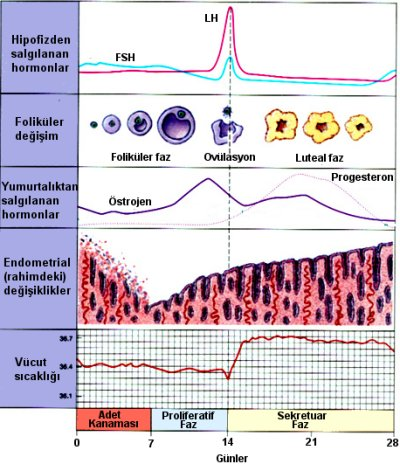

Adet siklusu (döngüsü) ilk adetten (menarş) son adete (menopoz) kadar süren, adet kanaması ile karakterize, amacı üreme ile soyun devamı olan ve tüm vücudu etkileyen olaylar zinciridir.

Adet siklusu ya da adet dönemi denildiğinde kastedilen bir adet kanamasının ilk gününden bir sonraki adet kanamasının ilk gününe kadar geçen süre kastedilir. _**Adet dönemi denildiğinde kanamalı olan süre ya da kanamasız olan süre anlaşılmaz**_

**Normal siklus nedir ?**  
Normal siklus 21-35 günde bir olan (ortalama 28 gün), kanamanın 2-8 gün arası sürdüğü ve 20-80 ml kanama ile karakterize bir dönemdir.

Adet siklusu beyin-yumurtalıklar-rahim sistemi tarafından kontrol edilen karmaşık bir döngüdür.

**Adet siklusu kaç döneme ayrılır ?**  
Adet döneminin ovülasyona kadar olan kısmı overlerde folliküller gelişmekte olduğu için “folliküler faz” yada endometrium kalınlaştığı için “proliferatif faz” adı verilir. Ovülasyon sonrası dönem ise “luteal faz” ya da “sekretuar faz” olarak adlandırılır.

**Adet siklusunu yakından incelemek**  
Adet döngüsünün ya da siklusunun ilk aşaması beyindeki hipotalamus adı verilen bölgeden salgılanan gonodotropin salgılatıcı hormondur (Gonadotropin releasing hormone, GnRH). GnRH direkt olarak yine beyinde yer alan hipofiz bezinin ilgili kısımlarını uyararak folikül uyarıcı hormon (Follicle Stimulating Hormone, FSH) salgılanmasını başlatır. FSH’nın hedefi adından anlaşılacağı gibi yumurtalıklar içinde bulunan foliküllerdir. FSH salgısı adet kanaması ile birlikte başlar.

Folikül, içinde yumurta hücresini barındıran keseciğe verilen isimdir. Ergenlik dönemindeki bir kız çocuğunun yumurtalıklarında yaklaşık 400.000 folikül bulunur. Bu foliküller primer oosit ya da premordial folikül olarak adlandırılır. Her adet döneminde, hipofizden salgınanan FSH belirli bir sayıda folikülü büyümek üzere uyarmaya başlar.

Yumurtalık içinde bulunan binlerce folikülden hangilerinin büyümeye başlayacağı önceden bilinemez. Recruitment adı verilen bu seçimin hangi mekanizmalar ile gerçekleştiği bilinmemektedir.

Uyarılan foliküller büyürken folikül içinde bulunan **granüloza hücreleri** de östrojen adı verilen kadınlık hormonunu salgılamaya başlarlar. Günler geçip foliküller büyüdükçe kandaki östrojen miktarı da artar. Artan bu östrojenin 2 görevi vardır. İlk görevi hipofizi etkileyerek artık daha fazla FSH üretmesini engellemektir. Hipofiz bir tür termostat görevi görür. Östrojen yükseldikçe beyin yeteri kadar folikülün büyümeye başladığını anlar ve FSH üretimini azaltır. Östrojenin diğer görevi de rahimin içini döşeyen ve endometrium adı verien zar tabakasını kalınlaştırmaktır. Bu zar tabakasının görevi bir gebelik olduğunda embryonun yerleşmesi için yataklık etmektir.

Östrojen artıp endometrium kalınlaştıkça kanama da azalır ve sonunda tamamen kesilir. Foliküller büyümeye devam ederken bunlardan bir tanesi seçilerek baskın hale gelir. Bu olayın mekanizması ve hangi faktörlerin baskın folikülün seçiminde etkili olduğu tam olarak bilinmemektedir. Ancak FSH’nın bağlandığı reseptör sayısı fazla olan ve bu nedenle kandaki FSH miktarı azalmasına rağmen tüm FSH’yı etkili şekilde kullanabilen folikülün baskın hale geçtiği düşünülmektedir. Seçilmiş olan baskın folikül büyümesini ve östrojen salgılamasını sürdürürken diğer foliküller artık daha fazla büyümezler ve gerilemeye başlarlar.

Foliküller gelişim aşamasında premordial, preantral, antral ve preovulatuar folikül olarak adlandırılırlar. Gerileyen foliküller gelişimlerini preantral aşamaya kadar sürdürebilirler ve bu aşamadan sonra gerilemeye başlarlar. Bu olay siklusun 5-7. günlerinde gerçekleşmektedir.

Antral folikül aşamasına ulaşan folikülün içindeki granüloza hücre sayısı artmaya devam ederken içinde de sıvı birikmeye başlar. Biriken bu sıvı ultrasonografide saptanabilir ve küçük bir kist gibi görünür.

Baskın olan folikül 18-20 mm çapa ulaştığında artık çatlamaya hazırdır. Bu dönemde kandaki östrojen düzeyi ani bir artış gösterir. Kan östrojen düzeyi 200 pg/mL üzerine çıkıp yaklaşık 50 saat bu düzeyde kadığında hipofiz bezini uyararak luteinize edici hormon (LH) salgılanmasını başlatır. LH miktarları kanda hızla yükselir ve daha sonra hızla düşer. Buna LH piki adı verilir ve bu olay yumurtlama olmasını sağlar.

LH pikinden 34-36 saat sonra yumurtlama gerçekleşir ve baskın olan folikül çatlayarak içindeki sıvı ve yumurta hücresi yumurtalık dışına atılır. Atılan bu yumurta hemen tüp tarafından yakalanır. Yumurtlama gününe kadar östrojen düzeyleri artış gösterdiğinden endometrium tabakası da kalınlaşmaya devam etmektedir. Adet siklusunun bu aşamaya kadar olan kısmı folliküler ya da proliferatif faz olarak isimlendirilir.

Ovülasyondan hemen önce folikül içindeki granüloza hücreleri büyür ve içlerinde lutein adı verilen sarı bir madde birikmeye başlar. Granüloza hücrelerindeki büyüme ovülasyonu takip eden 3 gün bounca devam eder. Bu aşamada yine folikülün yapısında bulunan **teka hücreleri**ile birlikte diğer kadınlık hormonu olan progesteronun üretimi başlar.

Progesteron endomertiumu etkileyerek artık daha fazla kalınlaşmasına engel olur. Kalınlaşması duran endometrumun içinde salgı bezleri gelişmeye başlar. Salgının amacı olası bir gebelikte embryo endometrium içine gömülene kadar onun canlılığını devam ettirecek mikroortamı sağlamaktır.

Ovülasyondan sonra folikülün yumurtalık içinde kalan kısmı korpus luteum ya da sarı cisim olarak adlandırılır. Temel görevi progesteron salgılamak olan corpus luteum gebelik olmazsa ovülasyondan 9-11 gün sonra hızla küçülmeye başlar, dejenere olarak progesteron salgılaması azalır ve 14. günde ömrünü tamamlar. Gebelik olması durumunda ise plasenta kendi progesteronu üretecek hale gelene kadar (yaklaşık 90. gün) hormon salgılamayı sürdürür.

Dejenerasyonun hangi mekanizma ile gerçekleştiği bilinmemektedir. Progesteron salgısı azalınca endometrium üzerindeki etkisi de azalır ve kalınlaşmış olan endometrium dökülmeye (yıkılmaya) başlar. Bu dökülme sonucu damarlar da açılır ve kanama başlar. Yıkılan doku ve kan rahim ağzından geçerek vücut dışına atılır. Bu kanamaya adet kanaması adı verilir.

Adet kanaması ile birlikte yeni bir siklus başlar. Folikül gelişimi ile birlikte başlayan östrojen endometriumun yeniden kalınlaşmasını uyarır ve endometrium kalınlaşırken açılmış olan kan damarları da onarılır ve yeni bir siklus başlar. Bu döngü ilk adet kanamasından menopoza kadar bu şekilde devam eder. Siklusun ovülasyondan sonraki dönemi luteal faz ya da sektretuar faz olarak adlandırılır.

Korpus luteumun ömrü kısmen sabit olduğu için (14. gün) adet süklusunun süresini belirleyen ovülasyon öncesi dönem yani folliküler fazdır.

**Adet görmek için gerekli şartlar**  
1\. Beyinden hormon salgılanmalı  
2\. Beyinden salgılanan hormonlara cevap olarak hipofizden hormon salgılanmalı  
3\. Overlerde follikül bulunmalı ve bu folliküller hormon salgılama kabiliyetinde olmalı  
4\. Endometrium bulunmalı ve bu hormonlara karşı duyarlı olmalı  
5\. Ortaya çıkan kanın dışarı akmasına engel olacak bir anomali bulunmamalı

**İlk Adet**  
Çocukluktan ergenliğe geçişin son aşaması olan ilk adetin kaç yaşında görüleceğini önceden kesin olarak bilebilmek mümkün değildir. Bu ırklara ve çevresel faktörlere göre değişiklik gösterebilir. İlk adet ülkemizde genelde 11-14 yaşları arasında olmaktadır. 16 yaşına kadar adet görülmemişse ve sekonder seks karakterleri adı verilen memelerde büyüme, kasık ve koltuk altında kıllanma gibi belirtiler de yoksa bir jinekolog ile temasa geçmek faydalı olur. Bazı yazarlar sekonder seks karakterlerinin geliştiği durumlarda ilk adet için 19 yaşına kadar beklenebileceğini söylemektedirler. İlk adetten sonraki dönemde sikluslar düzensiz olur. Bu sikluslarda genelde yumurtlama olmaz (anovulatuar siklus). Bazen ayda 2 defa bazen de 3-4 ayda bir kanama görülür. Bunların hepsi normaldir. Adetlerin ve yumurtlamanın düzene oturması 2 yıl kadar sürebilir.
