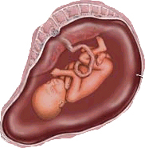

**Amniyon sıvısı nedir?  
**Karınızıdaki bebeğiniz tüm hamilelik süresince etrafı zar ile çevrili bir kese içinde gelişimini sürdürür. Bu kesenin adı amniyon kesesidir. Amniyon kesesinin içi amniyon sıvısı adı verilen bir sıvı ile doludur. Bu sıvı hamilelik ve bebeğin gelişimi açısından son derece önemlidir. Bebeği dış etkenlere karşı korumasının yanı sıra kas ve sinir sistemi başta olmak üzere pek çok organ sisteminin gelişiminde rol oynar. Sıvının miktarı değişken olmakla birlikte hamileliğinizin sonlarında genelde yarım litre kadar sıvı bebeği çevrelemektedir. Bu sıvı statik yani sabit bir sıvı olmayıp sürekli emilir ve yeniden yapılır. Amniyon sıvısının kaynağı temel olarak bebeğinizin akciğerleri ve böbrekleridir. Bebek bu sıvıyı yutar ve plasenta yardımıyla içeriği sizin dolaşımınıza geçer. Öte yandan bebeğinizin çıkardığı idrar amniyon sıvısının önemli bir kaynağıdır.

Hamilelerin %7’sinde amniyon sıvısının miktarında normalden sapmalar gözlenir. Çok az ya da çok fazla sıvı olması bazı problemlerin belirtisi ya da sonucu olabilir.

**Polihidramniyos nedir?**  
Amniyon sıvısının normalden fazla olması hidramniyos ya da polihidramniyos olarak adlandırılır. Sıvının 2 litreden fazla olması patolojiktir. Literatürde 15 litre amniyon sıvısı bildirilen olgular vardır.

**Polihidramniyos nedenleri nelerdir?**  
Polihidramniyos anne ya da bebeğe bağlı nedenler ile ortaya çıkabilir. Anneden kaynaklanan en önemli neden şeker hastalığı yani diabettir. Bebekten kaynaklanan nedenler ise:

*   Sıvı geçişini kısıtlayan sindirim sistemi tıkanıklıkları
*   Merkezi sinir sistemi kaynaklı yutma bozuklukları
*   Yutma bozukluğuna neden olabilen kromozom anomalileri
*   İkizden ikize transfüzyon sendromu
*   Bebekte kalp yetmezliği
*   Konjenital enfeksiyonlar
*   Çoğu durumda altta yatan bir neden bulunamaz.

**Polihidramniyosun etkileri nelerdir?**  
Fazla miktarda olan sıvı rahminiizn fazla gerilmesine ve zarların erken açılması ile erken doğum eylemine neden olabilir. Polihidramniyos aynı zamanda bebekte bazı anomalilerle birlikte olabileceğinden önemlidir. Sıvı fazlaysa zarlar açıldığında suyun aniden boşalması [plasentanın zamanından önce ayrılması](?p=298)na neden olabilir ya da kordon sarkabilir. Bebeğin kordonunun vajinaya sarkması bebek açısından son derece tehlikeli bir durumdur.

**Belirtileri nelerdir?**  
Amniyon sıvısı fazla olduğunda hiçbir belirti olmayabilir ancak anne adaylarının en sık karşılaştığı yakınmalar şunlardır:

*   Rahimin hızlı büyümesi
*   Karında rahatsızlık ve gerginlik
*   Rahimde kasılmalar

Bu yakınmalar polihidramniyos dışında diğer tıbbi durumlarda da ortaya çıkabileceğinden varlığı halinde mutlaka doktorunuzu haberdar etmelisiniz.

**Tanısı nasıl konur?**  
Polihidramniyos tanısı ultrason incelemesi ile konur. Ultrason aynı zamanda polihidramniyos nedeni olabilecek anomalilerin tanısında da önemlidir.

**Tedavi  
**Polihidramniyosun tedavisi doktorunuzun genel sağlık durumunuz, bebeğinizin durumu, olayın şiddeti ve sizin görüşünüzü bir arada değerlendirmesinden sonra belirlenir. Tedavide:

*   Yakın takip ve sık ultrason incelemeleri
*   Bebeğinizin idrar miktarını azaltmaya yönelik ilaç tedavileri
*   Amniyon sıvısını azaltmak için amniyosentez
*   Doğum yani hamileliğinizin sonlandırılması olabilir.

Tedavinin amacı anne adayını rahatlatmak ve gebeliği devam ettirmektir.
