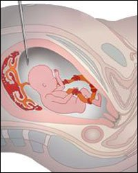

**Amniyosentez nedir?**  
Bebeğiniz tüm hamileliğiniz süresince amniyon kesesi adı verilen bir kese içinde gelişimini sürdürür. Bu kesenin içi amniyon sıvısı adı verilen bir sıvı ile doludur. Amniyon sıvısı statik bir sıvı olmayıp sürekli emilim ve yapım halinde bulunur. Sıvının ana kaynağı bebeğin akciğerleri ve boşaltım sistemidir. Bu sıvı aynı zamanda bebekten dökülen hücreleri de içerir. Bu hücreler bebeğinizin tüm hücreleri ile aynı genetik yapıya sahip olduklarından incelenmeleri bebeğinizin genetik durumu hakkında bilgi verir.

Amniyosentez bebeğinizin içinde yüzdüğü amniyon sıvısından ince bir iğne yardımıyla örnek alınması demektir. En sık uygulanan anne karnında tanı yöntemlerinden birisidir. İlk kez 1882 yılında fazla olan amniyon sıvısının miktarını azaltmak için uygulanmıştır. Daha sonraları ise kan uyuşmazlığı olan çiftlerde bebeğin etkilenme derecesini saptamak için ya da erken doğum tehditi olgularında bebeğin akciğer olgunlaşmasının yeterli olup olmadığını değerlendirmek amacıyla kullanım alanı bulmuştur. Günümüzde ise başta bebekteki bazı doğum defektlerini ve genetik bozuklukları saptamak olmak üzere pek çok nedenle gebeliğin ikinci trimester’ında uygulanan bir testtir. Tıp alanında ve gebelik takibinde pek çok modern gelişme lmasına rağmen amniyosentez hala daha en yeterli bilgiyi sağlayan altın değerinde bir testtir.

Amniyosentezin en sık uygulanan prenatal test olduğunu belirtmiştik. Koriyonik villus örneklemesi (CVS) gibi diğer bazı testler ise doğumsal anomalilerin pek çoğunu saptamakla birlikte amniyosentez kadar etkili değillerdir. CVS gebeliğin daha erken döneminde yapılmakla birlikte amniyosenteze göre daha yüksek oranda düşük ve başka komplikasyon riskleri taşır. Bazı araştırmalar CVS sonrası çok düşük oranda el ve ayak parmaklarında doğum anomalilerine rastlanabildiğini ileri sürmektedirler.

Bebeklerin bir kısmı çeşitli anomaliler ile doğarlar. Bunlardan bazıları yaşam ile bağdaşmazken bazıları hayati olmamakla birlikte bireyin ve çevresinin hayat kalitesini olumsuz yönde etkileyebilir. Bu gruba en güzel örnek down sedromudur.

Amniyosentez ve diğer tüm prenatal testlerin (anne karnında teşhise yönelik testler) amacı özellikle tedavi olanağı olmayan genetik hastalıklar başta olmak üzere bu hastalıkları ve anomalileri mümkün olduğunca erken dönemde saptamak, anne baba adaylarına hastalık ve bebeğin dünyaya geldikten sonraki olası durumu hakkında bilgi vermek ve yine onların kararı ve onayıyla mümkün olduğunca erken dönemde gebeliğin sonlandırılmasını sağlamaktır. Bazı anne baba adayları Down sendromu gibi yaşam ile bağdaşan anomalilerin varlığında hamileliği devam ettirme yönünde karar verebilirler. Bu tamemen çiftlerin seçimi olup yasal ya da vicdani hiçbir zorlama mevcut değildir. Benzer şekilde amniyosentez yapılıp yapılmaması kararı da yine yalnizc çifte aittir. Doktorunuz sizi amniyosenteze zorlamaz, sadece önerir.

**Amniyosentez kimlere önerilir?**  
Amniyosentez hem invazif bir girişim olduğu için hem de az da olsa düşük riski taşıdığı için rutin olarak her hamile kadına önerilmez. Kromozomal ya da genetik doğum defekti ya da bazı malformasyonlar açısından yüksek risk altında olduğu saptanan kadınlrda önerilen bir testtir. Genel olarak amniyosentez önerilmesi gereken durumlar şunlarıdır:

*   **İleri anne yaşı:** Down sendromu başta olmak üzere bazı genetik hastalıkların görülme riski kadının yaşı ile paralel olarak artış göstermektedir. Eğer anne adayının yaşı beklenen doğum tarihinde 35 ya da daha fazla olacak ise amniyosentez yapılması önerilir. İleri anne yaşı en sık amnyosentez önerilen durumdur.
*   **Pozitif öykü:** Daha önceki bir hamilelik genetik bir sorun nedeni ile sonlandırıldıysa ya da nöral tüp defekti, spina bifida gibi doğum defektli bir bebek öyküsü varsa sonraki hamileliklerde amniyosentez önerilir.
*   **Bilinen genetik hastalık varlığı:** Anne ya da baba adayında, ya da yakın akrabalarında bilinen genetik bir hastalık varsa amniyosentez önerilir. Bazı metabolik hastalıklar kalıtsal geçiş gösterir. Anne ya da babada hastalık olmamasına karşın bunlar taşıyıcı olabilirler ve sorunu bebeklerine aktarabililirler. Her iki ebeveyneden de hastalıklı gen geldiğinde bebekte hastalık ortaya çıkar. Bu gibi duruların araştırılmasında amniyosentez yararlı olabilir. Akdeniz anemisi gibi hastalıklar ise bazı bölgelerde çok sık görülür. Bu gibi durumların varlığında da amniyosentez bebeğin hastalık taşıyıp taşımadığını anlamak için yararlı olabilir. Bir diğer konu da akraba evlilikleridir. Akraba evliliklerinde çiftin her ikisinin de taşıyıcı olma olasılıkları normal topluma göre daha yüksek olduğundan bbekte hastalık görülme riski yüksektir ve bu nedenle amniyosentez önerilebilir. Bu grup hastalarda amniyosentez şart değildir. Şart olan hamilelik öncesi ya da erken dönemde genetik danışmanlıktır. Genetik uzmanı sizden ve eşinizden detaylı bir öykü alarak risk oranınızı belirler ve amniyosenteze gerek olup olmadığına karar verir.
*   **Pozitif tarama testi:** Günümüzde genetik hastalıklar ve anomaliler açısından yüksek risk taşıyan hamilelikleri saptamak amacıyla bazı testler her hamile kadında rutin olarak uygulanmaktadır. Bu testlerden en sık kullanılan üçlü tarama testidir. Tarama testleri adından da anlaşılabileceği gibi anomali varlığını belirtmez sadece yüksek risk altındaki kişileri işaret eder. Bu testlerin pozitifi çıkması durumunda kesin tanıya ulaşmak amacıyla amniyosentez önerilir.
*   **Ultrasonografide anomali saptanması:** Hamilelik takibi sırasında yapılan rutin ultrason incelemelerinde anomali saptanması varlığında, anomali ile birlikte görülebilecek genetik bozukluk riskine göre amniyosentez önerilebilir.
*   **Akciğer gelişiminin değerlendirilmesi:** Erken doğum riski olan, ya da hamileliğin devamının anne ya da bebek açısından risk oluşturduğu durumlarda amnyon sıvısından örnek alınarak lesitin/sfingomeyelin gibi bazı maddelere bakılarak akciğer olgunlaşmasının tamamlanıp tamamlanmadığında karar verilebilir. Yenidoğan yoğun bakım şartları günümüzde çok iyi düzeye gelmiştir. Ülkemizde de iyi merkezlerde 24-25 haftalık bebekler yaşatılabilmektedir. Bu nedenle akciğer gelişimi değerlendirmek amacıyla amniyosentez uygulaması artık eskisi kadar popüler değildir.
*   **Polihdramniyos:** [Amniyon sıvısının normalden fazla olması](http://www.mumcu.com/html/article.php?sid=113) durumunda anne adayını rahatlatmak amacıyla amniyosentez yapılarak bir miktar sıvı alınabilir.

**Amniyosentez ne zaman yapılır?**  
Bebeğin amniyon sıvısından örnek almak için en uygun zaman son adet tarihinden itibaren hamileliğin 16-18. haftaları arsıdır. Sonuçlar genelde 1-2 hafta içinde bazan daha geç çıktığından bu haftalarda yapılması idealdir. Son zamanlarda erken amniyosentez (15. haftdan önce) uygulansa da hem laboratuvar şartları hem de işlemden kaynaklanan risklerin yüksekliği nedeniyle pek tercih edilmemektedir. Bu uygulama henüz deneysel aşamadadır.

**Amniyosentez nasıl yapılır?**  
Amniyosentez işlemi esnasında çok ince bir iğne ile bebeğin içinde yüzdüğü amniyon kesesine girilir ve sıvı çekilir. İşlemden önce detaylı bir ultrason incelemesi yapılarak bebeğin durumu ve pozisyonu değerlendirilir. Daha sonra amniyosentez için uygun bir alana karar verilerek hazırlıklara başlanır. İşlem sırasında iğnenin bebeğin plasentasından geçmeyeceği bebekten uzakta bir bir alan bulmak önemlidir.

İşlemden önce hamile kadın ultrason masasında sırtüstü uzanır. İğnenin girileceği alan antiseptik solüsyonlar ile temizlendikten sonra karın steril örtü ile örtülür. Bir doktor ultrason ile işlemi gerçekleştirecek olan doktora rehberlik eder. İşlem tek kişi ile yapılacak ise özel tasarlanmış ultrson guide’ları kullanılmalıdır. İşlemi yapacak olan kişi ultrason görüntüsü altında iğneyi karın üzerinden yerleştirir ve önce karın katlarını daha sonra rahim kasını geçerek amniyon kesesine girer. İğnenin ucunu ultrasonda gördükten sonra arkasına bir enjektör takarak yaklaşık 20 mililitre sıvı alır.Bu aşamada bebeğin tüm amniyon sıvısının miktarı yaklaşık 200-300 mililitredir. Alınan sıvının kanlı olmaması gerekir. Yeterli miktarda sıvı alındıktan sonra iğne tek bir hamlede çıkarılır ve işlem tamamlanmış olur. Alınan sıvıyı bebek 1-2 saat içinde yeniden üretir

Daha sonra ultrasonografi ile bebek ve kalp atımları yeniden değerlendirilir. Hasta 10-15 dakika dinlendirildikten sonra evine gönderilebilir. Alınan sıvı oda sıcaklığında muhafaza edilerek laboratuvara gönderilir. Tüm işlem 1-2 dakika kadar sürer.

**Alınan sıvıda ne gibi işlemler yapılır?**  
Amniyon sıvısı bebeğe ait canlı hücreler içerir. Bu hücrelerin kaynağı bebeğin solunum , sindirim, boşaltım sistemi ve cildinden dökülen hücrelerdir. Alınan sıvı laboratuvarda ayrıştırıldıktan sonra hücreler kültür ortamınada çoğaltılır ve elde edilen hücrelerde genetik inceleme yapılır. Eğer amniyosentez bebeğin akciğer gelişimini değerlendirmek amacıyla yapılıyor ise laboratuvara gönderilmez. Değerlendirme aynı anda yapılabilr.

**Sonuçlar ne zaman alınır?**  
Amniyosentez sonuçları iki aşamalı olarak değerlendirilebilir. İlk planda florasan teknik ile (FISH) hücrelerin genetik yapısı incelenir. FISH 2-3 gün içinde sonuçlanır fakat her zaman kesin sonuç vermeyebilir. Kesin sonuç için hücre kültürlerinin beklenmesi gerekir. Bu genelde 1-3 haftarasında zaman alır. FISH yöntemi her yerde uygulanmayan sadece belirli laboratuvarlarda uygulanan güncel bir yöntemdir.

**Amniyosentez güvenli midir?**  
Her yıl dünyada milyonlarca kadında amniyosentez yapılmaktadır ve bu anne adaylarıın hepsinin zinhini kurcalayan temel soru budur. Ultrasonun yaygın olmadığı dönemlerde işlem körlemesine yapıldığından riskler daha yüksekti. 1976 yılında geniş kapsamlı bir araştıma sonucu Amerikan Ulusal Sağlık Enstitüleri gebeliğin ikinci trimesterında yapılan amniyosentezin güvenli olduğu yönünde görüş bildirmiştir. Ancak tüm invazif girişimlerde olduğu gibi amniyosentezde de bazı riskler vardır. Bu riskler şunlardır:

*   **Düşük:** Amniyosentez önerilen çiftleri en fazla endişelendiren konu olmakla birlikte amniyosenteze bağlı düşük riski son derece azdır. Amerikan Hastalık Kontrol ve Önleme Merkezinin verilerine göre amniyosenteze bağlı düşük riski 200-400 işlemde 1’dir. İşlemi yapan kişinin tecrübesi ile düşük riski arasında ilişki olduğu düşünülmektedir. Düşük riski erken amniyosentezde daha fazladır. 1998 yılında Kanada’da yapılan bir araştırmada erken amniyosentez sonrası düşük riski %2.6 olarak bulunmuştur. Bu oran ikinci trimestarda yapılan amniyosentezlerde %0.8’dir. Günümüzde kabul edilen görüş amniyosentezin düşük riskini sadece %1 oranında arttırdığıdır (%1 düşük riski taşır demek değildir).
*   **Enfeksiyon:** Amniyosentez sonrası enfeksiyon görülme riski 1000’de birden daha azdır. Steril şartların sağlandığı durumlarda son derece nadir olarak görülür.
*   **Su gelmesi:** Yaklaşık %1 olguda vajinadan az miktarda sıvı gelebilir. Sıvı kaçağının yeri iğnenin giriş deliğidir. Amniyon zarı 1-2 gün içinde kendini onarır ve sıvı kaçağı kaybolur.
*   **Su kesesinin açılması:** Çok nadir karşılaşılır. Bu durumda gebeliğin sonlandırılası gerekir.
*   **Plasenta veya kordonun zedelenmesi :** Nadir görülen bir komplikasyondur.
*   **Erken doğum eylemi:** Nadir görülen bir komplikasyondur.
*   **İşlemin başarısız olması:** Uygun bir giriş alanı bulunamadığında ya da amniyon zarı rahim duvarından ayrılıp içeri doğru bombeleştiğinde iğnenin kese içine girmesi mümkün olmyabilir. Bu gibi bir durumda işlem birkaç gün sonra tekrarlanır.
*   **Bebeğin zarar görmesi :** İşlem ultrason altında yapıldığından son derece nadir olarak karşılaşılır. En sık olabilecek olan problem iğne batmasıdır. Bu durum bebekte kalıcı bir zarar yaratmaz.
*   **İşlemin tekrarlanması:** Alınan sıvı miktar olarak yetersiz ise ya da çok kanlı ise birkaç hafta sonra işlemin tekrarlanması gerekebilir. Bazı durumlarda tek bir girişte kese içine ulaşılamaz. Birden fazla giriş yapıldığında tüm riskler artar.

**İşlem için herhangi bir ön hazırlık gerekir mi?  
**Hayır. Amniyosentez öncesinde herhangi bir hazırlık yapmanız gerekmez. Bazı durumlarda mesanenizin dolu olması işlemi kolaylaştırabileceğinden doktorunuz su içmenizi önerebilir.

**İşlem sırasında acı olur mu?  
**Hayır. Amniyosentez genelde ağrısız bir işlemdir ancak iğne rahim kasına girerken ve çıkarken adet sancısı tarzında kramplar olabilir. Bundan daha fazla bir rahatsızlık sık karşılaşılan bir durum değildir.Bu nedenle lokal aneztezi uygulanmaz.

**İşlem sonrası nelere dikkat etmek gerekir?**  
Amniyosentez sonrası yatak istirahati ya da aktivite kısıtlaması gerekli değildir. 24 saat süre ile ağır fiziksel aktiviteden kaçınılması, 15 dakikadan daha uzun ayakta durulmaması önerilir.

Eğer kan grubunuz Rh (-), eşiniz de Rh(+) ise işlem sonrasında koruyucu iğne yapılması gerekir.

**Çoğul gebeliklerde amniyosentez yapılabilir mi?**  
Evet. Çoğul gebelikler amniyosentez için kontraendikasyon oluşturmazlar. Eğer mümkün ise tek bir iğne girişi ile tüm bebeklerden ayrı ayrı sıvı almak idealdir. Bir bebeğin kesesine girilip sıvı alındıktan sonra kese içine indigokarmen adı verilen renkli bir sıvı verilir. Bu sıvının bebeğe herhangi bir zararı yoktur. Amaç sıvı alınan bebeği belirlemektir. Daha sonra ultrason eşliğinde diğer bebeğin kesesine girildiğinde eğer renkli sıvı gelir ise yanlış kesede olunduğu belli olur ve bu sayede aynı bebekten iki defa sıvı alınmasının önüne geçilebilir. Tek bir kese içinde bulunan monoamniyotik ikizlerde ise böyle bir şans yoktur.

**Normal olarak bulunan bir sonuç bebeğin sağlıklı olacağını garanti eder mi?**  
Yüksek risk saptanan anne adaylarının %95’inde prenatal testlerin sonucu normal olarak bulunur. Ancak hiçbir perinatal test sağlklı bir bebek için %100 garanti veremez çünkü bazı anomaliler doğumdan önce hiçbir şekilde saptanamaz. Bebeklerin %3-4’ü anomalili olarak doğarlar.

Amniyosentezin kromozomal anomalileri saptamadaki başarısı %99.4 ile %100 arasında değişir.

**Amniyosentez ile saptanan anomaliler tedavi edilebilir mi?  
**Günümüzde pekçok defekt doğum öncesi saptanabilmekte ancak çok azı tedavi edilebilmektedir. Down sendromu gibi genetik hastalıkların tedavisi ne yazık ki mümkün değildir.

**Amniyosentez sonrası doktorunuzu aramanız gereken acil durumlar:**  
Eğer

*   Kasılmalarınız ya da şiddetli kramplarınız olursa
*   Vajinal kanamanız olursa
*   Vajinal sıvı kaçağı fazla miktarda olur ya da 1-2 günden uzun sürerse
*   Ateşiniz 37.5 derecenin üzerine çıkarsa
*   Kötü kokulu bir akıntınız olursa

zaman kaybetmeden doktorunuzu aramalısınız
