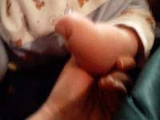
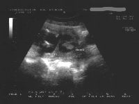

Amniyotik band sendromu üzücü sonuçlara yol açabilen ancak oldukça nadir görülen bir tablodur. Görülme sıklığı değişik kaynaklarda farklı olarak verilmektedir. Bazı yazarlar 1200 canlı doğumda bir görüldüğünü ileri sürmektedirler bu oldukça yüksek bir orandır. Sendromun gerçek görülme sıklığı ise 5000 ile 10.000 canlı doğumda bir olarak kabul edilmektedir.

Gebeliğin erken döneminde kendiliğinden olan düşükler de göz önüne alındığında oranların biraz daha yüksek olabileceği düşünülmektedir. Sendrom çok değişik isimlerle anılmaktadır. Amniyotik band sendromu en çok kullanılan terminoloji olmakla birlikte, **ADAM kompleksi**(amniyotik deformite, adhezyon, mutilasyon), aniyotik band sekansı, amniyotic distuption complex, konjenital amputasyon, konjenital kontrakte band, transvers terminal defekt gibi çok değişik şekillerde tarif edilmektedir.

Oldukça nadir görülmekle birlikte genelde sonuçları dramatiktir. Tanım olarak amniyotik band sendromu, bebeğin kol ve bacaklarında hafif ödemden, kol ve bacaklar başta olmak üzere fetal kısımların tamamen kaybolmasına kadar uzanan konjenital anomalileri kapsar.Meydana gelen band fetal dokuları sararak sıkar ve o seviyeden asagiya kan, ve dolayisi ile oksijen akımını keser.Etkilenen vücut kısmının hareket kabiliyeti azalır.Sonuç olarak bandın bulunduğu yerden aşağı seviyelerde gelişim durur.

Örneğin eğer band bebeğin bir dirseğine dolanırsa, olayın şiddetine göre ya kolun dirsekten aşağı kısmı hiçbüyümez (otoamputasyon) ya da deformite oluşur.Eğer oluşan fibröz band fetusun boynuna ya da hayati öneme sahip kısımlarından birine dolanırsa bebek anne karnında kaybedilebilir.

Çok hafif olan durumlarda ise parmaklarda yapışıklık gibi doğum sonrası ameliyat ile düzeltilebilecek düzeyde anomaliler görülür. Sendromun en sık görülen formunda ise bebek doğduktan etkilemiş kısımlarda sanki çok sıkı bir lastik geçirilmiş gibi oluklar görülür.

Genel olarak ifade etmek gerekir ise ortaya çıkan problem bandın nerde olduğuna ve ne kadar sıkı olduğuna bağlıdır.Nedeni tam olarak bilinmemekle birlikte geçerli olan teori, gebeliğin çok erken dönemlerinde amniyon zarının herhangi bir nedenle yırtılması ve serbest şekilde sallanan parçaların fetal kısımları sarmalayıp sıkıştırması olarak kabul edilmektedir.Bu yırtılma sonrası amniyon zarı kendini yeniler ancak fetusa bağlanan kısımlar olduğu gibi kalır.

Bugüne kadar bu sendroma yol açabileceği belirlenen kanıtlanmış herhangi bir risk faktörü yoktur. Benzer şekilde genetik faktörlerin etkisini düşündürecek kanıtlar da mevcut değildir. Ancak bazı teratojen ilaçların durumdan sorumlu olabileceği ileri sürülmüştür. Bu konuda çalışmalar devam etmektedir.

Amniyotik band sendromu tetkarlama eğilimi olan bir tablo değildir. Birkez amniyotik band sendromlu bebek dünyaya getirenlerde diğer bebeklerde de benzer durumun görülme olasılığı artmaz.

Amniyotik band sendromunda tanı ultrasonografik inceleme esnasında duvardan başlayıp kesenin içinde ilerleyen ve fetusda biten band şeklinde yapıların görümesi ile konur.Ayrıca etkilenen kısmın alt seviyelerindeki organ deformiteleri inceleme esnasında saptanabilir. Asimetrik deformite varlığında amniyotik band araştırılmalıdır.

Ayırıcı tanıda ise band gibi görülen amniyon zarı katlantılarına dikkat edilmelidir.

Tedavi konusunda yapılabilecek fazlaca birşey yoktur. Hastalığın ileri formlarında durum fark edildiğinde gebeliğin sonlandırılması düşünülebilir. Hafif formlarda ise anne karnında cerrahi girişim ile bu bandların kesilmesi deneysel aşamada devam etmektedir.

**Benzer durumlar**   
Erken gebeliklerde ultrasonografilerde amniyotik band benzeri yapılar sıklıkla saptanırlar. Ancak bu yapılar ikinci trimesterda kaybolurlar. Büyük olasılıkla band olarak değerlendirilen bu yapılar amniyon zarının kıvrıntılarıdır. İlk trimesterda ultrasonda görülen bu yapılar nedeni ile hemen amniyotik band sendromu tanısı koymak doğru değildir.

Zaman zaman ultrasonografide saptanan görüntüler amniyotik bandı düşündürebilir ancak bunlar gerçek amniyotik band değildir. Örneğin uterus içinde bulunan yapışıklıklar (sineşi) yanlış değerlendirme sonucu amniyotik band zannedilebilir. Gebeliğin gidişatında kritik öneme sahip değildirler ve nadiren probleme neden olurlar. Yarattıkları en önemli problem bebeğin baş yerine başka bir kısmının önde gelmesidir.

Ultrason incelemesinde bebekte herhangi bir anomalinin olmaması ayırıcı tanıda rol oynar. Çok büyük sineşiler bebekte gelişme geriliğine yol açabilirler. Doppler ultrasonografi incelemesinde gerçek amniyotik bandta kan akımı saptanmaz iken, sineşide oldukça yoğun bir akım bulunur ve bu ayırıcı tanı için tipik bir bulgudur.
