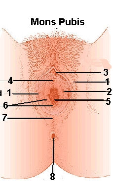
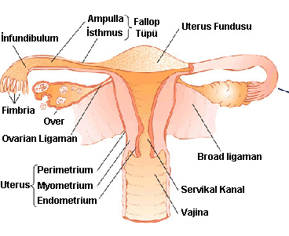

Tıpta bilgi sahibi olabilmek için ilk adım anatomiyi öğrenmektir. İnsan vücudunu ve onu oluşturan parçaları öğrenmeden ne normal ne de patolojik bir durum anlaşılamaz.Bu nedenle tıp fakültelerinde geleceğin doktorlarına ilk öğretilen ders anatomidir. Yapıyı öğrendikten sonra sıra bu yapıların fonksiyonları ve çalışma mekanizmalarına gelir. Bu mekanizmalara da fizyoloji denir. İnsan da dahil olmak üzere tüm canlılardaki anatomik oluşumlar o tür için aynıdır. Ancak arada küçük farklılıklar bulunabilir. Bu farklılıklara varyasyon adı verilir. Kabaca bir örnek vermek gerekirse bütün insanların eli aynı yapıdadır, aynı yerden köken alır, aynı sayıda kemik ve kas içerir, sinirler aynı yerden gelir, lenf ve damar dolaşımı aynıdır. Ancak baktığınızda kimsenin eli kimseye benzemez. parmakların yapısı, tırnakların şekli değişiktir. İki insanda da el üzerinde aynı damarlar olmasına rağmen kiminin el üstünde bu damar daha yüzeyden geçer ve belirginidir kiminde ise değildir. İşte bu varyasyondur. İnsan vücudu hücrelerden oluşur. Hücreler dokuları, dokular organları, organlar sistemleri ve sistemler de vücudu meydana getirir. Kadın ve erkek anatomileri arasındaki en belirgin fark üreme sistemlerindedir.

Kadın üreme sistemi eksternal (dış) ve internal (iç) genital organlar olarak 2 başlık altında incelenir. Karın boşluğu içinde bulunan ve dış dünya ile ilişkisi olmayan organlar internal organlardır. Diğerleri ise dış genital organlar olarak isimlendirilirler.

**Dış genital organlar**  
**Vulva**  
Dış Kadın genital organının tamamına vulva adı verilir. Vulvanın üstündeki kıllı ve yağ dokusundan ibaret bölüm ise mons pubis olarak adlandırılır. Bu kıllar göbeğe doğru birkaç santim ilerledikten sonra düz bir hat üzerinde sonlanırlar. Kılların fonksiyonu tam olarak bilinmemekle birlikte cinsel bir fonksiyonunun olduğu ve kadınlara has bir kokunun çabuk dağılmasını engellediği ileri sürülmektedir.

**1.Labium Majus (Büyük dudaklar) :**Orta hat üzerinde bulunan bir çift uzunlamasına deri kıvrımıdır. Erkeklerdeki torbaların karşılığıdır. Ön tarafda her iki L.Majus birleşir arka tarafda birleşmez ve anüse kadar uzanır. Dış yüzeyini çrten deri kıllıdır, bol miktarda yağ ve ter bezi içerir. İç yüzünde ise kıl bulunmaz.  
**2.Labium Minus (Küçük dudaklar) :** L. Majusların arasında vajina girişini çevreleyen iki küçük doku parçasıdır. Kıl ve yağ dokusu içermez. Bol miktarda sinir ve kan damarı barındırır.  
**3.Klitoris :** Erkekdeki pensin karşılığı olan erektil dokudur.Dıştan görüne kısmına glans klitoris denir. İçeride mons pubisin iç kesimlerine kadar uzanır.  
**4.Ürethral orfis:**Mesanenin dış dünyaya açılış yolu olan ürethranın son noktasıdır. İdrar burdan dışarıya atılır.

**5.Vajina:** Kadın üreme siteminin iç kısımları ile dış kısımlarını birbirine bağlayan tüp şeklinde bir dokudur. Ön ve arka duvarları normalde birbiri ile temas halindedir. Bazı yazarlarca iç genital organ olarak tanımlanır.Boyu yaklaşık 9 cm kadardır. Son derece esnak bir dokudur.  
**6.Hymen (Kızlık zarı):**Vajina girişinde bulunan ince zar şeklinde bir yapıdır. Ortası deliktir ve bu deliğe himenal orifis adı verilir. Görevi vajina ve iç genitalleri dışarıdan gelecek mikroorganizmalara karşı korumak olduğu sanılmaktadır.  
**7.Perine:**Pelvis boşluğunu alttan kapatan kas ve bağ dokusundan oluşan dokudur. Vulva arka kenarı ile anüs arasında uzanır.  
**8.Anüs :**Barsakların dış dünyaya açılış noktasıdır. Makat olarak da adlandırılır.

**İç Genital Organlar**

Pelvis boşluğunun içindeki üreme sistemini oluşturan organlardır. Bunlar sırası ile uterus (Rahim), tuba uterina (fallop tüpleri) ve overlerdir (yumurtalık). Tüpler ve overler her iki yanda ikişer tanedir. Uterus ise ortada ve tek bir tanedir. Embryonik hayatta her iki yandan gelen tüp şeklinde yapılar orta hatta birleşerek uterusu oluşturur. Bu birleşmede meydana gelen aksaklıklar rahimde çift gözlü uterus gibi şekilsel bozukluklara neden olurlar. Bunlara genel olarak Müllerian Füzyon anomalisi adı verilir.

**Uterus (Rahim)**  
Pelvis boşluğunda yer alan ve gebeliği miadına kadar taşımaya yarayan dışta düz kas hücrelerinden oluşan içte ise endometrium adı verilen zar tabakası ile kaplı armut biçimli bir organdır. Normal anatomide öne ya da arkaya dönük olabilir. Fundus, Korpus, İsthmus ve serviks olarak 4 kısımda incelenir. Uteus bir takım bağlar tarafından yerinde tutulur. Bunlar tutucu ve asıcı bağlar olarak sınıflandırılırlar.Uterusun içi boştur. Bu boşluğa kavite ya da endometrial kavite adı verilir. Gebelik oluştuğunda burada yerleşir ve büyür.  
Serviks rahimin vajina yani dış dünya ile tamasını sağlayan en uç kısmıdır. Jinekolojik muayene esnasında gözle görülebilen bir yapıdır. Dış dünyaya açık olduğundan enfeksiyonlara ve yaralara karşı oldukça savunmasızdır. Smear testi esnasında buradan alınan hücreler incelenir. Serviksin ortasından serviksle endometrial kaviteyi birleştiren bir kanal geçer. Bu kanala endoservikal kanal adı verilir.  
Serviks ile korpusun birleşim yerine isthmus adı verilir. Uterusun ana yapısı korpusdur. İstemsiz çalışan düz kaslardan meydana gelen bir yapısı vardır.Fundus rahimin karın boşluğu içinde en tepesini oluşturan kısmıdır.  
Uterus önde mesane arkada ise rektum (barsakların rezervuar görevi yapan son kısmı).

**Tuba Uterina (Fallop tüpleri)**  
Yumurtalıklar ile rahim arasında uzanan yaklaşık 10 cm uzunluğunda, sperm ve yumurta hücresinin geçişini sağlayan bir çift kanaldır.5 kısımda incelenir.  
**İntramural:** Tüplerin uterusun kas tabakası içine gömülü olan kısmıdır. 1.5-2 cm uzunluğundadır.Çapı yaklaşık 0.4 milimetredir  
**İsthmik:** İntramural kısımdan yanlara doğru uzanan bölgedir.2-3 santimetre uzunluğunda, 1-2 milimetre kalınlığındadır.  
**Ampulla:** Tüplerin en geniş kısmı olup 5 santimetre uzunluğunda ve 1 santimetre kalınlığındadır. Yumurta ile spermin karşılaşması ve döllenme burada gerçekleşir. Dış gebeliklerin %90’ı bu kısımda yerleşir  
**İnfundibulum:** Tüplerin huni şeklindeki ucudur.  
**Fimbria:** Tüplerin en uç kısmıdır. Püskül şeklindedir. Yumurtalıklardan atılan yumurta hücresini süpürür tarzda hareketlerle yakalama görevini yerine getirir.

**Overler  
**Uterusun her iki yanında yer alan sert yapıda ve sedef renginde bir çift organdır. Uzunlukları yaklaşık 3.5 santimetre, genişliği yaklaşık 2.5 santimetre ve kalınlığı yaklaşık 1 santimetredir. Bağlar ile karın duvarına ve uterusa bağlanmışlardır. Görevleri kadınlık hormonlarını üretmek ve yumurta hücresi geliştirip salmaktır. Erkekteki testislerin karşılığıdır.
