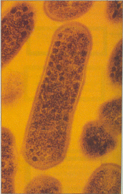

İlk defa 1955 yılında tanımlanan ve Haemophilus vaginalis adı verilen bir bakterinin yol açtığı vajinal enfeksiyondur.

Etkene Gardnerella vajinalis adı da verilir. Cinsel ilişki ile bulaşabilir ancak bu konuda bilimsel bir görüş birliği yoktur.

Halk arasında en çok görülen vajinal enfeksiyonun mantar enfeksiyonu olduğu sanılmasına rağmen gerçekte en sık bakteriyel vajinozis yani Gardnarella enfeksiyonu görülür. Kadınların %10-68’inde gardnarelle vajiniti görülür.Genelde üreme çağındaki kadınlarda rastlanır.

Gardnarella vajinlis etkeni

**Belirtileri**  
Vajina, ürethra (mesane ile idrar çıkış noktası arasındaki boru), mesane ve genital bölgedeki deriyi tutar.

Normalde kadın vajinasında belirli miktarda gardnarella vajinalis mikroorganizması bulunur. Vajina içerisinde pekçok mikroorganizma barınır ancak bunlar belirli bir denge içinde bulunduğundan enfeksiyona neden olmazlar. Bu dengeyi sağlayan en önemli unsurlardan birisi laktobasil adı verilen mikroorganizmalardır. Laktobasiller vajianın asit baz dengesini sağlayarak diğer organizmaların enfeksiyon yapacak kadar çoğalmalarını engellerler. Bu denege bozulduğunda enfeksiyon ortaya çıkar.

Gardneralla vajinalis enfeksiyonu çoğu zaman herhangi bir belirti vermez. En sık karşılaşılan yakınma kötü kokulu bir akıntıdır. Tipik olarak gri renkli ve kötü kokulu akıntı mevcuttur. Vajinanın pH’ı bazik yöne kayınca ortaya bazı aminler çıkmakta ve enfeksiyonda tipik olan balık kokusu duyulmaktadır. Bu balık kokusu bakteriyel vajinit için tipiktir. En sık adet kanaması sonrası ya da cinsel ilişkiyi takiben duyulur.

**Tanı  
**Tanı muyanede akıntının görülmesi ile ya da alınan akıntı örneğinin mikroskop altında incelenmesi ile konur. Bazen herhangi bir bulgu olmayan olgularda vajinal kültr ya da smear testi sonucu fark edilir.

**Tedavi**  
Tedavi edilmediği taktirde pelvik enfeksiyonlara neden olabilir. Tedavide lokal ve sistemik antibiyotikler kullanılır. Olguların %79’unda erkek ürethrasında da bu mikroorganizmaya rastanır. Bu nedenle inatçı olgularda eş tedavisi de önerilmektedir
