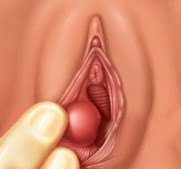

Bartholin kanal kisti ya da absesi üreme çağındaki kadınlarda sık karşılaşılan sorunlardan birisidir.

**Bartolin kisti ve absesi nedir?**  
Bartholin bezi vajina girişinde, deri kıvrımlarının arasında yer alan bir tür salgı bezidir. Her iki yanda vajinaya göre saat 4 ve 8 hizalarında olmak üzere toplam 2 tanedir. Ergenlik ile birlikte bu bezlerden de salgı başlar. Bartholin bezlerinin görevi vajinal ıslaklık ve kayganlığa yardımcı olmak üzere sıvı salgılamaktır.

Bartholin bezleri normalde gözle görülemez ya da elle hissedilemez. Ancak herhangi bir nedenle salgı bezinin ürettiği sıvıyı dışarıya taşıyan kanallarda tıkanıklık meydana gelir ise bu sıvı birikir ve kistik bir yapı oluşur. Bu kist herhangi bir nedenle enfekte olur ise bu durumda abse meydana gelir. Çoğu zaman öncesinde herhangi bir kist olmaksızın ilk belirti abse gelişimi olmaktadır.

**Görülme sıklığı**  
Bartholin kistleri kadın dış genital organında en sık karşılaşılan kistik oluşumlardır. Her 100 kadından yaklaşık 2 tanesi yaşamlarının herhangi bir döneminde bartholin kisti ya da absesi ile karşı karşıya kalmaktadır. Bartholin absesi kistten yaklaşık 3 kat daha fazla görülür. En sık 20-29 yaş arasında cinsel yönden aktif kadınlarda karşılaşılır.

**Belirtileri**  
Eğer bartolin kisti çok küçükse ve enfekte değilse hiçbir belirti vermeyebilir. Ancak çoğu hastada vajinanın hemen giriş kısmından içeriye doğru uzanan ağrısız ve yumuşak bir kitle vardır. Bu kitle dolgunluk hissi yaratabileceği gibi cinsel ilişki sırasında da rahatsızlığa neden olabilir. Kistin boyutları sabit kalabileceği gibi zaman içerisinde yavaş bir büyüme de izlenebilir. Kitle küçük bir bilye kadar olabileceği gibi mandalina büyüklüğüne kadar da ulaşabilir.

Abse ise son derece rahatsızlık verici bir durumdur. Vajina girişinde kızarıklık ve şişlik bulunur. Ancak en önemli sorun şiddetli ağrıdır. Bu ağrı otururken ve yürüken de kendini belli eder ve kişi oturmakta ve yürümekte güçlük çekebilir ve büyük acı yaşayabilir. Dinlenmek ve hareketsiz kalmak ile ağrı çok fazla azalmaz. Ağrının şiddeti absenin büyüklüğü ile direkt orantılı değilir. Küçük bir abse bile çok fazla ağrıya neden olabilir. Ağrının şiddeti zaman ilerledikçe artabilir ve ağrı kesicilere yanıt vermez.

Abse ya da kist çoğu zaman tek taraflı olmakla birlikte nadiren aynı anda her iki tarafta da görülebilir.

**Nedenleri**  
Bartholin bezinin salgısını dışarıya taşıyan kanallarda tıkanıklığa neden olan faktörler bilinmemektedir. daha önceden bu bölgede geçirilmiş cerrahi girişimler risk faktörü olmakla birlikte hastaların neredeyse tamına yakınında böyle bir operasyon öyküsü bulunmamaktadır. Kısacası bartolin kistinin nedeni bilinmemektedir.

Öte yandan abse söz konusu olduğunda yapılan kültürlerde en sık karşılaşılan mikroorganizmalardan birisi gonore yani bel soğukluğudur. Bir diğer sık karşılaşılan mikroorganizma da klamidyadır. Bununla birlikte koli basili olarak bilinen ve barsaklardan bulaşan E.coli bakterisi de sıklıkla saptanan mikroorganizmalardandır.

Bartholin abselerinin büyük bir kısmında olaydan tek bir bakteri türü sorumlu olmayıp pekçok değişik bakteri bir arada bulunmaktadır.

En sık karşılaşılan mikroorganizmaların gonore ve klamidya olması nedeni ile uzun yıllardır barholin absesinin cinsel yolla bulaşan bir hastalık olduğu düşünülmekle birlikte günümüzde tek nedenin bu olmadığı kabul edilmektedir. Ancak Bartholin absesi olan kadınlarda diğer cinsel yolla bulaşan hastalıklar ile ilgili araştırmaların da yapılması yararlı olacaktır.

İleri yaştaki kadınlarda ise çok nadir olmakla birlikte bartholin bezine ait kanserler göz ardı edilmemelidir.

**Tedavi**  
Herhangi bir şikayet yaratmayan küçük kistlerin tedavi edilmesi gerekmeyebilir. Böyle bir durumda ılık oturma banyolarının yararlı olabileceği ileri sürülmektedir. Ancak büyük ve yakınmaya neden olan kist ya da boyutu ne olursa olsun abse varlığında cerrahi tedavi gerekir.

Carrahide temel hedef mümkün olduğunca bartholin bezine zarar vermemektir. Kist ya da abse tamamen çıkarılabileceği gibi sadece bir delik açılarak içindeki iltihaplı sıvının dışarı akması sağlanabilir. Böyle bir durumda kist duvarları dışarıya doğru dikilerek abse duvarlarının yeniden kapanması engellenir. Bu işleme marsupializasyon adı verilir. Atılan bu dikişler kendiliğinden eriyen türden olup sonradan alınması gerekmez.

Cerrahi girişimler lokal ya da genel anestezi altında yapılabilir ancak abse durumunda iltihaplı alanda lokal aneztezik ilaçlar fazla etkili olmayacağından genel anestezi tercih edilmelidir. İşlem genelde 10-15 dakika kadar sürer ve ameliyat sonrasında kişinin ağrısı dramatik şekilde bir anda iyileşir. İşlem sonrası duvarların hemen kapanmasını engellemek ve biriken sıvının dışarıya atılmasını sağlamak amacıyla kist içine gazlı bez benzeri maddeler konulup birkaç gün sonra çıkartılabilir.

Bartholin absesinin tedavisinde cerrahi dışında sadece antibiyotik ile tedavinin yeri yoktur. Operasyon sonrasında ise antibiyotik sadece cinsel yolla bulaşan bir hastalık ya da vajinal enfeksiyon saptanması durumunda verilir. Bartholin absesinde cinsel yolla bulaşan bir hastalık yoksa eş tedavisine de gerek yoktur.

Operasyon sonrası bir miktar kanlı akını olabilir. Bölgenin tamamen iyileşmesi yaklaşık 2 hafta sürer ve bu süre içinde cinsel ilişki, havuz, deniz, jakuzi vb önerilmez. Ayakta duş şeklinde banyo yapmanın ise bir sakıncası yoktur.

İşlem sonrası hafif ağrı olabilir ve bu ağrı basit ağrı kesiciler ile kolaylıkla giderilebilir.

Çok nadiren abse kendiliğinden açılabilir ve hastanın yakınmaları biranda azalır.

**Önlem**  
Bartholin absesinin oluşmasını engellemek mümkün değildir. Ancak alınacak bazı tedbirler bu durumun ortaya çıkma şansını azaltabilir. Bu önlemlerin en önemlisi güvenli sekstir. Cinsel yolla bulaşan hastalıklara karşı alınacak şüpheli partnerler ile birlikte olmamak ve her ilişkide mutlaka prezervatif kullanmak gibi önlemler bu hastalıklara yakalanma şansını azaltacağından bartholin absesi riskini de azaltabilir. Ancak abse oluşumundan cinsel yolla bulaşan hastalıkların tek etken olmadığı akılda tutulmalıdır. Öte yandan kişisel hijyende temizlik sırasında arkadan öne doğru değil de önden arkaya (vajinadan makata doğru) temizlik yapılması kuralı da göz ardı edilmemelidir.

Vajina girişinde şüpheli bir şişlik fark edildiğinde mutlaka zaman kaybetmeden jinekoloğunuz ile görüşmeniz ve muayene olmanız abse gibi tatsız ve sıkıntı verici bir durumla karşılaşmamanız açısından önemlidir.

KAYNAKLAR

*   Azzan BB. Bartholin’s cyst and abscess. A review of treatment of 53 cases. Br J Clin Pract 1978;32(4): 101-2.
*   Cheetham DR. Bartholin’s cyst: marsupialization or aspiration? Am J Obstet Gynecol 1985;152:569-70
*   Kaufman RH. Benign diseases of the vulva and vagina. 4th ed. St Louis: Mosby, 1994:168-248.
*   Kovar WR, Scott JC Jr. A practical, inexpensive office management of Bartholin’s cyst and abscess. Nebr Med J 1983;68:254-5.
*   Omole F, Simmons JB, Hacker Y Management of Bartholin’s Duct Cyst and Gland AbscessAm Fam Physician 2003;68:135-40.
