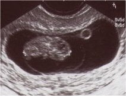

**Hafta**

**Ortalama  
mm**

**+/-** **2 SD  
mm**

**6+2**

**7.0**

3.3

**6+3**

**6.5**

1.4

**6+4**

**7.0**

4.6

**6+5**

**6.5**

4.2

**6+6**

**10.0**

2.6

**7+0**

**9.3**

2.3

**7+1**

**10.3**

8.0

**7+2**

**11.8**

5.7

**7+3**

**12.8**

4.8

**7+4**

**13.4**

6.7

**7+5**

**15.4**

3.6

**7+6**

**15.4**

4.4

**8+0**

**17.0**

4.9

**8+1**

**19.5**

5.7

**8+2**

**19.4**

6.2

**8+3**

**20.4**

5.0

**8+4**

**21.3**

3.8

**8+5**

**20.9**

2.4

**8+6**

**23.2**

3.6

**9+0**

**25.8**

6.0

**9+1**

**25.4**

4.6

**9+2**

**26.7**

4.4

**9+3**

**27.0**

2.8

**9+4**

**32.5**

4.2

**9+5**

**30.0**

10.0

**9+6**

**31.3**

5.5

**10+0**

**33.0**

7.2

**10+1**

**33.8**

7.6

**10+2**

**35.2**

7.3

**10+3**

**36.0**

7.9

**10+4**

**37.3**

9.7

**10+5**

**43.4**

7.7

**10+6**

**40.1**

7.1

**11+0**

**41.7**

6.1

**11+1**

**43.6**

7.2

**11+2**

**47.5**

6.2

**11+3**

**48.8**

5.9

**11+4**

**49.0**

9.5

**11+5**

**54.0**

9.8

**11+6**

**56.2**

9.5

**12+0**

**58.3**

9.4

**12+1**

**56.8**

7.2

**12+2**

**59.4**

6.6

**12+3**

**62.6**

8.6

**12+4**

**63.5**

9.5

**12+5**

**67.7**

6.4

**12+6**

**66.5**

8.2

**13+0**

**72.5**

4.2

**13+1**

**69.7**

8.5

**13+2**

**73.0**

15.1

**13+3**

**77.0**

8.5
