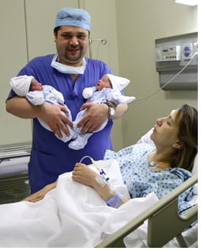

Meslekte geçirilen onlarca yıl, doğumuna tanıklık edilen onbine yakın bebek… bunların hiçbirisi insanı kendi eşinin gebeliği ve bebeklerinin gelişimi ile ilgili yaşadığı endişeler konusunda diğer bireylerden çok da farklı kılmıyor. Benzer endişeler ve heyecanlar belki kadın doğum uzmanı olmayan kişilere göre biraz daha bilinçli yaşanıyor o kadar.

Ve en önemlisi insanın tüp bebek & kadın hastalıkları ve doğum uzmanı olması erken doğuma karşı bir engel teşkil etmiyor.

İkizlerimiz Alp ve Arda 24 Ekim 2007 tarihinde planlanandan 2 hafta önce su keselerini patlatarak artık dünyayagelmek istediklerini gösterdiler. Ikiz olduklari için zaten erken almayı planlıyorduk ama onlar daha da aceleci çıktılar. Doğduklarında 33 hafta 5 günlüktüler ve Alp 2295 Arda ise 2595 gram ağırlığındaydı. Doğum sonrasında bize hiç sorun yaşatmadılar, yoğun bakım ya da özel bakım gerektirmeden 3. günde taburcu olup eve yerleştiler.

Anne baba olmak gerçekten çok zor bir iş. İkiz sahibi olmak ise zorlukları katmerliyor. Hayat tamamen ve kökten değişiyor ancak buna rağmen çok mutluluk verici ve çok keyifli bir durum ve kesinlikle buna değiyor.

Alp ve Arda için yaptığım siteye aşağıdaki resme tıklayarak ulaşabilirsiniz

