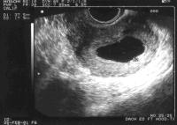

Halk arasında su gebeliği olarak da adlandırılan bu durumda gebelik kesesini oluşturan zar ve plasenta oluşurken bu yapıların içinde bir bebek bulunmaz.

Tanısı ultrasonda embryo ve kalp atımları görülmesi gereken haftalarda kesenin boş olarak izlenmesi ile konur. Erken gebelikte konulan bir tanı olduğu için bazı özel durumlara dikkat etmek gerekir. Özellikle adet kanamaları düzensiz olan kişilerde yumurtlama beklenen tarihten daha sonra gerçekleşmiş olabileceğinden bu durum özellikle dikkate alınmalıdır.

Boş gebelik ile çok erken dönemdeki normal bir gebeliği ayırdetmenin en önemli yolu kese içinde yolk kesesi adı verilen yapının izlenmesidir. Yolk kesesi varlığı gebeliğin boş gebelik olmadığının en önemli belirtisidir. Öte yandan kesenin ultrasondaki görüntüsü de bu iki durumun ayrımında yol gösterici olabilir. Teorik olarak son adet tarihinden yaklaşık 5 hafta geçen durumlarda transvajinal ultrasonografi ile fetus görülebilmelidir. Bunun gerçekleşmediği durumlarda ise boş gebelik tanısı koymak için aceleci davranmak çok yanlış bir yaklaşım olacaktır. Bu gibi bir durum varlığında en azından bir hafta beklenerek durumun gidişatı hakkında yeterli bilgi edinilmelidir.

Erken gebelik kayıpları, yani düşüklerin neredeyse yarısından fazlasının sebebi boş gebeliklerdir.

Blighted ovumda annede yumurtlama olur. Bu yumurta babadan gelen sperm ile birleşir ve döllenir. Döllenen yumurta tüplerdeki yolculuğunu tamamlar ve rahim duvarına tutunur.Gelişen hücreler gebelik kesesini oluşturmaya başlarlar. Buraya kadar herşey normal gebelikle aynıdır. Normal olmayan ise bu kesenin içinde embryo olmamasıdır.

**Belirtileri**  
Klinik olarak normal bir erken gebelikten hiçbir fark yoktur. Tüm belirtiler aynıdır. Ne bir kanama ne de kramplar bulunur.Zaman geçtikçe hafif kahverengi akıntı görülebilir ancak bu da ayırıcı bir bulgu değildir. Kişi ultrason kontrolünde gebelik kesesinin içinde embroyun ve kalp atımlarının olmadığı anlaşılana kadar boş gebelik olduğunu fark edemez.

**Nedenleri**  
Boş gebelik kromozomal problemlerden kaynaklanan bir tablodur. Bu olayın kalıtsal olduğu anlamına gelmez. Sadece o gebeliği meydana getiren sperm ve yumurtalarda kalite düşüklüğü ya da anomali söz konusudur. Geçmişte düşük yapan kadınların çoğu boş gebelikten haberdar bile değildiler. Oysa günümüzde uterus içinde neler olup bittiğini çok güzel gösteren ultrason cihazları ve tecrübeli hekimler sayesinde bu tür hastalıkları tespit edebiliyoruz ve düşük gibi tehlike yaratabilecek durumlara karşı önlemimizi alabiliyoruz.

Blighted ovum tekrarlama eğiliminde olan bir anomali değildir. Kromozomal bozukluk olmasına karşın anne ya da babada genetik bir problem yoksa kalıtsal özellik göstermez. Tamamen normal bir düşük olarak sınıflandırılmalıdır. Özellikle ilk gebeliği boş gebelik veya düşük ile sonuçlanan anne baba adayları haklı olarak endişe duyarlar. Oysa bir neden aramak için arka arkaya 2 yada 3 düşük olması gereklidir.

**Tedavi**  
Blighted ovum’un tedavisi gebeliğin kürtaj ile sonlandırılmasıdır. Bunun dışında herhangi bir tedavi alternatifi yoktur.Kürtaj tanı konulduktan sonra mümkün olan en kısa zamanda yapılmalıdır.  
Boş gebelik nedeni ile kürtaj olmak zorunda kalan anne adaylarında 1-2 hafta içinde yeniden yumurtlama olur ve 4 hafta sonunda adet görürler. Bu adet kanamasından sonraki siklusdan itibaren yeniden gebe kalınmasında hiçbir sakınca yoktur.
