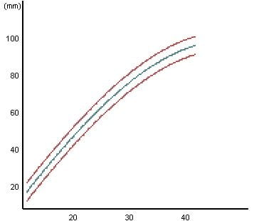
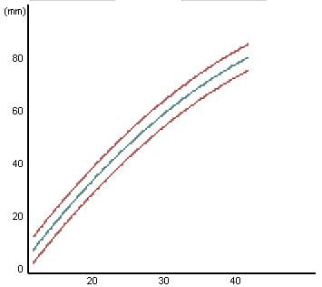
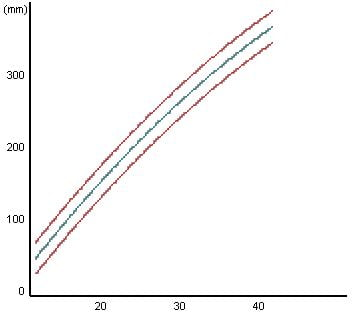
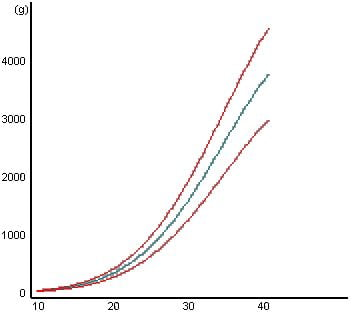

Aşağıdaki grafiklerde ultrason takipleri sırasında bebeklerde yapılan ölçümlerin normal seyrini inceleyebilirsiniz. Grafiklerdeki kırmızı çizgiler normalin alt ve üst sınırını, yeşil çizgi ise bebeklerin %50’sinin izlediği yolu göstermektedir. Grafiklerde alttaki sayılar gebelik haftasını göstermektedir.

BPD: Baş çapı

* * *

Femur uzunluğu

* * *

Karın çevresi

* * *

Tahmini fetal ağırlık
