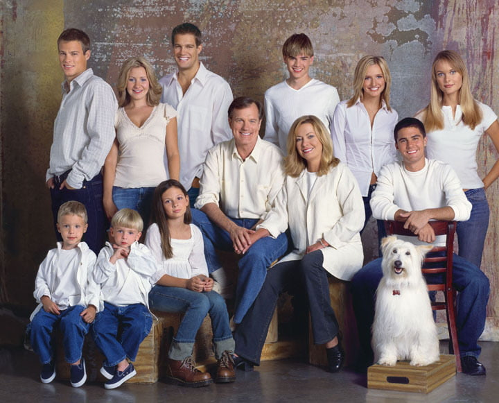

Uykusuz uzun geceler ve anne baba olmanın getirdiği stres uzun bir yaşamın sırrı gibi görünmüyor olabilir, ancak yayınlanan yeni bir çalışmanın sonuçlarına göre çocuk sahibi olmak anne babaların yaşam süresine fazladan birkaç yıl ekliyor olabilir.

İsveç’deki Karolinska enstitüsünden Dr. Karin Modig ve arkadaşları Çocuk sahibi olan insanların hiç çocuğu olmayanlarla karşılaştırıldığında yaklaşık iki yıl daha uzun yaşadıklarını ortaya koymuşlar.

Araştırmacılar bulgularını Journal of epidemiology and community health dergisinde yayınladılar.

Dr. Modig ve arkadaşları daha önceki benzer çalışmalarda da anne baba olan bireylerin hiç çocuğu olmayanlarla karşılaştırıldığında daha uzun yaşadıklarının bilindiğini ancak bu ilişkinin arkasında yatan nedenin açık olmadığını ve bununla ilgili yeterli araştırma bulunmadığını belirtiyorlar.

Ekip 1911 ve 1925 yılları arasında doğan 704.481 erkek ve 725.290 kadına ait ulusal verileri gözden geçirmişler. Bireylerin evlilik durumlarını, sahip oldukları çocuk sayısını ve her çocuğun cinsiyetini incelemişler.

Bu verileri değerlendirerek anne baba olmanın kişilerin 60 yaşından sonraki yaşam süreleri üzerindeki etkilerini araştırmışlar ve Çocuk sahibi olmanın kişinin yaşam süresini uzattığı sonucuna varmışlar.

Örneğin 60 yaş üzerinde çocuk sahibi olan erkeklerin olmayanlarla karşılaştırıldığında iki yıl civarında daha uzun yaşadıklarını kadınlarda ise bu sürenin yaklaşık 1.5 yıl olduğunu göstermişler.

Enteresan olan evli olmayanlar da yaşam süresinin daha uzun olarak saptanması.

Araştırmacılar bir hayat arkadaşı olmayışının kişinin çocuklarına daha fazla bağlanması sonucunu doğurduğunu ve bunun sonucunda da yaşam sürelerinin daha uzadığını düşünüyorlar.

Daha önceki çalışmaların tersine erkek ya da kız çocuk sahibi olmak yaşam süresi üzerinde herhangi bir etkiye sahip çıkmamış.

Enteresan olmakla birlikte bilimsel açıdan çok fazla öneme sahip olmayan bir çalışma.

KAYNAK

*   [http://jech.bmj.com/content/early/2017/01/30/jech-2016-207857.long](http://jech.bmj.com/content/early/2017/01/30/jech-2016-207857.long)
