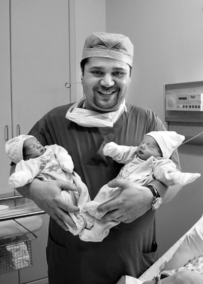

**İkizler**

**En Çok Çoğul Doğuran**  
Rusya’da 1707-1782 yılları arasında yaşamış olan Fyodor Vassilyev isimli kadın tam 16 kez ikiz doğum yapmıştı. Aynı kadın ikizlere ek olarak 7 kez üçüz, 4 kez de dördüz doğurmuştu. Dünyaya getirdiği 69 bebekten 67’si yaşamıştı.  
1899’da ölen Mary Jonas ise 15 kez ikiz doğum yapmıştı ve bebekler her seferinde bir oğlan bir kız olmuştu.

**En erken doğan ikizler**  
Dünyada bugüne kadar kaydedilmiş, yaşayan en erken doğan ikizler 27 Mart 1999 tarihinde doğan Jimmy ve Missy Fisher’dir. İkizler dünyaya beklenenden 117 gün önce, 23 haftalıkken merhaba demişlerdi.

**İki ikiz arasındaki en uzun süre**  
Paggy Lynn, ikizlerinden ilkini 11 Kasım 1995 yılında doğurdu. İkizlerin diğer teki olan Eric ise tam 84 gün sonra 2 Çubat 1996’da doğdu.

**İlk Tüp İkizler**  
Dünyanın ilk tüp ikizleri 5 Haziran 1981’de doğan Stephen ve Amanda Mays’dir.

**En uzun süre ayrı kalan ikizler**  
Iris Johns ve Aro Campbell 13 Haziran 1914 yılında birbirlerinden ayrıldılar ve tam 75 yıl sonra yeniden buluşabildiler.

**En genç ikiz anne ve babası**  
Nicola Doherty 20 Nisan 1997’de ikizlerini dünyaya getirdiğinde 14 yaşındaydı. James Sutton ise 17 yaşındaki kız arkadaşı kendinden olan ikizleri doğurduğunda sadece 13 yaşındaydı.

**Üçüzler**

**En prematür üçüzler**  
Lewis, Alister ve Charlotte Akerman 9 Aralık 1980’de doğduklarında, beklenen doğumgünlerine 98 gün vardı (Guinness 1998)

**En Hızlı Doğal Üçüz doğum**   
A.B.D.’de doğan Bradley, Christopher ve Carmon Duck, normal yoldan sadece 2 dakikada dünyaya merhaba demişlerdi.

**En uzun yaşayan üçüzler**  
18 Mayıs 1899’da doğan Faith, Hope ve Charity Cardwell en uzun yaşayan üçüzlerdir. Faith 95 yıl 135 gün yaşadıktan sonra Ekim 1994’de ölmüştür. Charity 1995’de, Hope ise 1997’de hayata veda etmişlerdir.

**İlk Tüp bebek üçüzler**  
Dünyanın ilk tüp üçüzleri 8 Haziran 1983’de Avustralya’da dünyaya gelmiştir.

**En yaşlı üçüz annesi**  
Tedavi almadan gebe kalarak üçüz doğuran en yaşlı kadın Washington’da yaşayan Arcelia Garcia’dır. Bn. Arcelia üçüzlerini dünyaya getirdiğinde tam 54 yaşındaydı. En yaşlı tedavi ile üçüz doğuran anne ise 53 yaşında doğum yapan Avustralya’lı Wendy Kenyon’dur.

**En genç üçüz annesi**  
Crystal Cornick üçüzlerini doğurduğunda sadece 17 yaşındaydı. İkinci üçüzlerini ise 19 yaşındayken dünyaya getirdi.

**En çok üçüz doğuran**  
Maddelena Granata (1839-1886) tam 15 kez üçüz doğurmuş. Güney Afrika’lı Anna Steynvaait ise 1960 yılında 10 ay ara ile 2 kez üçüz doğum yapmış.

**Ektopik üçüzler**  
En enteresan üçüz vakası ise Eylül 1999’da yaşanmıştır. Jane Ingram iki kız ve bir oğlan çocuğa gebe kalmıştı. İkizler normal yerinde, yani rahim içindeyken, erkek bebek dış gebelik olarak fallop tüpüne yerleşmişti. Bir süre sonra dış gebelik olan tüp yırtıldı ve gebelik ürünü karın boşluğuna atıldı. Şans eseri kanama durdu ve fetus’un plasentası karın boşluğunda yerleşecek bir yer buldu, bu sayede erkek bebek de gelişmeye devam etti. Tüm bebekler miadında sezaryen ile doğurtulde ve her üçü de hala daha hayatta.

**Dördüzler**

**Eş Dördüzler**  
Dünyada bilinen 19 eş dördüz vakası mevcuttur. Eş dördüz gruplarının 12 tanesi kız, 7 tanesi ise erkekdir.

**İlk tüp dördüzler**  
Dünyanın ilk tüp dördüzleri 1984 yılında Avustralya’da dünyaya gelmişlerdir.

**En çok dördüz doğuran**  
Rusya’da 1707-1782 yılları arasında yaşamış olan Fyodor Vassilyev isimli kadın tam 4 kez dördüz doğum yapmıştır.

**En prematür dördüzler**  
20 Şubat 1997’de dünyaya gelen Avustralyalı dördüzler doğduklarında anneleri sadece 25 hafta 1 günlük gebeydi.

**En yaşlı dördüzler**  
Yaşayan en yaşlı dördüzler 19 Mayıs 2000 de 70. yaşgünlerini kutlayan Morlok dördüzleridir. Bilinen en uzun yaşayan dördüzler ise 5 Mayıs 1912’de dopan Ottman dördüzleridir. En uzun yaşayanı Adolf tam 79 yıl 316 gün yaşamıştır.

**En genç dördüz annesi**  
B. Jo Broviak 2 kız ve 2 erkekden oluşan dördüzlerini dünyaya getirdiğinde 15 yaşındaydı ve tedavisiz gebe kalmıştı.  
Erin Belcher ise Nisan 1998’de dördüzlerini doğurduğunda 16 yaşındaydı ve kızlardan ikisi eş idi.

**En yaşlı dördüz annesi**  
Mary Fudel tüp bebek ile gebe kaldığı dördüzlerini 1998 yılında doğurduğunda 55 yaşındaydı.

**En yaşlı dördüz babası**  
Toni Del Renzio’nun eşi 2 kız ve iki erkekden oluşan bebeklerini 1985 yılında dünyaya getiriken baba tam 70. yaş günündeydi.
