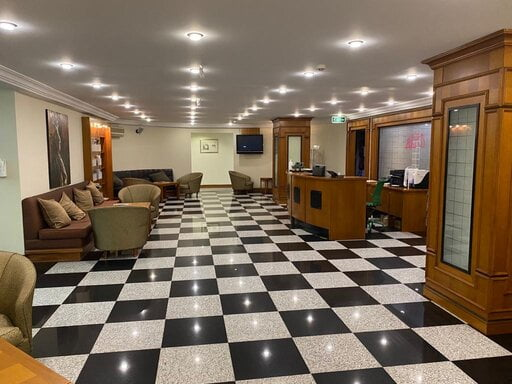

2019 yılının sonlarında başlayan ve tüm dünyayı etkisi altına alan korona virüs salgını hepimizin hayatını pek çok yönden olumsuz etkiledi.

Salgın nedeni ile daha önce hiç aklımıza bile gelmeyecek yeni uygulamalar hayatımızın en azından (ve umud ederim ki) şimdilik vazgeçilmez rutini haline geldi.

Hayatımızda ortaya çıkan değişikliklerden biri de sağlık hizmetleri ile ilgili endişeler ve buna bağlı aksaklıklar. Salgının ilk başladığı dönemde tüm dünyada olduğu gibi ülkemizde de sağlık bakanlığı önerileri uyarınca acil olmayan tüm işlemler ve rutin muayenleri durdurmuştuk. Ancak hastalığın bulaşma yollarının ve tedavi seçeneklerinin daha iyi anlaşılması ile hayatın yavaş yavaş normale dönmesi sonucu “yeni normal” olarak adlandırılan önlemler ile tüm muayene, cerrahi işlem ve tüp bebek tedavilerine yeniden başladık.

Hastalarımızın ve çalışanlarımızın sağlığı ve güvenliği birinci önceliğimiz.

Muayenehanemizde günlük olarak ve her hasta muayenesinden sonra ulusal ve uluslararası rehberlere uygun olarak önlemler alınmaktadır.

Yakın bir gelecekte atlatacağımızı ümit ettiğim Korona virüse bağlı COVID-19 günlerinde muayene ile ilgili bazı noktalara dikkatinizi çekmek isterim

*   Bilenler bilir en önemli özelliklerimden biri dakik olmam ve randevuları saatlerini çoğu zaman geciktirmememdir. Zaman zaman 5-10 dakikayı geçmeyen gecikmeler yaşansa da genelde hastalarım randevu saatlerinde görüşmeye girmiş olurlar. Bu nedenle randevu saatinizden 5 dk önce klinikte olmanız daha sonraki randavuların aksamaması açısından önemlidir. Nişantaşı’na daha önce varmanız durumunda kılıniğe gelmek yerine açık havada vakit geçirmeyi düşünebilirsiniz. Bekleme salonumuz geniş olsa da bu sayede daha az kalabalık olması sağlanabilir.
*   Gelen herkesin uygun bir maske takması ve muayenehanede kaldığı sürece maskeyi takılı tutması gereklidir.
*   Görüşmeleri 15 dakikadan daha uzun tutmamaya gayret gösteriniz.
*   Son 14 gün içerisinde yurtdışına bir seyahatiniz oldu ise bunu mutlaka asistanlarımıza bildiriniz.
*   Öksürük ve ateş şikayetiniz varsa bu durumda kendi sağlığınız ve toplum sağlığı açısından bir hastaneye başvurmanız son derece önemlidir.

Kliniğimizde bol miktarda el dezenfektanı vardır. Ellerinizi en az 20 saniye sabunlu su ile yıkayıp el dezenfektanı ile temizleyiniz.

*   KOVİD salgını döneminde hemen bütün hastaneler anestezi altında yapılacak girişimler ve doğum öncesinde tüm hastalardan 48 saat öncesinde COVID testi yaptırmalarını şart koşmaktadır.

Bu zor günleri alacağımız tedbirlerle el birliği ile aşacağız…

Ilgili makaleler[Hamilelik ve korona virüs (COVID-19)](/hamilelik-ve-korona-virus-covid-19/)

[Gebelerde Corona virüs İngiliz rehberi](?p=3233)
