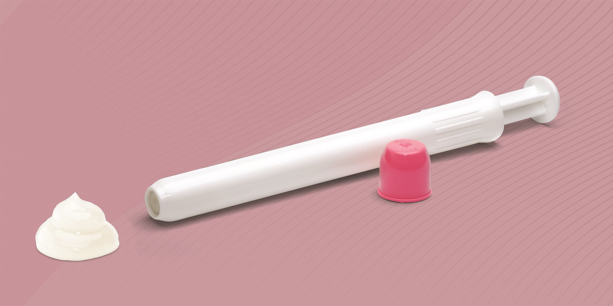

Phexxi doğum kontrol jeli ve aplikatörü

Amerikan gıda ve ilaç dairesi 2020 yılının mayıs ayında yeni bir doğum kontrol yöntemi olan dünyadaki ilk hormonal olmayan doğum kontrol jeli için onay verdi.

Bu yeni ürün önceden doldurulmuş kullanıma hazır applikatörü ile geliyor ve tıpkı tampon gibi vajina içerisine uygulanıyor.

Uzun yıllardır hormon kullanmak istemeyen ancak etkili bir doğum kontrol yöntemi isteyen kadınların seçenekleri çok fazla değildi. Ülkemizde kullanımı pek yaygın olmasa da, özellikle Amerika Birleşik Devletleri’nde sperm öldürücü ilaçların ilişkiden önce vajina içersine uygulanması hormon kullanamayan ya da kullanmak istemeyen kadınlar için önemli bir alternatif.

Çok kısa bir zaman önce piyasaya çıkan yeni ilaç ise farklı bir şekilde, vajinanın asit baz dengesini değiştirerek etki ediyor. 

Bir maddenin ya da ortamın ne asidik ya da bazik (alkali) oluşu pH ölçümü ile belirlenir. Sıfır en asidik, 14 ise en bazik durumdur. pH Değerinin yedi olması ise nötrdür. Bir başka değişle ortam ne asidik ne de bazıktır.

Normalde sağlıklı bir vajina hafif asidikdir ve pH değeri 3.5 ile 4.5 arasında bulunur. Bu ortam normal şartlarda spermlerin hareket etmesi hatta yaşaması için uygun değildir.

İlişki sırasında meni ortamın pH değerini 7 ya da 8’e çıkartır, yani hafif bazik yapar. Bu sayede spermler vajina içersinde yaşamaya ve hareket etmeye devam ederler.

Phexxi adındaki yeni ürün vajinanın pH değerini ilişki sırasında ve sonrasında da asidik tutarak etki eder. Jel, laktik asit, sitrik asit ve potasyum bitartrate içerir. 

Laktik asit yoğurt ve kefirin yapısında da vardır. Aynı zamanda vajinanın doğal ortamında da bu asidi salgılayan bakteriler (laktobasiller) bulunur.

Sitrik asit limon gibi narenciye’ye ekşiliğini veren maddedir.

Potasyum bitartrate ise mutfakta cream of tartar adı altında uzun zamandır kullanılan bir maddedir.

Yeni bir doğum kontrol yöntemi olan Phexxi İlişki sırasında vajinanın pH değerini asidik tutarak spermlerin hareket yeteneğini kısıtlar ve ölmelerine neden olur.

Kutusunda 12 adet özel aplikatörü ile gelen Phexxi, ilişkiden hemen önce vajina içersine uygulanır. İlişkiden 60 dakika öncesine kadar uygulandığında etkisinin tam olduğu belirtilmektedir. 1 saatten daha uzun zaman önce uygulanması önerilmez.

İlişkiden sonra kullanıldığında etkili değildir. 

Bir saat içinde ikinci kez ilişki olacaksa yeni bir doz uygulanması önerilir.

Jel formunda olduğu için ilişki sırasında vajinadan dışarıya akmaz ve herhangi bir rahatsızlığa neden olmaz.

Cinsel yolla bulaşan hastalıklara karşı hiçbir koruyuculuğu yoktur.

**Phexxi ne kadar etkilidir?  
**Henüz çok yeni bir ürün olması nedeniyle çok fazla çalışma mevcut değildir. Ancak bugüne kadar yapılan araştırmalarda kullanıldığı durumların %86.3’ünde işe yaradığı ortaya konmuştur.

Burada dikkat edilmesi gereken çok erken uygulandığı ya da ilişkiden hemen sonra kullanıldığı durumlarda işe yaramadığıdır.

İdeal kullanımında etkinliğinin %93 olması beklenmektedir.

Çok kabaca bir hesapla doğum kontrol jeli kullanan her 100 kadından yaklaşık 15 tanesinde gebelik ortaya çıkacaktır.

Kıyaslama yapmak gerekirse bakırlı spirallerde bu oran %99.2, hormonlu spirallerde %99.6, doğum kontrol haplarında ise yaklaşık %96-97 civarındadır. Prezervatifin koruyuculuğu ise yaklaşık %87dir.

**Phexxi kullanımının riskleri nelerdir?**  
FDA verilerine göre Phexxi kullanan kadınların en az %2’sinde istenmeyen etkiler ortaya çıkmaktadır.

*   En sık karşılaşılan problemler şunlardır:
*   Genital bölge ve vajinada yanma kaşıntı ağrı ya da rahatsızlık
*   Vajinal mantar enfeksiyonu
*   Genital bölgede genel bir rahatsızlık hissi
*   Bakteriyel vaginozis
*   Vajinal akıntı
*   İdrar yolu enfeksiyonu
*   İdrar yaparken ağrı ve rahatsızlık

**Kimler Phexxi kullanamaz?**  
Yeni bir doğum kontrol yöntemi olan bu vajinal jeli aktif idrar yolu enfeksiyonu olan, ya da sık idrar yolu enfeksiyonu şikayeti yaşayan kadınların kullanması önerilmemektedir.

Tek bir partneri olan ve hormonal bir yöntem kullanmak istemeyen kadınlar için de iyi bir alternatif olabilir.

Bu ürün henüz ülkemizde piyasada bulunmamaktadır. Amerika Birleşik Devletlerinde ise tıpkı doğum kontrol hapları gibi ancak reçete ile satılmaktadır.

  
  
İlgili konular[Doğum kontrolü ana sayfası](?p=72)
