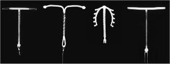
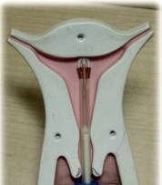
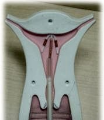
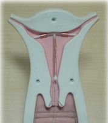
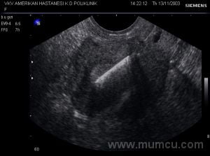

Rahim içi araç (RİA) ya da halk arasında yaygın şekilde kullanılan adıyla SPİRAL tüm dünyada en fazla tercih edilen geri dönüşümlü doğum kontrol yöntemidir.

RİA’nın bir başka özelliğide uzun süreli geri dönebilir yöntemler içinde maliyeti en düşük olan yöntem olmasıdır.

Tüm dünyada yaklaşık 106 milyon kadının istenmeyen gebeliklerden korunmak için RİA yöntemini tercih ettiği tahimin edilmektedir. Bu kadınların %70’i sadece tek bir ülkede; Çin’de yaşamaktadır.

RİA kullanım alışkanlıkları incelendiğinde bazı coğrafi bölgelerde sıkça tercih edildiği, bazı bölgelerde ise neredeyse hiç kullanılmadığı görülür. Örneğin Çin’de her 3 evli kadından birisi RİA kullanırken, İskandinav ülkelerinde bu oran %18, Yakın doğu ve Afrika’da %12 iken Avrupa’da %7, Avusturalya’da ise %5’dir. Kullanımın en düşük olduğu bölgelerden biri ise kuzey Amerika ve Sahra bölgesidir.

Oranlardaki bu büyük dalgalanma yöntemin erişilebilirliği, uygulayacak eğitimli kişilerin varlığı ve kültürel farklılıklar ile açıklanabilir. Ancak gelişmişlik sıralamasında en başlarda yer alan kuzey Amerika’da tercih edilmemesinin nedeni farklıdır. Dalkon Shield adı verilen rahim içi aracın pelvik iltihabi hastalık görülme riskini berligin derecede arttırdığının saptanması bu bölgede spiral kullanımının karşısındaki en önemli sorundur. Bu spesifik araç 25 yıl önce piyasadan çekilmesine karşın olumsuz etkileri ve önyargılar hala daha devam etmektedir.

Günümüzde Dünya Sağlık Örgütü (WHO), Amerikan Tıp Birliği (AMA) ve Amerikan Jinekolog ve Obstetrisyenler Birliği (ACOG) RİA’yı en güvenli ve etkili doğum kontrol yöntemlerinden biri olarak kabul etmektedir.

**RİA NEDİR?**  
Rahim içi araç geri dönebilir doğum kontrolü sağlayan ve ana yapısı kıvrılabilir polietilen olan küçük bir araçtır. Yapısı T harfine benzer. Polietilen gövde üzerinde bakır tel sarılıdır. Bu bakır zaman içinde yavaş yavaş salınarak RİA’nın etki mekanizmalarından birini oluşturur. Günümüzde kullanılan modern spirallerlerin önerilen kullanım süreleri değişkendir. Üretici firmalar 3 yıl ile 8 yıl arasında değişen kullanım süreleri belirtmekle birlikte yapılan klinik deneysel çalışmalarda bunların hemen hepsinin 10 yıl süreyle sorunsuz kullanılabileceği gösterilmiştir.

Temel yapı T şeklinde olmakla birlikte piyasada değişik marka ve yapılarda pek çok RİA bulunmaktadır. Bunların etkinlik açısından birbirlerine üstünlükleri yoktur. Toplumumuzda ithal spiral şeklinde bir tabir bulunmaktadır. Hastalar kendilerine ithal spiral takılmasını talep etmektedirler oysa Türk malı bir spiral zaten piyasada yoktur.

Piyasada en sık bulunan RİA türleri

Dünya üzerinde sıkça kullanılan RİA’ların hemen hepsinde polietilen gövde üzerinde baryum sülfat adı verilen bir madde kaplıdır. Baryum sülfatın amacı RİA’nın rontgen filmlerinde görülebilmesini sağlamaktır.

Spiralin alt ucunda genellikle bir halkaya da topuz bulunur. Bu bölüme “spiralin ipi” bağlıdır. Bu ip bakterilerin yukarıya doğru tırmanmasına izin vermeyecek materyalden üretilmiştir. Bu ip pamuk ya da bazı doğal materyalden üretilmiş iplikler gibi sıvı çekerek şişmez. İpin görevi RİA çıkartılacağı zaman kolaylık sağlamaktır. Bunun yanısıra kontrollerde ipin uzunluk ve durumu RİA’nın yerinden kayıp kaymadığının anlaşılmasında yardımcı olur.

**RİA NASIL ETKİ EDER?**  
Yüz yıla yakın bir zamandır istenmeyen gebeliklerin engellenmesinde güvenle ve yüksek etkinlikle kullanılmasına rağmen RİA’nın gebeliği nasıl engellediği hala daha tam anlamıyla anlaşılamamıştır.

Yapılan biyokimyasal çalışmalar RİA kullanan kadınlarda döllenmenin hiç gerçekleşmediği gösterilmiştir. Ancak RİA’nın nasıl olup da fertilizayonu engellediği bilinmemektedir. Öne sürülen fikir sperm ve yumurtanın hareket yeteneğini etkilediği düşünülmektedir.RİA’dan salınan bakır sperm hareketliliğini engelliyor olabilir. Bir diğer olasılık da yumurtanın tüplerden geçişini hızlandırarak döllenmeye engel olmasıdır.

RİA üzerinde bulunan bakır yavaşyavaş salgılanarak sistemin etkinliğini direkt olarak etkiler. Bu etki iki mekanizmayla ortaya çıkar. Birincisi bakır rahimin içini döşeyen endometrium tabakasında inflamasyon adı verilen bir reaksiyona neden olarak bu dokudan olan enzim üretimini değiştirir. Bu etki sonucu yumurta döllenmiş olsa bile rahim içinde tutunamaz. Öte yandan bakır prostoglandin adı verilen maddelerin üretimini etkileyerek gebeliği destekleyen hormonların üretimini bozar. Yani spiral hem döllenmeyi engeller hem de döllenme olsa bile bu embryonun rahim içinde tutunma ve canlılığını devam ettirme şansını azaltır.

**RİA’NIN ETKİNLİĞİ NE KADARDIR?**  
RİA tüm doğum kontrol yöntemleri içinde etkinliği en yüksek olanlardan birisidir. Koruyuculuk araç takıldığı andan itibaren başalar. Kullanımın ilk yılı içinde 1.000 kadından sadece 6-8’i istenmeyen bir hamilelikle karşı karşıya kalır. Spiralin koruyuculuğu çıkarıldığı anda biter. Yumurtlama üzerinde bir etkisi olmadığından kişi aynı ay hamile kalabilir.

RİA’nın cinsel yolla bulaşan hastalıklara karşı hiçbir koruyuculuğu yoktur. Bu nedenle bu hastalıklar açısından yüksek risk grubunda olan kadınlar (birden fazla partneri olan ya da, partneri birden fazla kişi ile ilişkisi olan kadınlar) mutlaka prezervatif kullanmalıdırlar.

**DOĞUM KONTROLÜ DIŞI YARARLARI NELERDİR?**  
Doğum kontrol hapı ya da prezervatifin aksine RİA’nin istenmeyen gebelikleri önlemek dışında kadın sağlığı açısından herhangi bir yararı yoktur. Asherman sendromu açısından risk altında olanlarda ya da histeroskopi ile açılan rahim için yapışıklıklardan sonra yeniden yapışıklık olmasını engellemek amacıyla da kullanılabilir.

**RİA KİMLER İÇİN UYGUN BİR YÖNTEMDİR**  
Aşağıdaki durumlar RİA için uygun adayları belirler:

*   Yüksek etkili, uzun süreli ve geri dönebilen bir yöntem arayanlar
*   Son 12 ay içinde pelvik iltihabi hastalık, gonore ve klamidya enfeksiyonu geçirmemiş olanlar
*   Cinsel yolla bulaşan hastalıklar için yüksek risk grubunda olmayan kadınlar
*   Emziren anneler
*   Sigara kullanımı ya da başka nedenler ile doğum kontrol hapı veya diğer hormonal yöntemleri kullanamayanlar
*   Doğum kontrol yöntemine fazla zaman ayırmak istemeyenler. (tak ve unut)

**RİA KİMLER İÇİN UYGUN DEĞİLDİR?**  
Spiral kullanımının önündeki en büyük engel bilinen ya da şüphe edilen bir gebelik varlığıdır. Bunun dışında aşağıdaki durumların varlığında RİA takılması uygun değildir.

*   Belsoğukluğu ya da klamidya gibi cinsel yolla bulaşan bir hastalık varlığı
*   Son 3 ay içinde endometrium enfeksiyonu geçirmiiş olmak
*   Son 3 ay içinde enfekte bir düşük olayı yaşamış olmak
*   Kontrol altına alınmamış serviks ya da vajina enfeksiyonu olması
*   Anormal vajinal kanama olması (nedeni açıklanamamış)
*   Bilinen ya da şüphe edilen serviks veya endometrium kanseri olması
*   Bağışıklık yetmezliği, AIDS, Lösemi gibi enfeksiyonlara duyarlılığa neden olan sistemik hastalıkların varlığı
*   Serviks ve uterusda RİA’nın takılmasını olanaksız ya da tehlikeli hale getiren anatomik bozuklukların olması
*   PAP smear sonucunun normal olmaması
*   RİA’dan daha küçük ve kısa bir rahim olması
*   Problem ortaya çıktığında tıbbi hizmet alma olanağının bulunmaması

Yukarıdaki durumlara ek olarak bakıra alerjik olduğu bilinen kadınlara da RİA takılmaz.

Diatermi adı verilen ısı tedavisi uygulanan kadınlarda RİA takılması doğru değildir. Tedavi sırasında ısınan bakır endometriumda kalıcı hasara neden olabilir.

Vücutta tehlikeli miktarlarda bakır birikimi ile karakterize, nadir görülen genetik geçişli bir hastalık olan Wilson Sendromu varlığı da RİA uygulanmaması gereken bir durumdur.

Bakteriyel endokardit adı verilen çok tehlikeli bir enfeksiyon açısından yüksek risk grubunda olan kalp kapakçık hastaları ise gerekli önlemler altında RİA kullanabilirler.

**RİA NASIL TAKILIR**?  
RİA takılması zor bir işlem değildir. Genelde çok fazla ağrı olmaz ve kolaylıkla tolere edilebilir. RİA takılması ile ilgili detaylı bilgi için [Spiral takılırken sizi neler bekler](http://www.mumcu.com/html/article.php?sid=267) başlıklı yazıyı okuyabilirsiniz.

RİA takılmadan yarım saat kadar önce basit bir ağrı kesici alınması işlem sırasında ya da sonrasında yaşanabilecek krampları azaltacaktır. Bazı hekimler enfeksiyona karşı önlem olarak antibiyotik alınmasını önerebilirler. Bu şart olmayan bir uygulamadır.

Jinekolojik muayenede olduğu gibi spekulum takılarak serviks görünür hale getirilir ve antiseptik solüsyon ile silinerek temizlik yapılır.Serviks tenekulum adı verilen bir alet ile tutularak çekilir ve uterus düz pozisyona gelir. Daha sonra histerometri adı verilen bir alet serviks ağzından rahim içine itilerek rahimin boyu ölçülür.

Aplikatör tüp içinde bulunan spiral rahim ağzından geçirilerek rahim içine yerleştirilir ve rahimin tepe noktasına deyinceye kadar ittirilir.Bundan önce tüp üzerindeki işaret histerometri ile ölçülen mesafeye getirilerek tepe noktasından daha öne ya da arkaya ittirilmesi engellenmiş olur.

Tüpün içindeki piston ileri doğru itilerek RİA’nın tüpün içinden çıkması sağlanır.

Daha sonra tüp dikkatli bir şekilde uterus dışına alınır. Spiral artık tamamı ile içeridedir. Resimde doğru şekilde yerleştirilmiş bir spiral görülmektedir. RİA’nın ipi 0.5-1 cm dışarıda kalacak şekilde kesilir.

RİA takıldıktan sonra doğru yerde olup olmadığı ultrason ile kontrol edilmelidir.

**RİA NE ZAMAN TAKILIR?**  
En yaygın uygulama adet kanamasının ilk 3 günü içinde RİA takmaktır. Ancak bu şart olmayan bir uygulamadır. RİA doğum ya da sezaryen sonrası, veya kürtajdan hemen sonra takılabilir. Bu konu ile ilgili detaylı bilgi için [Spiral ne zaman takılmalıdır](http://www.mumcu.com/html/article.php?sid=266) başlıklı yazıyı okuyabilirsiniz.

**RİA TAKILDIKTAN SONRA**  
RİA takıldıktan hemen sonra yada takılması sırasında hafif kramp tarzında ağrılar olabilir. Bunlar normaldir ve geçicidir. Pekçok kadın takılan spirale çok çabuk uyum sağlar.İlk birkaç ay adet kanamaları fazla miktarda ve ağrılı olabilir ancak zaman içinde bu durum ortadan kalkacaktır. Kullanıcıların %95’i herhangi bir rahatsızlık yaşamazlar.

İlk birkaç ay adet aralarında lekelenme tarzında kanamalar olabilir. Adet kanamalarının 10 güne kadar sürmesi normaldir.

**KONTROLLER**  
RİA takılmasını takiben ilk adet kanamanızdan sonra mutlaka ilk kontrolünüze gitmelisiniz. Bu kontrolde spiralinizin yerinde olup olmadığına ve herhangi bir enfeksiyon bulunup bulunmadığına bakılacaktır. Herşey yolundaysa yılda birkez kontrole gitmeniz yeterlidir. Bu kontrolde çaok daha önemli bir test olan [PAP smear](http://www.mumcu.com/html/article.php?sid=10) testiniz de yapılabilir.

  
Ultrasonda normal görülen RİA

**KENDİ KENDİNE RİA KONTROLÜ**  
Bazen rahim takılan spirali dışarıya atabilir. Bu durumla hiç doğum yapmamışlarda daha sık karşılaşılır. En sık RİA kullanımın ilk 3 ayında görülür.Bu nedenle her zaman dikkatli olmalı her tuvalete gittiğinizde çamaşırınızı ve petinizi kontrol etmelisiniz.

**UYARI İŞARETLERİ**  
RİA kullanırken aşağıdaki durumlar ortaya çıkrsa zaman kaybetmeden doktorunuzu aramalısınız.

*   Adet gecikmesi olması
*   Şiddetli kasık ağrısı ya da kramplar
*   Baygınlık
*   Açıklanamayan ateş ve titreme
*   Kötü kokulu akıntı
*   Anormal vajinal kanama

Normalde RİA ilişki sırasında hissedilemez. Eğer eşiniz hissettiğini söylüyorsa RİA yerinden kaymış olabilir.

**ÇIKARTILMASI**  
RİA’nın çıkartılması son derece kolay ve ağrısız bir işlemdir. Doktorunuz spekulum taktıktan sonra spiralin ipini bir aletle tutarak çeker. Nadiren RİA uterus içine hafifçe gömülebilir ya da ipi içeriye kaçabilir. Böyle bir durumda bazı özel aletler yardımıyla çıkarılabilir. Eğer bu şekilde de çıkmaz ise histeroskopi altında çıkartılması gerekebilir.

**RİA’NIN AVANTAJLARI**

*   Uzun süreli, geri dönebilen bir yöntemdir
*   Koruyuculuk oranı çok yüksektir
*   Maliyeti çok düşüktür
*   Acil korunma amaçlı kullanılabilir.
*   Etkisi hemen başlar, çıkartılmasıyla birlikte sona erer

**RİA’NIN DEZAVANTAJLARI**

*   Sadece deneyimli bir uzman tarafından takılıp çıkartılabilir.
*   Cinsel yolla bulaşan hastalıklara karşı hiçbir koruma sağlamaz
*   Kanama düzensizliklerine neden olabilir.
*   Uygulanması diğer yöntemlere göre biraz daha ağrılıdır.

[Spiralin şaşırtıcı bir yararı olabilir](?p=3004)
