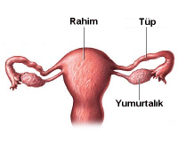
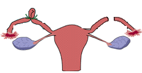

Bir kadında hamilelik oluşabilmesi için erkekten gelen sperm ile kadından gelen yumurtanın fallop tüplerinde biraraya gelmesi ve sperminyumurtayı döllemesi gerekir. Herhangi bir nedenle (enfeksiyon, ameliyat) tüplerde meydana gelen hasarlanma ve tıkanıklık kısırlığa neden olur. Benzer şekilde tüplerin geçirgenliğinin bilinçli olarak engellenmesi ise bir doğum kontrol yöntemidir ve cerrahi sterilizasyon olarak adlandırılır. Bu şekilde sperm yumurtaya ulaşamaz ve onu dölleyemez.

Tüp ligasyonu ya da tüplerin bağlanması kalıcı doğum kontrol yöntemlerinden olarak kabul edilir. Daha sonra çocuk isteği ortaya çıkrsa tüplerin yeniden açılması her zaman mümkün olmaya bilir. Tüp ligasyonuna karar verirken bu durumun mutlaka göz önüne alınması gereklidir.

**Kimler için uygundur**  
Günümüzde Amerika Birleşik Devletlerinde üreme çağındaki evli her 5-6 kadından biri tüplerini bağlatmayı tercih etmektedir. Tüplerin bağlatılmasının önünde hiç kimsede tıbbi bir engel bulunmamakla birlikte bazı durumlarda yapılması daha uygun ve avantajlıdır.

*   Ailesini tamamlamış, dilediği kadar çocuk sahibi olmuş ve bundan sonra çocuk sahibi olmayı düşünmeyen çiftler
*   Olası bir hamileliğin kadın hayatını ciddi ölçüde tehdit etmesi beklenilen ve bu nedenle hamile kalmasına kesinlikle izin verilmeyecek olan kadınlar
*   Zeka özürü gibi nedenlere bağlı olarak cinsel tacize uğrama ve hamile kalma olasılığı yüksek olan kişiler

**Kimler için uygun değildir**

*   Henüz ailesini tamamlamamış çiftler
*   Ailesini tamamladığını düşünse bile 30 yaşın altındaki kadınlar
*   Üreme çağında olup eşiyle problemleri olan kişiler (Boşanma ve ileride başka biri ile evlenme olasılığı nedeniyle)
*   Eşini tam anlamı ile kalıcı doğum kontrol yöntemine ikna edememiş kadınlar

başka bir doğum kontrol yöntemini tercih etmelidirler.

**Avantajları**   
Tüplerin bağlanması kullanıcıdan bağımsız olarak yüksek oranda kalıcı koruma sağlaması açısından uygun kişilerde en avantajlı doğum kontrol yöntemidir. Tüpler bağlı olduğunda hamile kalma korkusu olmadığından cinselliğin daha verimli yaşanmasına yardımcı olabilir. Koruyuculuğu hemen başlar ve ömür boyu sürer

**Dezavantajları**  
Kalıcı bir yöntem olması ve geri dönüş olasılığının düşük olması en önemli dezavantajıdır. Öteyandan eşlerin her ikisinin de yazılı onayının gerekmesi bir başka dezavantajdır

**Etkinliği**   
Tüplerin bağlanması teorik olarak %100 koruma sağlamakla birlikte pratikte bu koruyuculuk daha düşüktür. İşlemin başarısız olma olasılığı 1000’de 4’tür. Tüpleri bağlı olan bir kadında adet gecikmesini takiben gebelik testi pozitif olduğunda bunun bir dış gebelik olmadığı mutlaka gösterilmelidir.

**Tüpleri bağlanan bir kadın bir daha hamile kalamaz mı?**  
Teroik olarak hayır. Ancak tüpler bağlanırken uygulanan tekniğe bağlı olarak mikrocerrahi işlemler ile tüpler yeniden açılabilir. Ancak bu operasyonların hem etkinliği düşüktür hem de maliyeti yüksektir. Tüpleri bağlanmış olan bir kadın yeniden çocuk sahibi olmak istediğinde en uygun yöntem tüp bebek uygulanmasıdır. Ancak tüp bebek uygulamalarında da gebelik şansının %100 olmadığı akılda tutulmalıdır. Artan kadın yaşı ile birlikte hamilelik şansı da giderek azalmaktadır.

**Ne zaman yapılabilir**  
Tüp ligasyonlarının çoğu sezaryen operasyonları sırasında yapılır. Ancak bu kural değildir. Laparoskopi ile her yaşta ve dönemde yapılabilir. Ancak sezaryen dışı zamanlarda yapıldığında gebelik testi yapılarak bir hamilelik olmadığı gösterilmelidir. Hamilelik şansını en aza indirmek için tercihan adet kanamasını takip eden ilk günlerde yapılmalıdır.

**Nasıl yapılır?**  
Bugüne kadar tanımlanmış pekçok tüp ligasyonu tekniği mevcuttur. Tüplerin etrafına sıkı bir plastik halka geçirilebilir, tüplerin süpürgemsi ucu (fimbria) cerrahi olarak çıkarılabilir, tüp yakılıp ortası kesilebilir ya da tüp ortasından bir parça çıkartılarak kalan uçlar bağlanabilir. En son tarif edilen teknik Pomeroy tekniği olarak adlandırılır ve en sık kullanılan tekniktir.

Laparparoskopi genelde son derece basit ve ayaktan yapılan bir işlem olmakla birlikte genel anestezi altında yapılır.Yaklaşık 15 dakika süren işlem sonrası hastanede yatmak gerekmez, 3-4 saatlik dinlenme sonrası hasta evine gidebilir. Takiben 1 günlük dinlenme genelde yeterlidir. İşlem sonrası ilk 24 saat ağızdan ağrıkesici almayı grektirecek şiddette ağrı olabilir.

**Yan etkileri**  
Tüplerin bağlanması işleminin herhangi bir yan etkisi yoktur. Adet düzeninde genelde bir değişikliğe neden olmaz. Cinsel yaşantı açısından hiçbir olumsuz etkisi yoktur

**Riskler**  
Genel anestezi ve laparoskopiye ait riskler dışında ek bir risk taşımaz
