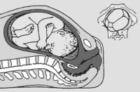
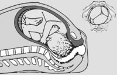
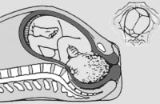
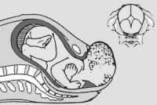
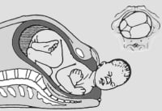
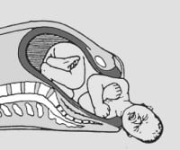

Doğum eylemi anne adayı açısından fiziksel olduğu kadar psikolojik de bir olaydır. Bebek açısından bakıldığında ise doğum olayı anneyle kıyaslandığında çok daha güç ve karmaşıktır.Bebek dünyaya gelmek için nispeten dolambaçlı sayılabilecek doğum kanalından geçmek zorundadır. Bu kanalın çaplarına kendi kafa çaplarını uydurmak için bazı hareketler yapması gerekir. Ayrıca doğum kanalında ilerlerken karşılaştığı dirençler ile başa çıkmak amacıyla pozisyon değişiklikleri yapar.Bu hareketler doğumun kardinal hareketleri (ya da esas hareketleri) olarak adlandırılır. Ne anne adayı ne de doğumu izleyen doktor bu hareketler üzerinde etkili değildir. Kardinal hareketlerin tek sorumlusu yolcu yani bebektir.

Doğum eylemi başlamadan önce bebeğin kafası rahim içinde ve kemik yapının dışında bulunur. Bir başka deyişle bebeğin kafası amniyon sıvısı içinde yüzmektedir. Böyle bir durumda doğum sancıları başlasa bile bebeğin doğması mümkün değildir. Bebeğin kafası yukarıdayken su kesesi açıldığında kenardan kordon sarkabilir ve bu oldukça tehlikeli bir durumdur. Bebeğin sorunsuz bir şekilde doğabilmesi için kafanın aşağıya, kemik yapı içine girmesi gerekir.

**Doğumun birinci esas hareketi: ANGAJMAN**

Angajman kelime anlamıyla bağlanmak demektir. Doğum bilimi açısından balıldığında ise bebeğin başının en geniş yan çapının kemik çatı girimini geçmesini ifade eder. Doğumun ilk hareketi angajmandır. Babeğin iki yandan gelen kafa kemikleri ortada birleşir ve bu eklem sagital sütür olarak adlandırılır. Normal bir angajmanda sagital sutur tam ortada olmalıdır.Böyle bir durumda başın sinklitik olduğundan söz edilir. Eğer bebeğin başı doğum kanalına girdiğinde kafası hafif yana doğru eğikse yani sagital sütür tam ortada değil de önde ya da arkadaysa bu durumda asinklitismus mevcuttur. Doğumun ilerleyişi sırasında budurum düzelebilir. Eğer düzelmez ise bebek doğum kanalında ilerleyemez ve eylem uzayabilir. Böyle bir durumda baş pelvis uygunsuzluğu nedeni ile doğumun önünde mekanik bir engel oluşabilir.

**İniş (DESENSUS)**  
Normal doğumun ikinci esas hareketi bebeğin doğum kanalı içinde aşağıya doğru ilerlemesidir. Bu iniş desensus olarak adlandırılır. Fetal iniş tek bir hareket olmayıp eylemin ikinci evresi boyunca devam eden bir sürekliliktir. Kadın tipi bir pelvite girimin ön arka çapı enine olan çaptan daha kısadır. Bu nedenle bebek başı angaje olurken pelvise kafasının enine çapıyla girer. Yani bebeğin yüzü annenin sağına ya da soluna gelecek şekilde olur.Doğum ilerlerken iniş devam eder ve bebeğin doğum yolunda bulunduğu yer muayeneler sırasında değerlendirilir. Doğum kanalının orta noktası her iki yanda dikensi çıkıntıların bulunduğu bölümdür. Bebeğin kafası bu seviyeye geldiğinde sıfır noktasında olarak tanımlanır. Bu noktanın üstü -1,-2, -3 altı ise +1, +2, +3 noktaları olarak tanımlanlamaktadır. Önde gelen kısım 0 noktasına ulaştığında genelde başın en geniş çapı da pelvis girimindedir ve angajman olmuştur. Ancak burada dikkat edilmesi gereken nokta bebeğin kafa derisinde görüebilecek olan ödemdir. Bos olarak adladırılan ve normalde görülen bu durumun varlığında bebeğin kafa derisi ile kemik yapılar arasında 2-3 santimetre fark olabilir ve aslında kafa angaje olmadığı halde muayenede angaje gibi hissedilebilir.

**Fleksiyon**

Doğumun üçüncü esas hareketi fleksiyondur. Fleksiyon bebeğin kafasını önüne doğru eğmesidir. Rahim kasılmaları ve bebeğin aşağı doğru itilmesi sırasında karşılaştığı yumuşak doku direnci ile bebek kafasını öne doğru eğer ve çenesini göğsüne yaklaştırır. Bu sayede bebeğin kafasının en küçük çapı olan ense kökü ile alnı arasındaki düzlem pelvis içine girer.

**İnternal rotasyon**  
Doğumun dördüncü esas hareketi internal rotasyondur. Burada bebek kafasını yandan öne doğru çevirmeye başlar. İnernal rotasyonun amacı kafanın en küçük çapını pelvisin en küçük çapına uydurmaktır. Dikensi çıkıntılar arası çap pelvisin en küçük çapıdır.Bu nedenle bebek kafasını buraya uydurabilmek için yüzünü içeri doğru çevirmek zorundadır.Öte yandan pelvis giriminin eni boyundan büyükken çıkımda tam tersi söz knusudur ve ön arka çap enine olan çaptandaha büyüktür. Bu durum internal rotasyon gerekliliğinin bir başka nedenidir. Yandaki resimde bebeğin kafasında oluşmaya başlayan ödem görülebilmektedir. Bebek kafasını çevirirken bunu genelde yüzü arkaya gelecek şekilde yapar. Eğer yüz öne doğru dönerse occiput posterior durumu söz konusu olur. Yani bebeğin kafatasının en arkasındaki kemik annenin kuyruk sokumunun hemen önündedir. Bu durum zor doğuma neden olabilir.

**Ekstansiyon**

Doğumun beşinci esas hareketi kafanın yukarıya doğru kaldırılması yani ekstansyondur. Burada bebek çenesini göğsünden uzaklaştırmaktadır. Taçlanma gerçekleşip bebek doğmaya hazırlandığında boynunun hemen arkasında yer alan annenin kemiğinden kurtulmasının tek kolay yolu budur.. Ekstansiyon hareketi sırasında bebeğin önce kafasının tepesi daha sonra da yüzü ve çenesi doğar. Yüzün öne doğru bakması yani yukarıda tarif edilen occiput posterior durumunda bebeğin neden rahtlıkla doğamayacağı yandaki resime bakıldığında kolaylıkla tahmin edilebilir.

**Eksternal rotasyon**  
Bebeğin kafası doğduktan sonra doğum eyleminde kısa bir duraklama olur. Bebeğin kafası doğduğunda yüzü arkaya doğru bakmaktadır. Çünkü kafası doğum kanalından en kolay bu şekilde çıkabilir. Oysa omuzlarının da rahatlıkla doğabilmesi için yüzünün ya sağa ya da sola doğru bakması gereklidir. İşte bebeğin kafasını bu şekilde yana çevirmesi eksternal yani dış rotasyon olarak adlandırlır ve bu olay doğumun 6. kardinal hareketidir. Çoğu zaman bu döndürme işlemini bebeğin kendisi değil doğumu gerçekleştiren doktor yapar. Bu aşamada en tehlikeli durum omuz takılmasıdır. Bebeğin kafası doğduktan sonra omuzlarının doğması için alan yeterli olmadığında omuz önde annenin iki kemiğinin birleşim alanı olan simfizisde takılabilir. Bu durum genelde iri bebeklerde ortaya çıkmakla birlikte annenin kamik çatısına bağlı olarak nadiren küçük bebeklerde de görülebilir. Bu şekilde omuz takılması olan bebeklerde köprücük kemiği kırılabilir, koltuk altından geçen sinirler zedelenebilir ya da boyun kasları içinde kanama olabilir. Bu durumlar nadiren kalıcı hasara neden olup kendiliklerinden ya da bazı tedavilerin yardımıyla düzelmektedir.

**Ekspulsiyon**

Doğumun son kardinal hareketi bebeğin rahim dışına atılması yani ekspulisyondur. Eksternal rotasyon gerçekleştikten sonra doktorunuz önce bebeği aşağıya doğru çekerek öndeki omuzu doğurtur. Bu harketin hemen ardından bebek yukarıya doğru kaldırılarak arkada kalan omuz da doğurtulur. Daha sonra bebek çekilerek gövdesi ve bacakları da doğurtulunca bebeğin doğumu gerçekleşmiş olur ve doğumun ikinci evresi sona erer. Bu aşmada bebeğinizin ağlamasını duyabilirsiniz.

Bebeğin kardinal hareketleri bağımsız olmayıp birbiri ile içiçe geçmiş halde, bir süreklilik izleyecek şekildedir. Tüm bu hareketerin amacı bebeğin girinti ve çıkıntılarla dolu kanaldan sorunsuzca geçmesini sağlamak içindir. Doğumların çok büyük bir kısmında bu aşamalar sorunsuz bir şekilde aşılır. Normal doğum doğanın mucizelerinden birisidir.

Tüm bu aşamaları öğrendikten sonra doğumun aslında anne adayı mı yoksa bebek açısından mı daha yorucu olduğuna karar vermekte zorlanabilirsiniz. 🙂
