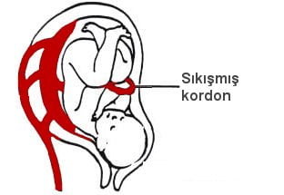

Eğer doğum eylemi sırasında göbek kordonu çok fazla sıkışır ya da gerilirse içinden geçen kan akımı azalacaktır. Bu durumda bebeğe giden oksijen de azalır. Bebeğin buna ilk tepkisi kalp atım hızında bir azalmadır. Kasılma geçip de rahim gevşediğinde kordon üzerindeki baskı da kalkacağından kalp atım hızı normale döner. Bu duruma deseleresyon adı verilir.

Kordon sıkışması normal doğumlarda çok sık rastlanılan bir durumdur. Özellikle kordonun kısa olduğu, boyuna dolandığı ya da üzerinde gerçek düğüm olan olgularda daha sık görülür.

Amniyon sıvısının az olması ya da bebeğin iri olması da kordon sıkışması aşısından risk grubu oluşturur.

Normalde bebeğin kalp atım hızı dakikada 120-160 arasındadır. Hız dakikada 100 atımın altına düşer ve birkaç dakika içinde normale dönmezse bazı önlemler almak gerekir. Anne adayı sol yanına döndürülür ve oksijen verilir. Genelde bebekler bu durumdan kolayca kutulurlar. Deselerasyonların birkaç dakikadan uzun sürmesi ya da oksijene yanıt vermemesi durumunda bebeği riske atmamak için sezaryene karar verilir.
