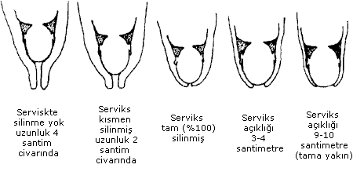
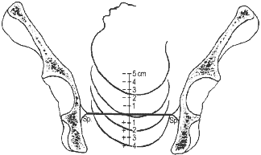
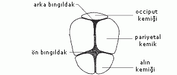
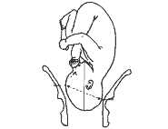
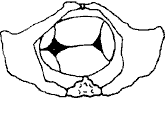
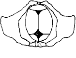

Doğum tüm insanları büyüleyen bir olaydır. Televizyonda ya da gerçek yaşamda bir canlının dünyaya gelişine tanıklık etmek zaman zaman o olayı yaşamak kadar heyacan uyandıran bir durumdur. Bir canlının içinden yeni bir canlının çıkışını anlayabilmek ancak oluş mekanizmasını kavrayarak mümkün olabilir.

Normal doğum pekçok işlemin birarada sürdürüldüğü bir fonksiyondur. Rahimin kasılması, kasılmalarla birlikte rahim ağzının incelme ve açılması, bebeğin o dar kemik tünele kendini uydurarak içinden geçişi ve dünyaya gelişi doğanın mucizelerinden birisidir.

Pekçok insan bu oayın nasıl geliştiğini anlamakta güçlük çeker. Oysa doğum basit bazı fizik kurallarının insan fizyolojisine yansıması gibidir. Kapalı bir yerde bulunan bir nesnenin dışarıya çıkabilmesi için dış dünyaya açılan bir kapıya gerek vardır. Bu kapı rahim ağzıdır.

Normalde tüm gebelik süresince bebek rahim içinde dış dünya ile temas etmeden gelişir. Doğum zamanı geldiğinde rahim ağzı açılarak bebeğin çıkışına olanak tanır. Rahim ağzındaki bu açılma efasman ve dilatasyon olarak adlandırılır.

Efasman rahim ağzının incelmesi ya da bir başka deyişle kısalması, dilatasyon ise açılmasıdır.

İlk resimde rahim ağzı yani serviks tamamen kapalı ve uzundur. Uzunluğu yaklaşık 4 santimetre kadardır. Doğum zamanı yaklaştığında serviksin dokusu içinde bulunan su miktarı artar, serviks yumuşar ve öne doğru dönmeye başlar. Bazen fark edilen bazen de fark edilmeyen kasılmaların etkisiyle bu incelme giderek artar. Serviksteki efasman yüzde olarak ifade edilir. İlk resimde %100 olan efasman ikinci resimde %50 olmuştur. Doğum eylemi ilerledikçe kasılmalar ve bebeğin uyguladığı basınç sonucu üçüncü resimde efasman tam yani %100 olmuştur. Bu aşamada serviks neredeyse bir kağıt kadar incelmiştir. Servikste incelme devam ederken bir yandan da açılma başlar. Dördüncü resimde 3-4 santimetre olan açıklık kasılmaların etksisi sonucu bebeğin başının baskısıyla beşinci resimde 8-9 santimetreye ulaşmıştır. Bundan sonraki aşamada ise bebeğin kafasının en geniş çapı ile aynı uzunluğa ulaşır. Tam açıklık olarak adlandırılan bu durum yaklaşık 10 santimetreye denk gelir.

Açıklık 3-4 santimetre oluncaya kadar geçen süre doğumun birinci evresinin latent fazı olarak adlandırılır ve bu aşamada ağrıların sıklığı ve şiddeti çok fazla değildir. Daha sonra ise aktif faz başlar ve kasılmaların hem sıklığı hem de şiddeti giderek artar.

Rahim ağzı incelip açılırken bebeğin başı da yavaş yavaş aşağıya doğru inmeye başlar.

Bu iniş sırasında her iki yandaki kemik çıkıntılara ulaşıldığında bebek sıfır pozisyonunda olarak tarif edilir. Bebeğin başının 0 noktasına ulaşması angaje olduğu yani doğum kanalına girdiğini belirler.

Doğumu etkileyen önemli noktalardan birisi de bebeğin başının doğum kanalındaki duruşudur. Normalde bebeğin çenesi göğsüne dayalı durumdadır. Buna fleksiyon adı verilir. Doğum kanalından geçtikten sonra bebeğin kafası vajina çıkışına ulaştığında bebek çenesine dayalı olan göğsünü geriye doğru atarak yani defleksiyon yaparak doğar. Bu işi becerebilmesi için en ideal pozisyon yüzü annenin arkasına bakar durumda doğum kanalına girmesidir. Böyle bir durumda kafasının arkasında yer alan occiput adlı kemik annenin önünde olacak ve bebek kafasını defleksiyona getirerek kolaylıkla vajinadan çıkabilecektir. Occiptun arkada olması yani bebeğin yüzünün annenin önüne bakması durumunda ise bebek doğabilmek için çenesini daha çok göğsüne yaklaştırmak zorunda kalacaktır. Zaten fleksiyonda olması nedeni ile böyle bir durumda doğum çok zor olabilecektir.

Annenin vajeninden bakıldığında doğum anıunda bebeğin başının ideal duruşu yukarıdaki resimde görülmektedir. Burada alın annenin arkasında occiput kemiği ise önündedir. Bebek kafasını arkaya doğru atarak yani defleksiyon yaparak kolayca doğar. Alttaki resim incelendiğinde olayı anlamak biraz daha kolay olabilir.Bebeğin buradan çıkmak için başını arkaya doğru kaldırması gereklidir. Başka türlü çıkması çok zordur.

Bebek angaje olurken genellikle kafası ön arka pozisyonda değil yan şekilde doğum kanalına girer. Eylem ilerlerken ve bebek aşağıya doğru inerken kafasını da çevirir ve occiput kemiği annenin önüne ya da arkasına gelir.

Angaje olduğunda kafanın vajinadan görünüşü

Doğum anında kafanın duruşu

Bebeğin doğum eylemi sırasında yaptığı bu hareketler eylemde bebeğin kardinal hareketleri olarak adlandırılır.
