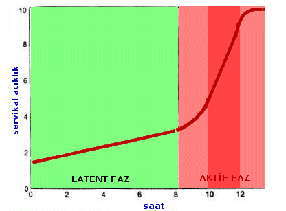

Bir bebeği vajina yoluyla uterus yani rahim içinden dış dünyaya gönderme amacıyla kadın vücudundaki değişik organların birarada yürüttüğü çabaya eylem ya da travay adı verilir. İdeal ve uygun bir eylemin sonucu bebeğin doğmasıdır.

Başarılı bir doğumun gerçekleşmesi için bebeğin içinde bulunduğu ve gelişimini tamamladığı rahimin dışına çıkması gerekir. Bunun için ise tüm hamilelik seyri boyunca kapalı duran rahim ağzının açılması ve rahimin içindeki bebeği bu açıklıktan vajinaya ve oradan da dış dünyaya itmesi gerekir.

Bu mucizevi olay belirli bir sırayı takip eden aşamalar halinde gerçekleşir. İlk önce rahim ağzı açılmaya ve incelmeye uygun hale gelmelidir. Normalde arkaya doğru dönük olan rahim ağzı yavaş yavaş öne doğru dönmeye başlarken içerdiği su miktarı artar ve yumuşar. Bu aşamada rahim ağzı ile rahim iç boşluğu arasındaki kanalı kaplayan sümüğümsü salgı vajinadan dışarı akabilir. Bu olay halk arasında nişan gelmesi olarak adlandırılır.

Temel hazırlıklar gerçekleştikten sonra ise rahim ağzının açılması ve bebeğin dışarı atılması için ana faktör olan rahim kasılmaları ile birlikte doğum eylemi başlar. Doğum eyleminin 3 klinik evresi vardır.

*   1\. evre rahim kasılmalarının başlamasından rahim ağzının bebeğin kafasının geçişine izin verecek kadar açılmasına ve incelmesine kadar geçen süredir. Bu açıklık 10 santim olarak kabul edilir.
*   2\. evre rahim ağzının tam açık olmasından bebeğin doğumuna kadar geçen süreyi ifade eder
*   3\. evre ise bebeğin doğumundan plasenta ve zarların tamamen rahim dışına atılmasına kadar geçen süredir.

**Doğumun 1. evresi**  
Doğumun birinci evresi rahim ağzının açılması ve incelmesi aşamasıdır. Bu evre doğum eyleminin en uzun dönemidir. Amaç rahim ağzının bebeğin kafasının geçmesine izin verecek kadar açılması ve aynı zamanda incelmesidir. Açıklık dilatasyon, incelme ise efasman olarak adlandırılır. Bu incelme ve açıklığı sağlamanın tek yolu bebeğin içeriden baskı yapmasıdır. Bunu sağlamanın yolu da yukarıdan belirli aralıklarla ve belirli bir güçle bebeği itmektir. Bu itme rahim kasılmaları ile gerçekleşir.

Rahim temel olarak kas dokusundan oluşmuştur. Bu kaslar rahimin tepe noktasından başlayarak güçlü şekilde kasılırlar ve aşağıya doğru bir basınç oluşturular. Bu kasılmalar anne adayı tarafından ağrı olarak hissedilirler ve doğum sancısı olarak adlandırılırlar.

Doğumun birinci evresi de kendi içinde bölümlere ayrılır. Eylemin başlamasından rahim ağzının 3-4 santim açılmasına kadar geçen süre latent evre olarak adlandırılır. Latent evrede kasılmaların sıklığı ve şiddeti nispeten daha azdır. İlk başlarda 15-30 dakika aralıklarla gelen ve 15 saniye süren kasılmaların sıklığı ve şiddeti giderek artar. 4 santim açıklıktan tam açıklık olmasına kadar geçen süre ise aktif fazdır. Aktif fazın sonlarına doğru kasılmalar 1-2 dakikada bir gelir ve bazen 1 dakika kadar sürebilir.

Doğumun birinci evresi genelde ilk doğumunu yapanlarda 12 saat, ikinci ya da daha sonraki doğumlarda ise 6-8 saat sürer.

Bununla birlikte birinci evre bir saatten daha kısa ya da 24 saatten daha uzun da sürebilir. Bu süreyi etkileyen faktörler şunlardır:

*   Anne adayının daha önce doğum yapmış olması
*   Rahim kasılmalarının sıklığı, şiddeti ve uzunluğu
*   Serviksin kısalma ve açılma yeteneği
*   bebek ile annenin çatısı arasındaki oranlar
*   Bebeğin ve önde gelen kısmın duruşu

**Doğumun birinci evresinde sizi neler bekliyor  
**Doğum eyleminin başladığına yapılan muayene ve monitör incelemesi ile karar verilir. Monitörde düzenli rahim kasılmalarının izlenmesi siz herhangi bir ağrı hissetmeseniz bile eylemin başladığı şeklinde yorumlanır. Muayenede ise rahim ağzında açıklık ve incelme olması tanıyı destekler. Bazı durumlarda hiçbir belirti olmasa bile rutin muayenede rahim ağzında 1-2 santimetre açıklık saptanabilir.

Doğum eyleminin başladığına karar verildiğinde artık hastaneye yatmanız gerekmektedir. Odanıza alındığınızda hemşireler tarafından gerekli kayıtlar tutulurken aynı zamanda tüm doğum eylemi boyunca size eşlik edecek olan monitör bağlanır. Monitörde hem bebeğinizin kalp atımları izlenir hem de rahim kasılamalarını şiddeti ve sıklığı değerlendirilir. İdeal olan tüm doğum eylemi süresince ve özellikle aktif faz başladıktan sonra monitörizasyona devam etmektir.

Monitör karın cildiniz üzerinize yerleştirilen iki probdan oluşur. Doğum takipleriniz sırasında yapılan NST incelemesi ile aynıdır. Problardan birisi rahim kasılmalarını kaydederken diğeri bebeğin kalp atım hızını kaydeder. Her iki veri de kağıt üzerine kaydedilir. Kasılmalar sırasında kalp atım hzıında meydana gelen değişiklikler bebeğin sıkıntıda olup olmadığı hakkında fikir verir.

Bu aşamada doktorunuz yeniden dikkatli bir muayene yaparak bebek ile kemik çatınız arasında bir uyumsuzluk bulunup bulunmadığını ve normal doğuma engel olabilecek bir durumun olup olmadığını değerlendirir.

Herşeyin yolunda olduğu ve normal doğuma engel olabilecek bir durumun bulunmadığı saptandıktan sonra barsaklarınızın son kısmında birikmiş olan dışkıyı boşaltmak amacıyla lavman yapılır. Lavman normal doğumda yapılması gereken bir uygulamadır. Bu işlem aynı zamanda doğum eylemini hızlandırma gibi bir fonksiyona da sahiptir. Lavmandan sonra yatağınıza alındığınızda damar yoluaçılarak serum takılacaktır. Bu işlem acil bir durum varlığında zamanında müdahale etmek açısından son derece gerekli ve önemlidir.

Doğum sancılarının sıklığı ve şiddeti yeterli değilse damar yolu ile suni sancı verilebilir. Eğer epidural katater takılacak ve ağrısız doğum gerçekleştirilecek ise bu işlem sancılar etkin hale geldikten yani latent faz geçildikten sonra (4 santim açıklığa ulaşıldıktan sonra) yapılır. Suni sancı uygulanması durumunda ya da sancıların sıklığı, şiddeti ve uzunluğunun uygun olduğu saptandığında epidural katater rahim ağzı açıklığına bakılmaksızın takılabilir.

Doktorunuz hem eylemi etkinleştirmek hem de amniyon sıvısında bebeğin dışkısının olup olmadığını görmek amacıyla muayene sırasında su kesenizi açabilir. Bu işlem sırasında ağrı ve acı duymazsınız. Su kesesinin açılması eylemin süresini kısaltmaktadır.

Eylem takibi sırasında doktorunuz belirli aralıklarla muayene ederek rahim ağzı açıklığını, silinmeyi, bebeğin başının pozisyonunu inceler ve bir problem olup olmadığını değerlendirir. Silinme ya da efasman rahim ağzı uzunluğunun eylem öncesi dönemdeki uzunluğuna göre kıyaslamasıdır. Örneğin uzunluk yarı yarıya azaldığında %50 silinme, tam olduğunda ve rahim ağzı kağıt gibi inceldiğinde ise %100 efasmandan söz edilir.

Muayenelerde bebeğin başının aşağıya doğru inip inmediği de değerledirilir. Kasılamaların yeterli güçte ve şiddette olmasına karşın bebeğin başının inmemesi bir problem varlığına işaret eder.

Muayeneler ilk başlarda kasılmaların durumunda göre 1-2 saatte bir olurken sonlara yaklaşıldığında daha sık aralıklarla yapılır.

Doğumun birinci evresinde bebeğin kalp atım hızında belirgin azalma olması bir tehlike işareti olabileceğinden uyanık olmak gerekir. Bu nedenle ideal olan sürekli monitörizasyondur. Ancak dönem dönem doktorunuz monitörün çözülmesine ve dolaşmanıza izin verebilir.

Rahim kasılmaları mide boşalmasını geciktirir. Bu nedenle yenilen katı gıdalar uzun süre midede kalacağından kusma söz konusu olduğunda mide içeriğinin akciğerlere kaçması olasılığı vardır. Bu nedenle doğumun birinci evresinde genel olarak katı yiyecekler yemeniz önerilmez. Ancak doktorunuzun onayı ile yoğurt, çorba gibi yumuşak gıdalar alabilirsiniz. Aşırıya kaçmamak şartıyla su içmenizde bir sakınca yoktur.

Serviks silinmesi tam, açıklığı 10 santimetre olduğunda doğumun en uzun evresi olan birinci evre sona ermiştir. Anne adayı daha sonra doğumhaneye alınır.

Özetleyecek olursak doğumun birinci evresinde yaşayacağınız olaylar şöyledir:

*   Doğum eyleminin başladığına karar verildiğinde hastaneye yatışınız gerçekleşir.
*   Lavman yapılarak barsakların son kısmı boşaltılır
*   Damar yolu açılarak sıvı verilir
*   Rahim kasılmaları ile bebeğin kalp atımları monitörize edilir.
*   Ağrıların durumuna göre damar yolundan suni sancı ile destek yapılabilir.
*   Kasılmalar düzenli hale geldikten sonra ya da açıklık 4 santimetreye ulaştığında epidural kateter takılır.
*   Eğer kendiliğinden açılmadıysa su keseniz doktorunuz tarafından açılabilir.
*   İlk başlarda 1-2 saatte bir daha sonra daha kısa aralıklarla muayene yapılarak durum değerlendirilir.
*   Zaman zaman monitör çözülerek dolaşmanıza izin verilebilir.
