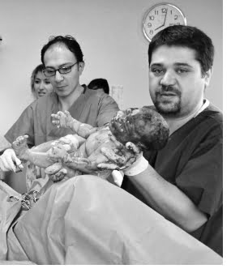
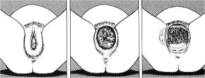
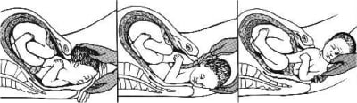

Doğum denildiğinde hemen herkesin aklına sancıların çok yoğun şekilde yaşandığı, ağrıların en kuvvetli ve en uzun olduğu birinci evre gelir.

Gerçekten de bu dönem kimi anne adayları için oldukça zor geçer. Doğumun birinci evresi anne adayının kendisinin doğum eylemi üzerinde etkisinin olmadığı bir dönemdir. Rahim ağzının 10 santim açılması bir başka deyişle tam açık olması ile bu evre sona erer.

Bu aşamada bebek artık kendisini dış dünyaya taşıyacak kanalın içinden başarı ile geçecek hareketleri yapacaktır. Kemik çatı ya da pelvis olarak adlandırılan bu kanal düz değildir. Pekçok kıvrım, girinti ve çıkıntı içerir. Bebek buradan geçebilmek için kendini bu girinti ve çıkıntılara uydurmak amacıyla bazı hareketler yapar. Bu hareketler doğumun kardinal hareketleri olarak adlandırılır. Bebeğin kafatasını oluşturan kemikler erişkinlerdeki gibi sabit olmayıp hareket etme yeteneğine sahiptir. Bu özellik bebeğin kafası doğum kanalından geçerken kemiklerin bir miktar birbiri üzerinde kayması, bu şekilde kafanın şeklinin doğum kanalına uyması ile sonuçlanır ve bebek doğum kanalından geçerek dış dünyaya çıkabilir.

İkinci evre ile birlikte anne adayının doğuma etkli olduğu zaman başlamıştır.İkinci evrenin başlaması ile birlikte doğum sancıları yani kasılmalar da karakter değiştirir. Araları açılır ve şiddetleri azalır. Anne adayı artık iyice yorulmuş hatta bazı durumlarda tükenme sınırına gelmiş olabilir. Bebeğin başı artık vajina içerisindedir ve doğuma çok yaklaşmıştır. İşte bu aşamada doğumunuzu yaptıracak olan doktorunuz sizden çok önemli bir yardımda bulunmanızı isteyecektir: **IKIN**.

Doğum esnasında doktorunuzdan en çok duyacağınız söz budur. Ikınma hissi bebeğin başının bir grup sinir yumağı üzerine yaptığı baskıdan kaynaklanır. Buna **Fergusson Refleksi** denir. Tıpkı barsağın en son kısmı olan rektum dolduğunda tuvalete gitme ihtiyacı duyduğunuz gibi bebeğin başı da rektuma bası yaptığında aynı şekilde bir his ortaya çıkar. Bu his ağrısız doğum durumunda büyük ölçüde kaybolur ve anne adayı ne zaman ıkınacağını fark edemeyebilir. Bu durumda hekimin hastanın yanında olarak kasılmaları eli ile ya da monitör ile saptaması ve kasılmanın en kuvvatli anında anneyi ıkındırması gerekir.

Tam açılma olduktan sonra bir süre kasılma olmaz. Bu süre 1 saate kadar uzayabilir. Bu zaman zarfında yorgun olan anne adayı biraz dinlenme ve soluklanma fırsatı bulur. Doğumun ikinci evresinde anne adayının başının hafif yukarıda olduğu durumlar yerçekimi gücünden de faydalanmak açısından önemlidir. Ikınma esnasında güç almak için pekçok doğum masasında tutacak saplar ya da ayak pedalları vardır.

Bazı hekimler ise bu evrede hastayı doğum masasında yatırmak yerine çömeltmek veya özel sandalyelere oturtmayı tercih ederler. Ülkemizde eskiden yaygın olarak uygulanan, günümüzde ise kullanılmayan başka bir yöntemde anne adayının tavandan sarkıtılan bir ipe tırmanmaya çalışmasıdır. Bütün bu teknikler teorik olarak doğru ve mantıklıdır.Bu aşamada yana dönük olarak yatmak önerilmez.

Doğru ve etkili ıkınmak için dikkat edilmesi gereken bazı kurallar vardır. Sancı en yüksek noktaya ulaştığında alınabildiği kadar derin bir nefes alınır. Baş öne doğru kaldırılır ve çene göğüse değdirilmeye çalışılır. Kabaca tanımlamak gerekirse vücut geniş bir C şeklini almalıdır.Ağız ve burundan hava ve ses kaçmayacak şekilde bütün güç ile sanki dışkı yapıyormuşcasına ıkınılır. Bu aşamada bağırmak, ciğerlerdeki havayı dışarı kaçırmak ya da sadece boğazı şişirmek anne adayının kendini yormasından başka hiçbir işe yaramaz. Ikınmanın amacı bebeği aşağıya doğru itmektir. İki kasılma arasında anne adayının dinlenmesi gerekir. Bu aşamada bir sonraki kasılma sırasında etkili bir şekilde ıkınabilmek için enerji toplanmalıdır. Bu amaçla derin derin nefes alınıp verilmesi gerekir. Doktorunuz duruma göre bu aşamada size maske ile oksijen verebilir.

Epidural ile ağrısız doğum yapacak olan bir anne adayı kasılmaları sancı olarak hissetmediği için etkili bir şekilde ıkınamayabilir. Eğer anne adayı etkili bir şekilde ıkınamıyor ise veya ıkınmaları yetersiz ise ve bebeğin kalp sesleri düşmeye yani kalp atım hızı yavaşlamaya başlıyor ise bu durumda doğumu çabuklaştırmak için üçüncü bir şahıs yukarıdan annenin karnına bastırabilir. Buna Kristeller manevrası adı verilir. Eğer bu manevraya rağmen doğum gerçekleşmez ise ve bebeğin kalp sesleri düşmeye devam eder ise vakum ya da forseps takılması gerekebilir.

Her kasılma ve ıkınma ile birlikte bebeğin başı biraz daha aşağıya iner. Kasılmalar sırasında bebeğin kalp atım hızında geçici azalmalar olması normaldir. Ancak bu düşüşler devamlılık gösteriyor ise bebek sıkıntıya girebileceğinden dikkatli olunması gerekir.

Bebeğin başı aşağıya doğru ilerledikçe saçları da vajina kanalında görülmeye başlar. Kasılma sona erdiğinde baş tekrar biraz yukarı gider ama genelde her seferinde eskisinden biraz daha aşağıda kalır.

Bebek çıkıma yaklaştığında her kasılma ile birlikte kafası vajina ile makat arasında kalan perine kısmını germeye başlar. Vajina yan duvarları bebeğin kafasının tepe noktasını bir taç gibi sarar. Bu olaya taçlanma adı verilir. Doğum artık çok yakındır. Taçanma gerçekleştiğinde eğer doktorunuz gerek görür ise epizyotomi açabilir.

**Taçlanma**

Bebeğin kafası artık iyice çıkıma geldiğinde doktorunuz dışarıdan, perine bölgesinden bebeğinizin çenesini kavramaya çalışır. Bu sırada sizin sürekli ve güçlü bir şekilde ıkınmanız istenecektir. Doktorunuz bir eli ile bebeğin çenesinden iterken diğer eli ile bebeğinizin başını kavrar ve kontrollü bir şekilde doğumu gerçekleştirir. Bu aşamada doktorunuz kontrolü eline aldığında sizden ıkınmamanızı isteyecektir. Tam çıkım anında kontrolsüz bir ıkınma bebeğin başının aniden çıkmasına ve doğum yolunda yırtıklara neden olabileceğinden doktorunuzun önerilerine dikkat etmeniz önemlidir.

Bebeğinizin başı doğduktan sonra hemen ağzındaki ve burnundaki salgılar temizlenir. Daha sonra bebeğin başı sağa ya da sola dönerek omuzların doğum kanalından geçmesi sağlanır. Bebek hafifçe aşağıya doğru çekilerek önce üstte kalan omuz doğurtulur.Daha sonra ise hafif yukarı doğru kaldırılarak alttaki omuz ve gövdesi doğurtulur.

**Bebeğin kafasının ve omuzlarının doğurtulması**

Bebek doğduktan hemen sonra genelde hemen daha kordonu bile kesilmeden sizin kucağınıza verilir. Bu ilk temasın çok önemli olduğuna inanılır. Pekçok anne kan ve salgılar ile kaplı bebeğini tutmaya çekinir. Oysa bunda korkulacak hiçbirşey yoktur.

Anne adayı doğumhanede sancı çekerken koridorda baba adayının volta atıp dolaşması artık sadece eski Türk filmlerinde karşılaşılan bir sahnedir. Günümüzde ise baba adayları doğumhanede doğum olayına eşlik etmekte hatta kendi bebeklerinin göbek kordonlarını kesmektedirler. Bu heyecan verici bir olay olduğu kadar ömür boyu unutulmayacak emsalsiz bir anıdır. Göbek kordonunun kesilmesi ile birlikte bebeğiniz ile aranızdaki organik bağ ortadan kalkar ve bir birey olarak kendisi soluk alıp vermeye başlar.

Bebek anne ve babasıyla tanıştıktan sonra bebek doktoru tarafından ilk muayenesi yapılır, silinir giydirilir ve yeniden annesinin kucağına verilir. Bu aşamada doğumun üçüncü evresi başlamıştır.

Özetleyecek olursak doğumun ikinci evresinde en önemli görevlerden biri anne adayına düşmektedir. Pekçok anne adayı ya başaramazsam, ya düzgün şekilde ıkınamazsam korkusu yaşarlar. Bu korkular çoğu zaman yersizdir. Ikınmak genelde bir beceriden çok doğum eyleminin normal bir parçasıdır ve siz istemeseniz de gerçekleşecektir. Doğa kendi doğum mekanizmalarını milyonlarca yıl içinde mükemmel bir şekilde geliştirmiştir. Yine de ters giden bir durum varlığında doktorunuz gerekli girişimlerde bulunacak ve bebeğinizin sağlıklı şekilde dünyaya gelmesine yardımcı olacaktır. Ancak burada unutulmaması gereken nokta hiçbir doğumun birbirinin aynısı olmadığı, kimi doğumlarda eylem son derece kısa sürerken kimilerinde ise bazen saatlerce uzayabileceğidir.
