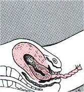

Bebeğinizin kordonunun kesilmesi ve ilk ağlaması ile birlikte tüm hamileliğiniz boyunca bebeğiniz ile sizin aranızdaki iletişim merkezi olan plasentanın da görevi sona erer. Doğumunzun bundan sonraki üçüncü ve son aşaması plasentanın doğumudur.

Bebek doğduktan sonra kasılmaların sıklığı ve şiddeti azalır. Birkaç kasılma ile birlikte plasenta yapıştığı yerden ayrılır. Doktorunuz bunu fark ettiğinde sizden son birkez daha ıkınmanızı isteyebilir. Bu ıkınma ile plasenta ve zarlar vücut dışına atılır. Plasentanın ayrılması genelde 5-30 dakika içinde gerçekleşir. Bu sürenin aşılması durumunda rahim ağzı kapanabilir ve plasentanın geçişine izin vermeyebilir. Böyle bir durumda doktorunuz eli ile rahim içine girerek tıpkı sezaryende olduğu gibi plasentayı eliyle kendisi ayırıp dışarıya alacaktır.

Plasentanın ayrılması

Plasentanın ayrılması ile birlikte bir miktar kanama olması normaldir.

Plasenta ve zarların doğumundan sonra üşüme ve titreme hissi olması normaldir.

Bazı durumlarda rahim içi tamamen boşaldıktan yeterli şekilde kasılmayabilir ve gevşek olan uterustan kanama görülebilir. Bu durumu engellemek için plasentanın doğumundan sonra kalçadan ya da damardan rahim kasıcı ilaçlar yapılır. Tüm bunlara rağmen rahim yeterli şekilde kasılmıyorsa el ile masaj yapılır.

Bazı yazarlara göre plasnetanın doğumundan sonraki ilk bir saatlik dönem doğumun dördüncü evresi olarak adlandırılır ve bu tür kasılma sorunları nedeni ile önemli bir dönemdir.

Plasenta ve zarlar da doğduktan sonra doktorunuz doğum kanalının kontrolünü yapar. Vajina duvarlarında ve perinede oluşabilecek olan yırtıkları değerlendirir ve dikiş gerekip gerekmediğine karar verir.

Eğer epizyotomi açılmış ise bu dikilir. Epidural anestezi varlığında dikişler sırasında ek lokal anestezik yapmaya genelde gerek yoktur. Dikiş işlemi çoğu zaman 10-15 dakika kadar sürer.

Dikişler de tamamlandıktan sonra genital bölge silinip temizlenir ve odanıza alınırsınız.

Bu aşamada normal doğumun sezaryene olan en önemli üstünlüğünü fark edebilirsiniz.Odanıza alındığınızda kendinizi mutlu ancak yorgun hissetmeniz normaldir.Dilerseniz hiç zaman kaybetmeden duş alabilir, üstünüzü değiştirebilir, yemek yiyebilir, ziyaretçilerinizi ve tebrikleri kabul edebilir, gezip dolaşabilir ya da yatıp dinlenebilirsiniz. Oysa sezaryen sonrasında duş almak, karnınızı doyurmak ve ayağa kalkıp dolaşmak için birkaç güne gereksiniminiz vardır.

Odanıza alındıktan hemen sonra epidural kateteriniz anestezi teknikeri tarafından çıkartılacaktır.

Doğumdan sonraki ilk 24 saati hastanede geçirdikten sonra doktorunuz ve bebeğinizin doktorunun izin vermesi durumunda taburcu olabilirsiniz.

Dikiş olması durumunda birkaç gün süreyle özellikle otururken batma hissedebilirsiniz. Eğer doktorunuz epizyotomi açmış ise büyük olasılıkla kenara doğru bir kesi yapmıştır ve dikişleriniz bu yöne doğrudur. Eğer doktorunuz solak değil ise dikişinizin sağ tarafınızda olması büyük olasılıktır. Böyle bir durumda otururken ağrılığınızı ters tarafa vermeniz bu batma ve ağrı hissini azaltacaktır.Yine de ağrılar sizi rahatsız ediyorsa doktorunuzun önerdiği ağrı kesicileri kullanmanızın hiçbir zararı yoktur.
