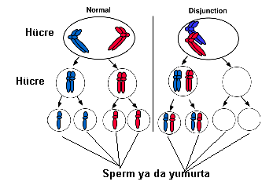
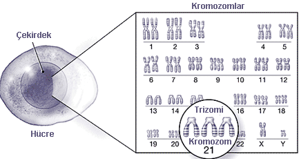

Eğer hamile iseniz bebek bekleyen anne adaylarının hepsinin en büyük ortak korkusunu çok büyük bir olasılıkla siz de yaşıyorsunuz demektir. Bu ortak korku bebeğin zeka özürlü olma olasılığıdır. Pek çok faktör bireyin zekasında rol oynar ancak bu nedelerden en iyi ve halk arasında en çok bilineni Down Sendromu ya da eski adıyla mongolizm’dir. Down sendromunun komuoyunda sık sık gündeme gelmesi ve adının geçmesi ve özellikle yaşı ileri annelerin bebeklerinde daha fazla görüldüğü bilgisi zeka geriliğini nerdeyse Down Sendromu ile özdeşleştirmiştir. Zeka özürü dışında pek çok yapısal ve fonkisyonel bozukluğu da bünyesinde barındıran Down sendromu ya da bilimsel adıyla “**_Trizomi 21_**” kromozomal bir bozukluktur.

**Tarihçe**  
Trizomi 21 ile ilgili ilk bilimsel kayıt 1866’yılına aittir. O tarihte İngiliz bilim adamı John Langdon Down bazı ortak özellikleri paylaşan ve diğerlerinden şekil olarak faklı ve zeka problemleri olan bir grup çocuğu yayınladığı makalesinde ilk kez tanımladı. Down aynı zamanda tiroid hormonu azlığına bağlı olarak görülen kretenizmden farklı bir durumun da ilk kez altını çiziyordu. Ancak kendisi çok talihsiz bir benzetme yaptı ve bu türdeki çocukları yüz yapıları nedeniyle bir uzakdoğu ırkı olan Moğollara benzeterek “**_Mongoloid idiotlar_**” olarak isimlendirdi.

Yirminci yüzyılın ilk yarısında Down sendromunun nedenleri konusunda çok fazla spekülasyon yapılmaktaydı. Bu durumun kromozomal anormalliklere bağlı olabileceği fikrini ilk kez 1930 yılında Waardenberg ve Bleyer ileri sürdüler ancak bunu kanıtlamak 1959 yılında çalışmalarını birbirinden habersiz olarak sürdüren iki ayrı bilim adamı; Jerome Lejeune ve Patricia Jacobs’a nasip oldu. Bu iki araştırmacı Down sendromunda 21. kromozomdan 2 tane olması gerekirken 3 tane olduğunu gösterdiler. Sendromun diğer nedenleri olan transloklasyon ve mozaisizmin ortaya konması ise 3 yıl daha aldı.

Bu bilgilerin ortaya konması zaten gergin ve kızgın olan Asyalı genetikçileri harekete geçirdi ve bilimsel arenada yarattıkları baskı sonucu mongolizm tanımlaması bilimsel literatürden kaldırıldı ve bunun yerine Down sendromu ismi 1970’li yıllardan itibaren kullanılmaya başlandı.

**Down sendromu nasıl olur?  
**Tüm canlı organizmalar gibi insan da hücrelerden oluşmuştur. Her hücrenin içinde tıpkı organlar gibi organel adı verilen yapılar bulunur. Bu yapıların her birinin hücre içinde farklı görevleri bulunur. Hücre organallerden biri de çekirdektir. Hücre çekirdeği içerisinde DNA yani genetik materyali barındırır. Genler bireyin kalıtsal ve diğerlerinden farklı olmasını sağlayan özelliklerini taşırlar. Belirli genler bir araya gelerek bir grup oluştururlar. Bu gruplara kromozom adı verilir. İnsanda 23 çift olmak üzere toplam 46 kromozom vardır. Bunların yarısı anneden diğer yarısı ise babadan gelir. 22 kromozom kadın ve erkelerde aynıdır.Bu kromozomlar bedensel faaliyetleri kontrol ederler ve otozomal kromozomlar olarak adlandırılırlar. 23. kromozom ise cinsiyeti belirlediğinden seks (cinsiyet) kromozomu olarak isimlendirilir. Kromozomlar belirli bazı işlemlerden geçirilerek özel mikroskoplar altında görülebilir hale getirilebilirler. Buna karyotip adı verilir. Normal bir erkeğin karyotipi 46 XY, kadının ki ise 46 XX’dir. Bir kromozom çiftindeki anneden ve babadan gelen kromozomlar aynı geni kodlarlar. Örneğin belirli bir işlevi gerçekleştiren genin 1. kromozomda olduğunu düşünelim. Bu işlev ile ilgili anneden ve babadan gelen genlerin ikiside 1. kromozom üzerinde yer alır.Bu bilgiler aynı geni kodlamasına rağmen farklı olabilirler. Bu farklılığa allel adı verilir. Örneği somutlaştırmak gerekirse göz rengi bir gendir. Ancak mavi, yeşil, kahverengi alleldir.

Hücreler bölünerek çoğalırlar. Doğada iki tür bölünme vardır. Mitoz bölünme adı verilen ilk türde bir hücreden birbirinin aynısı iki hücre ortaya çıkar. Erkekte testis ve kadındaki yumurtalıklarda yer alan üreme hücreleri dışında vücuttaki tüm hücreler bu mitoz bölünme ile çoğalırlar ve 23 çift olmak üzere toplam 46 kromozom içerirler. Testis ve overlerde ise durum farklıdır. Burada mayoz bölünme olur ve hücrelerin genetik materyalleri ikiye ayrılır. Yani sperm ve yumurta 23 çift değil 23 tek kromozom içerir. Sperm hücresi 22 otozomal kromozomla birlikte X yada Y kromozomu içerirken, kadındaki döllenmeye hazır yumurta hücresi 22 otozomal kromozom ve bir adet X kromozomu içerir. Sonuçta döllenme olup sperm ile yumurta birleştiğinde spermden gelen 23 tek kromozom ile yumurtadan gelen 23 tek kromozom birleşir ve ortaya çıkan embryoda 23 çift yani 46 kromozom olur.

Down sendromunda hücrelerde 46 değil 47 kromozom vardır ve fazla olan kromzom 21. kromzomdur. Başka bir değişle 21. kromozomdan 2 değil 3 tane vardır.

Hücre bölünmesi sırasında pekçok hata ortaya çıkabilir. Mayoz bölünme sırasında kromozom çiftleri birbirinden uzaklaşarak farklı hücrelere dağılırlar. Buna ayrılma ya da **disjunction** adı verilir. Bazı durumlarda bir çift kromozom ayrılmaz ve kromozom çifti beraberce bölünen hücrelerden birine geçer. Nondisjunction ya da ayrılmama adı verilen bu durum olduğunda bölünme sonrası ortaya çıkan hücrelerden birinde 22 kromozom varken diğerinde 24 kromozom bulunur. Eğer bu eksik ya da fazla sayıda kromozom taşıyan hücre döllenme olayına katılır ve normal sayıda kromozom içeren bir sperm ya da yumurta ile döllenirse sonuçta ortaya çıkan embryoda normalden farklı sayıda kromozom olacaktır. Ayrılmama en sık 21. kromozomda olur. 2 tane 21. kromozom içeren 24 kromozomlu bir üreme hücresi normalde olması gerektiği gibi 1 tane 21. kromozom taşıyan bir üreme hücresi ile birleştiğinde embryoda 3 tane 21. kromozom bulunacakır. Bu durum **trizomi 21** yani Down sendromudur. Down Sendromu olgularının %95’inde altta yatan neden işte bu ayrılmamadır. Tam tersi durumda hiç 21. kromozom içermeyen 22 kromozomlu bir sperm ya da yumurta normal yapıda bir sperm ya da yumurta ile birleştiğinde sadece 1 adet 21. kromozomu olan toplam 45 kromozomlu bir embryo oluşur. Buna monozomi adı verilir. Monozomi varlığında gebelik genelde düşükle sonuçlanır.

Ayrılmama en sık 21. kromozomda görülmekle birlikte 13 v 18 kromozomlarda hatta çok nadir olarak diğerlerinde de görülebilir.

Yapılan çalışmalar ayrılamamaya bağlı Down sendromu olgularının %90’ında iki tane 21. kromozom taşıyan anormal hücrenin sperm değil yumurta hücresi olduğunu göstermektedir. Yumurtada meydana gelen ayrılmamanın nedeni bilinmemekle birlikte anne yaşı ile kuvvetli bir ilişkisi vardır. Genetik bilimindeki gelişmeler konuyla ilgili pekçok araştırmanın yapılmasına da olanak sağlamıştır. Halen daha ayrılmamanın nedenleri ve zamanı ile ilgili çok sayıda araştırma devam etmektedir.

Trizomi 21 olgularının %1-4’ünde durum daha farklıdır. Fazla olan 21. kromozom serbest halde değil başka bir kromozoma eklenmiş halde bulunur. Bu duruma **Robertsonian Translokasyon**‘u (yer değiştirmesi) adı verilir. Genelde 14 ve 21. kromozomlar arasında görülür. Ondördüncü kromozomda bir kırık oluşur ve fazla olan 21. kromozom buraya yapışır. Karyotip olarak bireyde 46 kromozom olmasına karşın 14. kromozom normalden daha büyüktür. Bazen 21. kromozomun tamamı değil bir kısmı ayrışmaz ve 14. kromozoma eklenir. Bu duruma kısmı (parsiyel) trizomi 21 adı verilmektedir. Translokasyon kalıtsal olabilir bu nedenle translokasyon saptanan bireylerin anne babaları da incelenmeli, karyotip analizi yapılarak taşıyıcı olup olmadıkları belirlenmelidir.

Bir diğer Down sendromu türü de **mosaisizm**dir. Bu bireylerin hücre yapıları birbirinden farklıdır. Bazı hücreler normal sayıda kromozom içerirken, bazı hücrelerde trizomi 21 bulunur. Hücresel mosaisizmde aynı türdeki değişik hücrelerde farklı yapıda hücreler bulunur. Örneğin deri hücrelerinin bazısı normal bazısı anormaldir. Doku mosaisizminde ise farklı hücre gruplarının tamamı anormaldir. Örneğin kan hücrelerinin tamamı normalken, deri hücrelerinin tamamı anormaldir.

Bunlar dışında bir de **dengeli translokasyon** vardır. En sık görülen dengeli translokasyon varlığında bireyin 21 numaralı kromozomlarından birisi 14 numaralı kromozomlarından birsis ile birleşir. Sonuçta genetik materyal tam olmasına karşın kromozom sayısı 45’dir. Bu birey çocuk sahibi olduğunda 3 olasılık mevcuttur:

1.  Eğer bebeğe fazladan 21. kromzomu taşıyan 14. kromozom ve normal olan 21. kromozom geçer ise bebekte diğer ebeveynden gelen 1, translokasyonlu ebeveynden gelen 1 ve hatalı 14. kromozomdan gelen 1 olmak üzere toplam 3 tane 21. kromozom bulunur ve bebekte Down sendromu görülür.
2.  Eğer bebeğe hatalı 14. kromozom geçer ve 21. kromozom geçmez ise bebekte diğer ebeveynden gelen 1, translokasyonlu ebeveynden gelen 0 ve hatalı 14. kromozomdan gelen 1 olmak üzere toplam 2 tane 21. kromozom bulunur. 21. kromozomlardan birisi 14. kromozom üzerinde bulunduğundan bebek ebeveynlerinden birisi gibi dengeli translokasyon taşıyıcısı olur.
3.  Eğer bebeğe normal olan 14. kromozom ile birlikte normal olan 21. kromozm geçer ise bebekte diğer ebeveynden gelen 1, translokasyonlu ebeveynden gelen 1 olmak üzere toplam 2 tane normal 21. kromozom bulunur ve bebek tamamen normal olarak dünyaya gelir.

**Fazla kromozom olursa ne olur?**  
Kromozomların genleri taşıdığını belirtmiştik. Genler vücudumuzun işlev görmesi için gerekli maddelerin yapımını kontrol ederler. Bu işleve genin kendisini ifade etmesi (expression) adı verilir. Trizomi 21 varlığında üçüncü kez tekrarlanan genler, genin kendisini normalden fazla ifade etmesine yani **overexpression**‘a ve sonuçta bazı maddelerin gerektiğinden fazla üretilmesine neden olur.

Pek çok gen için “kendini fazla ifede etme” sorun yaratmaz. Vücudun düzenleyici mekanizmaları bu fazla ifadenin üstesinden gelebilir ancak 21. kromozom ve taşıdığı genler için durum farklıdır.

Hangi genleri taşımaktadır sorusu 21. kromozom keşfedildiği günden beri bilim adamlarının zihnini kurcalamaktadır. Yıllardır devam eden çalışmalar Down sendromunun ortaya çıkması için 21 numaralı kromozomun tamamının değil sadece bir kısmının 3 adet bulunmasının yeterli olduğunu ortaya koymuştur. Buna Down sendromu için kritik bölge adı verilir. Bu kritik bölge tek bir alan değildir Gerçekte birbirinden ayrı noktalardaki genleri ifade eder. 21 numaralı kromozomun yaklaşık 200-250 geni taşıdığı sanılmaktadır ve taşıdığı gen sayısına göre bakıldığında insandaki en küçük kromozomdur. Bununla birlikte sadece 20-50 genin Down sendromu gelişiminde rol aldığı tahmin edilmektedir. Bu genlerden hangisinin ne işe yaradığı ve Down sendromunda rol alıp almadığı spekülatiftir.

Down sendromu gelişiminde yer aldığı tahmin edilen genler şunlarıdır.

**Gen adı**

 

**Fonksiyonu veya fazlalığı durumunda görülebilecek bulgular**

**Superoxide Dismutase (SOD1)**

 

Fazlalığı erken yaşlanma ve bağışıklık sistemi bozukluklarına neden oluyor olabilir. Yaşlışığa bağlı bunama ve Alzheimer üzerindeki etkisi tartışmalıdır.

**COL6A1**

 

Fazlalığı kalp anomalilerine neden oluyor olabilir.

**ETS2**

 

Fazlalığı iskelet anomalilerine ve lösemiye neden oluyor olabilir.

**CAF1A**

 

Fazlalığı DNA sentezinde hatalara neden oluyor olabilir.

**Cystathione Beta Synthase (CBS)**

 

Fazlalığı DNA metabolizması ve tamirinde bozulmalara neden oluyor olabilir.

**DYRK**

 

Fazlalığı zeka geriliğinin nedeni olabilir.

**CRYA1**

 

Fazlalığı kataraktların nedeni olabilir.

**GART**

 

Fazlalığı DNA sentezi ve tamirinde hatalara neden oluyor olabilir.

**IFNAR**

 

Fazlalığı bağışıklık sisteminde bozulmalara neden oluyor olabilir.

Bunlar dışında APP, GLUR5, S100B, TAM, PFKL adı verilen genlerin de Down sendromu ile ilgili olabileceği düşünülmektedir. Ancak bugüne kadar hiçbir genin Down Sendromu ile olan ilişkisinin kanıtlanamadığı unutulmamalıdır.

Down sendromu ile ilgili olarak bir başka dikkat çekici nokta ise bu hastalığa sahip bireylerde çok değişik anomalilerin görülebilmesidir. Bireylerin zeka düzeyleri ve öğrenme kapasiteleri değişkendir. Bazı bebeklerde kalp anomalileri görülürken bazılarında görülmez, bazılarında epilepsi, hipotiroidi, celiac hastalığı gibi hastalıklar ortaya çıkarken bazılarında çıkmaz. Bu değişik durumların olası nedenlerinden birincisi hangi genin 3 kere tekrarladığı olabilir. Daha önce belirtildiği gibi genler allel adı verilen değişik şekillerde bulunurlar. Genin kendini fazla ifade etmesi ile ilgili olarak oraya çıkan bulgular hangi allelin fazla olduğuna bağlı olarak değişebilir. Bir diğer neden ise penetrans olarak adlandırılan durum olabilir. Eğer bir allel bazı bireylerde belirli bir durumun görülmesine neden oluyor diğerlerinde ise olmuyorsa buna değişken penetrans adı verilir ve değişken penetrans trizomi 21’deki durumu açıklayabilir: Alleller ona sahip olan bireylerde aynı etkiyi yaratmıyor olabilir.

**Yenidoğanda down sendromu tanısı nasıl konur?**  
Down sendromlu bebekler sanılanın aksine birbirlerine benzemezler. Tüm çocuklar gibi genetik özelliklerini aldıkları anne ve babalarına benzerler. Bununla birlikte bazı ortak özellikleri de taşırlar. Hamilelik takipleri sırasında tanısı konulmamış down sendromlu bir bebek dünyaya geldiğinde dış görüntüsünden şüphelenilerek genetik analiz yapılır ve tanıya ulaşılır.

Yenidoğan bir bebekte down sendromundan şüphelenmek için pek çok fiziksel özellik vardır. Ancak burada dikkat edilmesi gereken nokta bu özelliklerin hemen hepsinin daha nadir olarak tamamen normal bireylerde de görülebileceğidir. Bu nedenle sadece fiziksel özelliklere bakılarak tanı asla konmaz, konamaz ve konmamalıdır. Kesin tanı sadece ve sadece kromozom analizi ile konur.

Down sendromunda en sık karşılaşılan fiziksel özellikler şunlardır:

*   Kaslarda gerginliğin az olması (hipotoni)
*   Düz ve basık bir yüz yapısı, küçük burun
*   Burun kökünün basık olması
*   Gözün iç kenarlarında tipik görünüşlü deri kıvrımları (epikantus)
*   Anormal yapılı ve düşük yerleşimli kulak kepçeleri
*   El ayasını ortana ikiye bölen tek bir çizgi (Simian çizgisi)
*   Hiperfileksibilite (eklemlerin normalden fazla miktarda açılabilmesi)
*   El küçük parmağında ortadaki kemiğin olmaması
*   Ayak başparmağı ve ikinci parmak arasında ayrıklık
*   Dilin ağıza oranla çok büyük olması

Önceden de belirttiğimiz gibi bu anomalilerin herbiri çok daha düşük oranlarda normal bireylerde de görülebilir. Örneğin yanda resimi görülen Simian çizgisi Down sendromlu bireylerin yaklaşık %50’sinde bulunurken normal genetik yapıya sahip bireylerin sadece %1-2’sinde vardır. Benzer şekilde el baş parmağının geriye doğru aşırı bükülebilmesi Down sendromluların %77’sinde normal bireylerin ise %28’inde karşılaşılan bir durumdur.

Öte yandan Down sendromlu bireylerde bazı sağlık sorunlarına daha fazla rastlanır. Bireylerin yaklışık %60’ında işitme sorunları görülür. Yüzde 40 olguda doğumsal kalp anomalileri bulunur. Sindirim sistemi ile ilgili problemler de normalden daha fazladır. Beslenme de zaman zaman problem olabilir. Ergenlik ve erişkinlik döneminde obesite görülebilir. Tiroid fonksiyon bozukluklarına da sıkça rastlanır.

Down sendromunda görülen zeka geriliğine bağlı olarak motor gelişimde yavaşlama nadir değildir. Bebekler akranlarından daha geç yürümeye ve konuşmaya başlarlar.

**Down sendromunda yaşam beklentisi ne kadardır?**  
Down sendromlu bireylerde beklenen yaşam süresi normalden 10 ile 20 yıl daha azdır bununla birlikte 80 yaşına kadar hayatını devam ettirenler de vardır.

Down sendromunda çocukluk çağı lösemilerine (kan kanseri) daha sık rastlanır. Kesin bir kanıt olmamakla birlikte bu bireylerde genç yaşta Alzheimer hastalığının (erken bunama) görülme oranlarında da artış olduğu sanılmaktadır.

**Down sendromlu bireylerin çocukları olur mu?**  
Teorik olarak down sendromlu kadınların yarısı fertil yani üreme potansiyeline sahiptir. Erkekler için ise durum daha farklıdır. Bugüne kadar down sendromlu erkeklerden olan sadece 1 gebelik olgusu bilinmektedir. Bu olguda annesi de down sendromlu olan erkeğin eşi hamile kalmış ancak hamilelik düşük ile sonuçlanmıştır.

**Down sendromu tedavi edilebilir mi?**  
Hayır. Herhangi bir canlının genetik yapısını değiştirmek günümüzde mümkün değildir. Bu nedenle Down sendromunun tedavisi yoktur. Ancak bu bireyler yakın ilgi ve özel eğitim programları ile yaşamlarını rahatlıkla idame ettirebilirler pek çok aktivitede bulunabilirler. Down sendromlu bir aktörün ödül aldığını hatırlatmakta fayda var.

**Down sendromunun anne karnında tanısı mümkün mü?**  
Evet. Bu amaçla uygulanan 2 tür test vardır. Tarama testleri ve tanısal testler.

Tarama testleri kesin tanı koydurmayan ancak down sendromu açısından riskli bebekleri diğerlerinden ayıran kolay ve invazif olmayan testlerdir.

Tanısal testlerin halk arasında en iyi bilineni üçlü testtir. Burada anneden alınan kan örneğinde 3 ayrı maddenin miktarlarına bakılarak bir risk belirlemesi yapılır. Risk kabul edilebilir sınırların üzerine çıktığında tanısal testlere geçilir.

Bir başka tanısal test ise gebeliğin 11-14 haftalarında bebeğin ense kalınlığının ölçülmesidir. Kalınlığın belirli bir miktarın üzerinde olması down sendromu açısıdan oldukça önemlidir.

Güncel olan ve giderek popülarite kazanan bir başka tarama testi ise ikili testtir. Üçlü test gibi anne kanında bazı maddelerin miktarlarına bakılarak risk tayini yapılır.

Tarama testleri ile Down sendromlu bebeklerin %90’ına yakını saptanır ve ileri testler ile tanı doğrulanır.

Öte yandan ultrasonografi incelemeleri de Trizomi 21 açısından riskli bebekleri ayırdetmede önemli ipuçları vermektedir. İncelemelerde kalp anomalisi başta olmak üzere anomali saptanan olgularda tanısal testler önerilebilir. Yine ultrason incelemelerinde bebeğin kalça ve diz eklemi arasında bulunan ve femur adı verilen kemiğin olması gerekenden kısa olması, el küçük parmaklarında ikinci kemiğin olmaması gibi bulguar down sendromu lehine değerlendirilmelidir. Günümüzde giderek yaygınlaşan 3 boyutlu ultrasonografi ciazları sayesinde bebeğin el ayasındaki Simian çizgisi bile görülebilir.

 

**Down sendromundaki ultrason bulguları**

 

 

 

Rahim içi gelişme geriliği  
Beyindeki ventriküllerde genişleme  
Beyinde koroid pleksus kisti  
Ense kalınlığında artma  
Kistik higroma  
Kalp anomalileri  
Barsak anomalileri  
Oniki prmak barsağında tıkanıklık  
Böbrek pelvisinde genişleme  
Kol ve bacak kemiklerinde kısalık  
El küçük parmağında hipoplazi  
İki damarlı göbek kordonu

 

 

Tanısal testler amniyosentez ve kroyon villus örneklemesidir.

Modern gebelik takibinde tarama testlerinin her hamile kadına yapılması gereklidir.

**Down sendromu sadece yaşı ileri annelerin bebeklerinde mi görülür?**  
Down sendromlu bebeklerin sadece yaşı ileri anne adaylarında görüldüğü inancı sık yapılan bir yanlıştır. Bu bilgi doğru olmakla birlikte eksiktir. Down sendromu görülme riski artan anne yaşı ile birlikte yükselir. Dünyadaki tüm gebeliklerin sadece %5-8’i otuzbeş yaş üstündeki kadınlarda olmasına rağmen Down sendromlu bebeklerin %20’i bu gruptan dünyaya gelir. Bu durumun doğal sonucu olarak Trizomi 21 yani Down sendromu olan bebeklerin %80’i 35 yaşından genç annlerin hamileliklerinden doğmaktadırlar. Kadın yaşı 35’e ulaştığında amniyosentez sonrası düşük görülme olasılığı ile bebeğin down sendromlu olma olasılığı birbirine çok yaklaşır. Amniyosentez önermek için belirlenen 35 yaşı sınırının nedeni budur. Yaşınız kaç olursa olsun hamilelik takipleriniz sırasında doktorunuzdan tarama testlerini yapmasını istemelisiniz.
