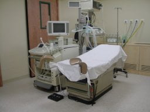

Elde edilen döllenmiş yumurtalar embryo olarak adlandırılır. Embryolar iki hücreli aşamadan çok hücreli blastokist aşamasına kadar herhangi bir dönemde transfer edilebilmekle beraber, en sık tercih edilen transfer zamanı 4-8 hücreli aşamadır. Embryolar bu aşamaya genellikle 2 ya da üçüncü günde ulaşmaktadırlar. Embryo trasnferi 2-6. günler arasında yapılabilir.

Yardımcı üreme tekniklerinde transfer edilen embryo sayısı ile klinik gebelik oranları arasında direkt bir ilişki mevcuttur. En iyi klinik sonuçlar 2-4 embryonun transfer edilmesi ile alınmaktadır. İkiden fazla sayıda embryo transfer edildiğinde çoğul gebelik oranları oldukça yükselmektedir ancak bu risk artan kadın yaşı ile birlikte azalmaktadır. Çoğul gebeliklerin komplikasyon oranlarının yüksek olması ve erken doğum gibi nedenler ile maliyetin artması nedeni ile pekçok ülkede transfer edilen embryo sayısının kısıtlanması yoluna gidilmektedir. İkiden fazla sayıda embryo ancak 37 yaşından büyük ve daha önceki IVF/ICSI denemelerinin başarısız olduğu hastalarda yapılmaktadır. Hatta bazı çalışmacılar 35 yaşından genç her hastada sadece 1 tane blastokist transfer edilmesini önermektedirler

En iyi kalitedeki embryolar transfer edildikten sonra eğer artan embryo varsa bunlar dondurularak saklanabilir.

Embryo transferi yapılırken hasta jinekolojik muayene pozisyonunda yatırılır. Vajinaya spekulum takıldıktan sonra steril serum fizyolojik ile temizlik yapılır. Ardından özel kültür sıvıları ile rahim ağzı temizlenir. Embryolog transfer edilecek embryoları katater içinde laboratuvardan getirir. İşlemi yapacak olan hekim karından yapılan ultrason eşliğinde embryoları rahim içine bırakır.

Embryo transferi işlemi ağrılı bir işlem değildir ve anestezi gerektirmez.

İşlem sonrası endometriumu desteklemek için hastaya enjeksiyon, fitil ya da krem şeklinde hormon ilaçları verilir. Luteal faz desteği adı verilen bu tedavi eğer gebelik oluşursa 10. haftaya kadar devam eder. Gebelik oluşmayıp adet kanamasının olduğu durumlarda ise kanamanın başlaması ile birlikte tedavi kesilir.

Embryo transferi sonrası 12. günde hasta gebelik testi için çağırılır.

Transfer işleminin yapıldığı ameliyathane
