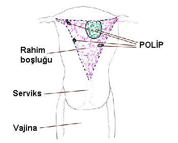
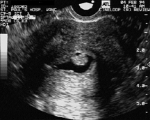

Polipler küçük ve çoğu zaman iyi huylu küçük tümoral oluşumlardır. Vücutta rahim ağzı, rahimin içi (endometrium), ses telleri ve barsaklar gibi pekçok değişik bölgede görülebilir.

Endometrial polip rahimin içini döşeyen zar tabakasından köken alır. Bu dokunun bazı bölümleri normalden fazla büyüyerek rahim boşluğuna doğru itildiğinde polip ortaya çıkar. İtilmiş olan bu doku endometrium ile bağlantısını kaybetmez. Eğer bu bağlantı çok ince ise buna saplı polip adı verilir. Bazı durumlarda ise endometrium ile polip arasındaki bağlantı daha geniş bir alana yayılır ve geniş tabanlı polipler ortaya çıkar. Saplı polipler zaman içinde rahim ağzından dışarıya doğru sarkabilirler.

**NEDENLERİ**  
Polipe yol açan faktörlerin neler olduğu bilinmemektedir. Ancak polip varlığı ile birlikte genelde endometrial hiperplazi de birarada görüldüğünden fazla östrojen aktivitesinin bu duruma yol açabileceği düşünülmektedir. Meme kanseri nedeni ile tamoksifen tedavisi alanlarda da endometrial poliplere sık rastlanır. Bazı çalışmalarda polipler ile genetik patolojilerin ilgili olabileceği ileri sürülmektedir. Ancak daha çok yeni olan bu konu hakkında bir fikre varabilmek için detaylı çalışmalara gerek duyulmaktadır.

Endometrial polipler ile sigara kullanımı, doğum kontrol hapı kullanımı ve yapılan doğum sayısı arasında bir ilişki yoktur.

**GÖRÜLME SIKLIĞI**   
Endometrial poliplerin görülme sıklığı konusunda net bir sayı vermek mümkün değildir ancak çok sık görüldüğü söylenebilir. Bazı çalışmalarda kadınların %50’sinde polip saptandığı ileri sürülmektedir.Genel kanı görülme sıklığının %10 civarında olduğudur.Öte yandan menopoz sonrası kanama sorunu yaşayan kadınların yaklaşık %7’sinde altta yatan neden iyi huylu bir poliptir.

Har yaştaki kadınlarda görülebilmekle birlikte en sık 39-50 yaş grubunda rastlanır.

Polipler genellikle rahimin tepe kısmında yerleşirler. Sıklıkla te olmakla birlikte bazen birden fazla polip görülebilir.

**POLİPLERİN TÜRLERİ**  
Şekil ve işlevsel özellikleri bakımından polipler gruplara ayrılır:

1) Hiperplastik polipler: Östrojene bağımlıdırlar ve endometrial hiperplaziye benzer özellik gösterirler.

2) Fonksiyonel polipler: Etrafındaki endometriuma benzer salgı hücreleri içerirler.

3) Adenomimatöz polipler: Bir miktar kas dokusu da içerirler.

4) Atrofik polipler. Hiperplastik ya da fonskiyonel polipin zaman içinde özelliğini kaybederek büzüşmesi (atrofi) sonucu oluşurlar

5) Pseudopolipler. Yalancı polipler. Genelde 1 santimetreden daha küçük yapılardır, adet siklusunun ikinci döneminde ortaya çıkıp adet kanaması ile birlikte kaybolurlar.

**BULGULAR  
**Poliplerin çoğu herhangi bir bulguı vermez ve başka bir nedenle yapılan incelemeler sırasında ya da rahim ameliyatları sonrasında patolojik incelemede fark edilirler.

En sık karşılaşılan yakınma kanama bozukluklarıdır. Adet kanamalarının fazla olması ya da iki adet kanaması arasında görülen lekelenme tarzında kanamalar polipin belirtisi olabilir. Benzer şekilde menopoz sonrası görülen kanamaların da altında yatan sebep endometrial polip olabilir. Bazı kadınlarda ise adet kanamasını takip eden günlerde kahverengi bir akıntı ile kendini belli edebilir.

Rahim ağzından dışarıya sarkan poliplerde ilişki sonrası kanama ya da ağrı da görülebilecek olan yakınmalar arasındadır. Dışarıya sarkan polip varlığında bunun rahim ağzından köken alan bir polip mi (servikal polip) yoksa gerçek bir endometrial polip mi olduğu anlaşılamayabilir.

Endometrial polip ile kısırlık ve tekrarlayan düşükler arasındaki ilişki tartışmalı olmakla birlikte genelde kısırlığa neden olduğu kabul edilmektedir. Eğer embryo polip üzerine yerleşirse normal gelişimini sürdüremeyebilir. Polip dışında normal endometrial alana yerleştiğinde de rahim içinde yer kaplayan bu lezyon gebeliğin sağlıklı bir şekilde devamına engel olabilir. Yapılan bir çalışmada kısırlık sorunu yaşayan çiftlerin yaklaşık %24’ünde endometrial polibe rastlandığı bildirilmiştir.

Poliplerin kanserleşme olasılığı son derece düşüktür.

**TANI**  
Endometrial poliplerin tanısında pekçok yöntem kullanılabilir.

Histerosalpingografi büyük poliplerin saptanmasında yardımcı olabilir ancak küçük polipler gözden kaçabileceği için tanıda yeri çok fazla değildir.

Polip tanısı büyük oranda transvajinal ultrasonografi ile konur. Ancak yalancı polipler ile karışabilir. Rutin ultrason incelemesi yerine rahim iç boşluğunu daha iyi gösteren sulu ultrasonografi (sonohisterografi) polip tanısında en etkili yöntemlerden birisidir. Rutin transvajinal ultrasonografinin polipleri saptamadaki duyarlılığı %66 iken sonohisterografinin duyarlılığı %100’dür.

Sonohisterografide endometrial polipin görünüşü

Polip tanısında altın standart histeroskopidir. Direkt olarak gözle görülen polip aynı anda alınarak tedavisi de gerçekleştirilmiş olur.

Anormal vajinal kanamanın durdurulması için yapılan kürtaj sorası patolojik inceleme de konulan polip tanısı azımsanamayacak miktardadır.

Radyolojik incelemelerden bilgisayarlı tomografi ve manyetik rezonans ile de rahim içindeki polip gösterilebilir.

**TEDAVİ**  
Poliplerin büyük kısmı herhangi bir yakınmaya neden olmaz. Ancak polip fark edildiğinde cerrahi olarak alınmalıdır. Bu işleme polipektomi adı verilir.

Geçmişte polip tedavisinde en sık başvurulan yöntem kürtajdır. Ancak kitle çok oynak olabildiğinden kürtaj sırasında alınamama olasılığı yüksektir. Bu nedenle modern jinekolojide polibin tedavisi histeroskopi ile alınmasıdır. İşem muayenehane şartlarında ağrısız bir şekilde yapılabilir. Ofis histeroskopi adı verilen bu girişimi tolere edemeyen hastalarda ise genel anestezi altında operatif histeroskopi uygulanır. Operasyon son derece kısa olup hastanın hastanede yatması gerekmez ve 1-2 saat içinde normal yaşantısına dönebilir.

Polip saptandığında cerrahi olarak alınmasının birkaç nedeni vardır:

**1\. Tanıyı kesinleştirmek**. Kanama bozukluğunun polip dışında başka bir nedene bağlı olmadığını göstermek için. Örneğin beraberinde tıbbi tedavi gerektiren endometrial hiperplazi olmadığının gösterilmesi için.

**2\. Kanseri ekarte etmek.**Menopoz sonrası kadınlarda kanama olduğunda ilk akla gelecek patoloji rahim kanseridir. Bu nedenle menopoz sonrası kadınlarda kanama varlığında polip saptandığında altta yatan bir kanser olmadığını dokümente etmek için polip mutlaka alınmalı ve patolojik incelemeye gönderilmelidir. Menopoz sonrası kadınlarda poliple beraber endometrial kanser görülme olasılığı %10-34 arasında değişmektedir.

**3\. Kanamayı durdurmak.** Polipe bağlı kanamayı durdurmanın en garantili yolu nedeni yani polibi ortadan kaldırmaktır.

**4\. Üreme potansiyelini arttırmak.** Hem kendiliğinden olan hamileliklerde hem de tüp bebek tedavileri öncesinde polip saptandığında gebelik şansını arttırmak için polipektomi yapılmalıdır. Yapılan bir araştırmada 2 santimetreden küçük poliplerin tüp bebek tedavilerinde gebelik şansını azaltmadığı ancak oluşan gebeliğin düşükle sonuçlanma riskinde bir artışa neden olduğu gösterilmiştir. 2002 yılında yapılan başka bir çalışmada ise poliplerin rahim içinde glycodelin adlı bir maddenin artmasına yol açtığı ve bu durumun hem yumurtanın döllenmesini hem de embryonun rahime tutunmasını olumsuz yönde etkileyebileceği gösterilmiştir.

**KAYNAKLAR**

*   Bettocchi S, Ceci O, Di Venere R, Pansini MV, Pellegrino A, Marello F, Nappi L. Advanced operative office hysteroscopy without anaesthesia: analysis of 501 cases treated with a 5 Fr. bipolar electrode. Hum Reprod 2002 Sep 17:2435-8

*   Bol S., Wanschura S., Thode B., Deichert U., Van de Ven WJ., Bartnitzke S., Bullerdiek J.. An endometrial polyp with a rearrangement of HMGI-C underlying a complex cytogenetic rearrangement involving chromosomes 2 and 12. Cancer Genet Cytogenet 1996;90(1):88-90
*   Lass A., Williams G., Abusheikha N., Brinsden P.. The effect of endometrial polyps on outcomes of in vitro fertilization (IVF) cycles. J Assist Reprod Genet 1999 Sep;16(8):410-5
*   Nanda S, Chadha N, Sen J, Sangwan K. Transvaginal sonography and saline infusion sonohysterography in the evaluation of abnormal uterine bleeding. Aust N Z J Obstet Gynaecol 2002 Nov 42:530-4
*   Nomikos IN, Elemenoglou J, Papatheophanis J. Tamoxifen-induced endometrial polyp. A case report and review of the literature. Eur J Gynaecol Oncol 1998 19:476-8
*   Richlin SS, Ramachandran S, Shanti A, Murphy AA, Parthasarathy S. Glycodelin levels in uterine flushings and in plasma of patients with leiomyomas and polyps: implications for implantation. Hum Reprod 2002 Oct 17:2742-7
*   Tjarks, M., VanVoorhis, B.J. Treatment of Endometrial Polyps. Obstet Gynecol 2000;96:886-9.
*   Vanni R, Dal Cin P, Marras S, Moerman P, Andria M, Valdes E, Deprest J, Van den Berghe H. Endometrial polyp: another benign tumor characterized by 12q13-q15 changes. Cancer Genet Cytogenet 1993 Jul 68:32-3
*   Vilodre LC, Bertat R, Petters R, Reis FM. Cervical polyp as risk factor for hysteroscopically diagnosed endometrial polyps. Gynecol Obstet Invest 1997 44:3 191-5
