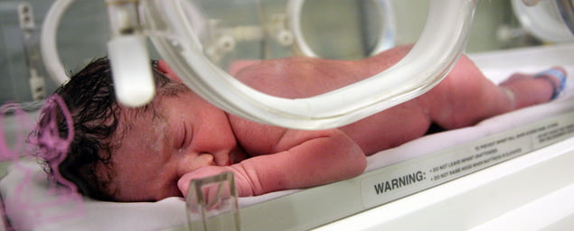

Uzun zamandır vaktinden önce doğan bebekler prematur olarak adlandırılırdı. Ancak son zamanlarda bu eğilim değişmektedir. Maturite yaşı değil fonksiyonu belirtmektedir. Bu nedenle vaktinden önce doğan bir bebek fonksiyonları normal ise prematür olmayabilir.

Tanım olarak bakıldığında erken doğum ya da preterm doğum 37 gebelik haftasının tamamlanmasından önce dünyaya gelen bebeği tarif eder.Doğum sancılarının başlaması ise erken doğum tehdidi olarak adlandırılır. Erken doğumlar tüm doğumların yaklaşık %9-10’unu oluşturur.

**Nedenler & Risk Faktörleri**  
Tıp alanında son zamanlarda yaşanan başdöndürücü gelişmelere rağmen hala daha doğumun nasıl ve hangi etkenlerle başladığı tam olarak açıklanamamıştır. Normal doğumu başlatan etkenler vaktinden önce faaliyete geçerlerse doğal olarak bu erken doğum tehdidine neden olacaktır. Erken doğumun sebepleri arasında suçlanan bazı etkenler vardır. Bunların başında enfeksiyonlar gelir.

Özellikle gebeliğin son dönemlerinde görülen idrar yolu enfeksiyonları ya da vajinal enfeksiyonlar salgıladıkları bazı maddeler ile doğum eylemini başlatabilirler. Yine bu tür enfeksiyonlar sonucu açığa çıkan bu maddeler amniyon zarının direncini düşürerek bu zarın vaktinden önce yırtılmasına yol açabilir. Zarların doğum eylemi başlamadan açılmasına Erken Membran Rüptürü adı verilir.

Zarların açılması erken doğumların önemli bir nedenidir. Erken doğum tehdidinde suçlanan bir diğer faktör de çoğul gebeliklerdir. Burada rahim fazla miktarda gerildiğinden sancılar erken başlıyor olabilir. Polihidramniyos vakalarında da benzer mekanizma ile doğum vaktinden önce gerçekleşebilir.

Çift gözlü rahim gibi doğumsal rahim anomalileri geç düşüklerin ve erken doğumların bir başka nedenidir. Ancak bu tür bir şekil bozukluğu olan her kadın erken doğum yapacak diye bir kural yoktur. Bu hastalarda sadece risk artmıştır.

Uterus myomları rahim içerisindeki hacimi azaltarak erken doğum sancılarını başlatabilir.

Gebeliğin son dönemlerinde ortaya çıkan ve yüksek tansiyon, idrarda protein kaybı, genel ödem ile kendini belli eden preeklempsi vakalarında ve plasentanın erken ayrıldığı abrubtio durumlarında da erken doğum normalden daha fazla görülür. Annede gebelikte ortaya çıkan ya da gebelikten önce var olan kansızlık (anemi)de erken doğumların özellikle ülkemizde önemli bir nedenidir.Yine düşük sosyoekonomik düzeydeki hastalarda erken doğum daha fazla görülür.

Önceden birden fazla geç düşük veya erken doğum öyküsünün bulunması da risk faktörleri arasında sayılır.

Erken doğuma yol açan nedenlerden en önlenebilir olanı sigara kullanımıdır. Erken doğum sigara kullanan anne adaylarını bekleyen önemli tehlikelerden birisidir.

Bazı hallerde ise doğum eylemi ve erken doğum kendiliğinden değil, doktor kararı ve müdahalesi ile gerçekleştirilir. Anne adayının hayatının tehlikede olduğu ve gebeliğin bu tehlikeyi arttırdığı durumlarda anne adayının hayatını kurtarmak amacı ile bir erken doğum söz konusu olabilir. Bu doğum sezaryen veya suni sancı verilerek normal doğum şeklinde olabilir.

Benzer şekilde bebeğin anne karnında durmasının içinde bulunduğu sıkıntıyı arttırabileceği ve bebeğin kaybedilme riskinin yüksek olduğu durumlarda da yine erken doğuma karar verilebilir.

**Belirtileri**  
Doğumun olabilmesi için rahimde kasılma olması ve bu kasılmaların rahim ağzını açacak kadar şiddetli ve sürekli olması gerekir.Ancak her kasılma ağrı olarak hissedilmeyebilir. Genelde belde ve kasıklarda adet sancısına benzer ağrılar hissedilebilir. Kişi bunu karnında bir sertleşme olarak algılar.

Yine halk arasında Nişan adı verilen sümüğümsü bir tıkacın gelmesi ya da normalden fazla sulu bir akıntı olması erken doğum tehdidini düşündürür. İstirahat ile geçmeyen bu tür sancılar olduğunda vakit kaybetmeden hekim ile temasa geçmek son derece önemlidir.

Bebek aşağıya doğru bastırıyor gibi bir his genelde erken doğum tehdidi altındaki pek çok kadında görülür.

*   **Erken doğum belirtileri varlığında ne yapılmalıdır**  
    Belirtiler başladığında ne yaptığınızı hatırlamaya çalışın
*   Yaptığınız işi bırakın
*   Bir saat sol yanınıza dönerek yatın
*   2-3 bardak sıvı için 1 saat içinde belirtilerde gerileme olmaz ise doktorunuza haber verin

**Tanı**   
Tanı vajinal muayenede rahim açıklığının saptanması, suların geldiğinin tespit edilmesi ve NST’de rahim kasılmalarının görülmesi ile konur. Erken doğumdan şüphelenildiğinde ilk yapılacak iş vajinal muayene ile rahim ağzında bir açıklık olup olmadığının saptanmasıdır. Aynı esnada zarların yırtılıp yırtılmadığıda kontrol edilmeli eğer emin olunamıyor ise turnusol kağıdı koyarak takip edilmelidir.

Daha sonra ultrasonografi ile bebeğin durumu değerlendirilir.

Eğer rahim açıklığı 4 santim ya da daha fazla ise erken doğumu 24-48 saatten daha fazla geciktirmek çoğu zaman mümkün olmamaktadır.

**Tedavi**  
Tanı konduktan sonra tedavi tıbbi olarak yapılır. Çok şiddetli durumlarda hastaneye yatırılarak damardan verilen ilaçlar yardımı ile kasılmalar durdurulmaya çalışılır. Bu sağlandığı taktirde daha sonra ağızdan alınan ya da fitil şeklinde kullanılan ilaçlar ile idame sağlanmaya çalışılır. Bu tedaviye tokoliz adı verilir.Kasılmalar çok şiddetli değilse ve açıklık 4 santimetreden daha az ise ağızdan kullanılan ilaçlar denenebilir.

Gebeliğin devam etmesinin anne ya da bebeğin hayatını tehlikeye atacağının düşünüldüğü durumlarda tokoliz uygulanmaz.

Bazı yazarlara göre 34 haftadan sonra tokoliz uygulanması gereksizdir.

Bu arada eğer saptanabiliyorsa doğum eylemini başlatan sebepler usulunce tedavi edilir.

Tokoliz masum bir tedavi değildir. Anne adayı açısından ciddi yan etkileri olabilir. Kullanılan her grup ilaç farklı yan etkilere sahiptir bu nedenle erken doğum tehdidi tanısının dikkatli konulması, eğer bebek gelişimini büyük ölçüde tamamlamış ise 37 haftadan küçük de olsa eylemin normal seyrine bırakılması önerilebilir.
