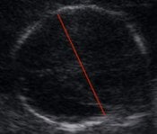

**Hafta**

**alt sınır  
(%5)  
mm**

**Ortalama  
(%50)  
mm**

**Üst sınır  
(%95)  
mm**

**8**

**4**

**6**

**8**

**9**

**5.7**

**8**

**10.3**

**10**

**7.7**

**10.3**

**12.9**

**11**

**10.5**

**13.5**

**16.5**

**12**

**14.7**

**18**

**21.3**

**13**

**19.4**

**23**

**26.6**

**14**

**25**

**27**

**29**

**15**

**28**

**30**

**32**

**16**

**32**

**34**

**36**

**17**

**35**

**37**

**39**

**18**

**38**

**40**

**42**

**19**

**41**

**43**

**46**

**20**

**44**

**47**

**50**

**21**

**47**

**50**

**53**

**22**

**50**

**53**

**56**

**23**

**54**

**57**

**60**

**24**

**57**

**60**

**63**

**25**

**60**

**63**

**68**

**26**

**62**

**66**

**70**

**27**

**66**

**70**

**74**

**28**

**69**

**73**

**77**

**29**

**72**

**76**

**80**

**30**

**74**

**78**

**82**

**31**

**77**

**81**

**85**

**32**

**79**

**83**

**87**

**33**

**81**

**85**

**89**

**34**

**83**

**87**

**91**

**35**

**85**

**89**

**93**

**36**

**86**

**90**

**94**

**37**

**88**

**92**

**96**

**38**

**89**

**93**

**97**

**39**

**90**

**94**

**98**

**40**

**91**

**95**

**99**

**41**

**92**

**96**

**100**

**42**

**93**

**97**

**101**
