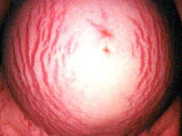
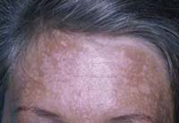
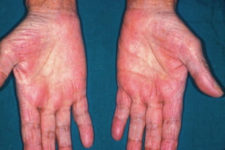

Gebelik kadın vücudunda pekçok değişime neden olan bir süreçtir. Hormonal ve mekanik nedenlere bağlı olarak gelişen bu değişimler gerek direk gerekse dolaylı yollardan kadının psikolojisini de etkiler. Bazı kadınlar gebeliğin vücudunda meydana getirdiği değişimlerden büyük bir hoşnutluk duyar ve gebeliğin kendisini güzelleştirdiğini düşünürken, oldukça önemli bir grup kadında çirkinleştiğini düşünür ve hatta kendi vücudundan utanır hale gelir. Oysa gebelik her kadına yakışan çok güzel ve farklı bir olaydır.

Gebelikte kilo artışı, ve karnın büyümesi dışında görülebilen en önemli fiziksel değişim ciltte yaşanır. Hem hormonların hem de büyüyen karnın etkisi ile ortaya çıkan bu değişikliklerin bir kısmı gebelik sonrası eskiye dönerken, bir kısmı da kalıcı olur.

**Çatlaklar**  
Gebelikte ortaya çıkan cilt değişimlerinden en sık bilineni karın çatlaklarıdır. Stria Gravidarum adı verilen bu çatlaklar tüm gebe kadınların %50 ile 90’ında ortaya çıkar. Hemen hemen bütün kadınlar bu çatlakların ortaya çıkmasından korkmakta ve çekinmektedir. Büyük çoğunluğu karnın alt kısmında görülen lezyonlar gebeliğin ikinci yarısından itibaren belirmeye başlar. Nadiren uyluklar, kalçalar, memeler ve kollarda da görülebilir.

Tipik görüntüsü deride ufak ve fazla derin olmayan çöküntüler şeklindedir. Açık tenli kadınlarda pembemsi bir rengi olabilir. Esmer tenlilerde ise etrafındaki cilt bölümlerinden oldukça açık renkte, hatta gümüş rengindedir. Ciltte bulunan kollajen adı verilen maddenin ayrılmasından dolayı görülürler. Ağrılı değillerdir ancak hafif bir kaşıntıya yol açabilirler. Hem mekanik gerilmeye bağlı olarak hem de hormonal nedenler ile ortaya çıkabilirler.

Çatlakların önlenmesi her zaman mümkün olmaz. Piyasada gebelik çatlaklarını engellemek için satılan pekçok ürün olmasına karşın etkinlikleri her zaman tatminkar değildir. Ailevi yatkınlık söz konusudur. Annesi ya da kızkardeşinde bu türden çatlaklar olanlarda daha sık görülür. Irkın da etkisi olduğu tahmin edilmektedir. Örneğin siyah ırkda daha az rastlanır. Ani ya da olması gerekenden fazla kilo artışı olanlarda çatlaklar daha kötü olur. Önlemek için yapılabilecek en iyi şey bol sıvı almaktır. Sıvı miktarı yüksek olan sağlıklı bir cilt gerilmeye daha iyi yanıt verir.

Çatlakların büyük bir kısmı doğumdan sonra kaybolmaz. Rengi biraz daha açılarak gümüşi bir hal alır. Pekçok kadın bu durumdan rahatsızlık duymaz ve bunu anne olmanın bir işareti olarak gururla taşır. Daha az sayıda kadın ise çatlaklardan kurtulmak ister. Bu amaçla geliştirimiş pek çok cerrahi teknik vardır ve bu teknikler plastik cerrahlar tarafından uygulanır. Sonuçlar tatminkar olmaktadır.

Özetleyecek olursak:

*   Aile öyküsü ve genetik yatkınlık çatlakların ortaya çıkmasında önemlidir. Anneniz ya da kızkardeşlerinizde varsa büyük olasılıkla sizde de görülecektir.
*   Eğer önceki hamileliklerinizde çatlak olduysa bu hamileliğinizde de oluşması kuvvetli bir olasılıktır. Önceden kalan çatlakların rengi geçici olarak koyulaşabilir.
*   Ani kilo artışı. Çok hızlı ve fazla miktarda kilo aldıysanız çatak ile karşılaşma olasılığınız yüksek demektir.
*   Beslenme durumu. Yeterli miktarda sıvı alan ve dengeli beslenen kadınlarda daha az ve daha hafif şiddette çatlak olduğunu unutmayın
*   Irkın önemini akılda tutun.

**Gebelik Maskesi**  
Cholasma olarak da adlandırılan gebelik maskesi gebelik esnasında yüzde meydana gelen değişimleri ifade eder. Gebelik sırasında melanotropin adı verilen madde fazla miktarda salgılanır. Bu madde burun, yanaklar ve alın civarında pigmentasyon artışına yani koyulaşmaya yol açar. Güneş ışınları duruma yol açmamakla birlikte olayın şiddetini arttırabilir. Gebe kadınların %45 ile 70’inde gebeliğin 4. ve 5. ayından başlayarak gebelik maskesi görülebilir. Kalıcı olmayan bu durum doğumdan sonra birkaç ayda kendiliğinden geriler ve kaybolur. Gebeliği sırasında makyaj yapan kadınlar cholasma’yı saklayabilirler. Gebelk maskesini önlemenin en kolay yolu güneşe çıkarken çok yüksek faktörlü koruma kremleri sürmektir. Kış aylarında da güneşin bu tür etkisi olabileceği unutulmamalı ve koruyucu krem sürmek ihmal edilmemelidir.

Koyulaşmalar sadece yüzde olmaz. Meme başları, koltuk altları, genital bölge de de gebeliğin sonlarına doğru renk değişiklikleri görülebilir. Bu değişiklikler önemli değildir ve doğumdan sonra kaybolurlar.

**Linea nigra**  
Orta hat üzerinde, kasıktan göbek deliğine kadar uzanan koyu renkli bir çizgidir. İlk gebeliğini yaşayanlarda gebeliğin üçüncü ayından başlayarak ortaya çıkar. Tecrübeli annelerde ise daha erken dönemde görülebilir. Her kadında görülmez.Bazı toplumlarda bu çizginin görülmesi bebeğin erkek olduğu şeklinde yorumlanır ancak bunun gerçekle bir ilgisi yoktur.

**Sivilce**  
Gebelikte meydana gelen hormonal değişimler ciltte yağlanma ve sivilceye neden olabilir. tamamen geri dönüşümlü olan bu sivilceler gebelik sırasında bol sıvı alımı ve düzenli yapilan cilt temizliği ile bir ölçüde engellenebilir.

**Damarlanma**  
Gebelik sırasında kanda artan östrojen seviyelerine bağlı olarak özellikle yüz, boyun, göğüs, kol ve bacaklarda değişik şekillerde damarlanmalar ortaya çıkabilir. Bu damarlanma yıldız şeklinde ve ciltten hafif kabarık yapılardır. Üzerine baskı uygulayınca renkleri solmaz. Bu yapılara örümcek ağına benzedikleri için İngilizce’de örümcek anlamına gelen spider kelimesinden esinlenerek “spider veins” adı verilir. Kadınların %60 civarında görülür ve doğumdan sonra kendiliğinden kaybolur.

**Palmar Eritem**

Tıbbi adı palmar eritem olan avuç içlerinde kızarıklık ve beneklenmenin nedeni tam olarak bilinmemektedir.Bununla birlikte artmış östrojen miktarına bağlı olarak ortaya çıktığı düşünülmektedir. Gebe kadınların %50-55’inde rastlanır. Zencilerde daha nadir görülür. Nadiren ayak tabanlarında da saptanabilir. Herhangi bir yakınma yaratmayacağı gibi hafif yanma ve kaşıntı olabilir. Her zaman kullanılan nemlendiriciler yararlı olabilir.  
Karaciğer hastalıklarının önemli bir bulgusu olan palmar eritem varlığında kan tetkileri ile karaciğer fonksiyon testleri yapılmasında fayda vardır. Palmar eritem doğumdan sonra östrojen düzeylerinin normale inmesi ile kaybolur.

**Diğer değişiklikler**  
Gebelik sırasında bazı kadınlrda saç ve tırnaklar normalden daha hızlı uzar. Tırnaklarda incelme ve kolay kırılma görülebilir. Bazı bölgelerde aşırı tüylenme olabilir. Terleme artabilir. Tüm bu değişiklikler hormonal artışlara bağlıdır ve gebelik sona erdikten sonra gerilerler
