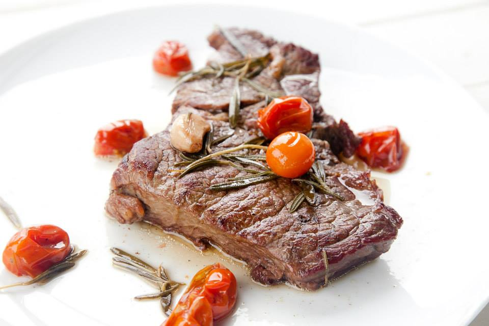

Değişik ülkelerden 11.216 hamile kadının incelendiği Norveç kaynaklı bir çalışmada yeteri kadar hayvansal gıda almayan hamile kadınların erken doğum yapma risklerinin arttığı ortaya konuldu.

Hamile kadınlar yeteri kadar et, süt ve yumurta tüketmedikleri takdirde sadece hayvansal gıdalardan alınabilen B12 vitamini yetmezliği görülme ihtimali yükseliyor.

Norveç’te yapılan bu çalışma B12 vitamini eksikliği olan kadınlarda erken doğum riskinin yaklaşık %21 daha fazla olduğunu ortaya koymuş.

Tüm dünyada düşük doğum ağırlığı ve erken doğumlar hayatın ilk 28 günü içersindeki bebek ölümlerinin en önemli nedeni. Anne adayının beslenme şekli bu açıdan sandığımızdan daha önemli olabilir.

Vücudun kendisi tarafından üretilemeyen B12 vitamini kırmızı kan hücrelerinin üretimi ve hücresel metabolik enerji kullanımı gibi yaşamsal fonksiyonlar açısından son derece önemli. Eksikliği kansızlığa neden olabileceği gibi sinir sistemi üzerinde de ciddi hasara yol açabiliyor.

Norveç ve gelişmiş batı ülkeleri gibi hayvansal ürünlerin yüksek miktarlarda tüketildiği ülkelerde bu vitaminin eksikliğinde pek rastlanmıyor.

Hindistan gibi vejeteryan beslenme şeklinin baskın olduğu ülkelerde ise hamile kadınlar arasında B12 vitamini eksikliği %65 civarında görülüyor.Bir başka deyişle her üç hamile kadından ikisinde bu vitaminin eksikliği söz konusu.

American Journal of Epidemiology dergisinin 20 Ocak 2017 tarihli sayısında yayınlanan bu yeni araştırma düşük B12 vitamini düzeyinin yeni doğan bebeğin doğum kilosunu etkilemediğini ortaya koyuyor. Ancak yazarlar gebelik sırasındaki düşük B12 vitamini düzeyinin erken doğum riskini %21 arttırdığını saptadıklarını bildiriyorlar.

Araştırmacılar ayrıca beslenme bozukluğu ya da gelir düzeyinin düşük olmasına bağlı olarak erken doğum riskinin artmış olabileceğinin de altını çiziyorlar.

Araştırmanın başındaki isim olan Dr. Rogne B12 vitamini düzeyi ile erken doğum riski arasında ilişki saptamalarına rağmen gebelik sırasında B12 ilaçlarının kullanılmasının ne gibi bir etkisi olduğu konusunda daha fazla araştırmaya ihtiyaç olduğunu belirtiyor.

Daha önce yapılan araştırmalarda gebelik sırasında B12 vitamini desteği verilen kadınlarda bebek doğum ağırlığı üzerinde herhangi bir değişiklik olmadığı ortaya konmuş, bununla birlikte B12 vitamini desteğinin erken doğumu önlemek yönünden herhangi bir etkisinin olup olmadığı konusunda literatürde yeterli yayın yok.

Hiçbir hayvansal gıda tüketimi olmayan vegan beslenme şeklinde gebe olsun ya da olmasın mutlaka dışarıdan B12 vitamini desteği gerekirken, süt ürünleri ve yumurta tüketen vejeteryanlarda eksikliğe çok fazla rastlanmıyor.  
[Associations of Maternal Vitamin B12 Concentration in Pregnancy With the Risks of Preterm Birth and Low Birth Weight: A Systematic Review and Meta-Analysis of Individual Participant Data](https://academic.oup.com/aje/article-abstract/doi/10.1093/aje/kww212/2918733/Associations-of-Maternal-Vitamin-B12-Concentration?redirectedFrom=fulltext), Tormod Rogne et al., American Journal of Epidemiology,
