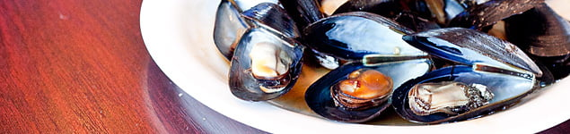

Midye ve özellikle istiridye ölümle sonuçlanabilecek ciddi besin zehirlenmelerine neden olabilen bakterilere ev sahipliği yapan deniz ürünleridir. Pekçok virus, bakteri ve toksinleri barındırabilirler. Uygun şartlarda saklanmadıklarında bu zararlı mikrop ve toksinler çok hızlı bir şekilde üreyebilirler ve şiddetli besin zehirlenmesine neden olabilirler. Hatta istiridye ve midye hepatit virüsü de taşıyabilmektedir. Hamile olmak bu hastalıklara yakalanma riskinizi arttırmaz ancak zehirlenme ortaya çıktığında kullanılması gereken bazı ileçlar gebelikte sakıncalı olabilir.

Ayrıca bu kabuklu deniz ürünleri civa ve benzeri çevresel zehirleri fazla miktarda barındırabilirler.

Tüm bu nedenler ile gebelikte kabuklu deniz ürünlerinin tüketilmesi güvenli olarak kabul edilmemektedir
