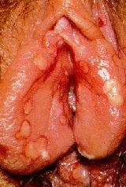

Yaygın adı ile uçuk olarak bilinen lezyon, Herpes Simpleks Virus (HSV) adı verilen virüsün yol açtığı bir enfeksiyondur.  
Sadece 45 milyon kişi A.B.D.’de bu hastalğa yakalanmıştır ve her yıl 500.000 yeni vaka ortaya çıkmaktadır. Bu tablonun dramatik olan yanı hastaların %80’i ya herhangi bir yakınma ortaya çıkmadığı ya da belirtileri yanlış yorumladığı için hasta olduğunun farkında değildir.

HSV’nin 2 tipi vardır: HSV1 ve HSV2. HSV1 genelde dudak etrafındaki uçuk şeklinde lezyonlara neden olurken, HSV2 genelde genital organlarda enfeksiyon yaratmaktadır.

Virus ilk defa enfeksiyon yarattıktan sonra sinir düğümlerinde sessiz olarak yıllarca bekleyebilmekte ve uygun ortam ve zamanda yeniden enfeksiyona neden olabilmektedir. Bu nedenle HSV enfeksiyonları sinsi enfeksiyonlardır.

**Belirtiler**   
Herpes bulguları kişiden kişiye değişir. İlk atakta genelde virüs ile tamastan sonra 2 gün 3 hafta arası bir sürelik kuluçka devresini takiben yanma, kaşıntı, bacaklarda ağrı, kalça ve genital bölgede ağrı, vajinal akıntı, karın boşluğunda dolgunluk hissi görülebilir. Bu ilk bulgulardan birkaç gün sonra enfeksiyon alanında uçuk tarzı yaralar ortaya çıkar. Bu yaralar vajinada ve rahim ağzında olabilir. 3-4 gün içinde bu yaralar iz bırakmadan kaybolurlar. Bu aşamadan sonra virus omurilik düzeyinde sinir köklerine giderek yerleşir ve burada inaktive halde beklemeye başlar. Pekçok kişide de periyodik olarak re-enfeksiyona neden olur. Bu reenfeksiyonlar esnasında virusler sinirler boyunca ilerleyerek genelde ilk enfeksiyonu yarattığı alanların yakınında yeni lezyonları yapar.Her enfeksiyon atağı esnasında gözle görülebilen lezyonların bulunması şart değildir. Çoğu zaman fark edilmeyen ataklar olur. Bu dönemlerde vajinal salgılar ile virüs yayılımı olduğundan kadın cinsel partnerine hastalığı bulaştırabilir.

Genital herpes lezyonunun  
tipik görüntüsü

**Tanı**  
Gözle görülebilen lezyonların varlığında tanıyı koymak kolaydır. Ancak bunun HSV olduğunu göstermek için bazı laboratuvar tetkikleri gerekebilir. Bunun en iyi yolu aktif enfeksiyon sırasında lezyonlardan alınacak materyalde viral kültür yapmaktır. Ancak bu oldukça masraflı bir tekniktir. Materyalde virus üretilememesi hastalık olmadığı anlamına da gelmez. Kesin tanının çok zor olması nedeni ile pekçok vaka hatalı olarak teşhis ve tedavi edilmektedir. Kanda yapılan immünolojik testler ile de HSV varlığı saptanabilir. Ancak bu testler aktif enfeksiyonu göstermez. Sadece kişinin hayatının herhangi bir döneminde enfeksiyon geçirip geçirmediğini ve bağışıklık sisteminin virüse karşı antikor geliştirip geliştirmediğini belirler. Antikorlar bulunsa bile bunlar kişiyi yeni enfeksiyonlardan korumaz. Kan testi ayrıca oral ve genital enfeksiyonların ayrımını da sağlayamaz. Son zamanlarda HSV1 ve HSV2’yi ayrıdedebilen kan testleri geliştirilmiş olmakla beraber bunların yaygın kullanımı henüz daha mevcut değildir.

**Tedavi**  
Günümüzde Herpes tedavisi için değişik ilaçlar mevcuttur ancak bu ilaçlar kesin tedavi sağlayamamaktadırlar. Viral bir enfeksiyon olduğu için antibiyotikler etkisiz olmaktadır. İlaçlar sedece ilk atağın şiddetini azaltmakta ve süresini kısaltmakta , daha sonraki atakların ise sıklığını düşürmektedir. HSV enfeksiyonu geçiren kişiler bazı birkaç basit kurala uyarak enfeksiyonun süresini ve bulaşıcılığı azaltabilirler. Bu önlemlerden en basit fakat en önemli olanı enfekte alanı temiz ve kuru tutmaktır.

Uçuk olan bölgeye dokunmamak ya da dokunduktan sonra hemen elleri yıkamak son derece önemlidir.

Lezyonlar tamamen iyileşene kadar cinsel ilişkiden kaçınmak da önemli bir konudur.

Tekrarlayan enfeksiyonlar travma, soğuk algınlığı, adet görme ya da stress gibi vücut direncini düşüren durumlarda ortaya çıkmaktadır.

**Riskler**  
Genital Herpes enfeksiyonu bazı riskleri de beraberinde getirir.Ancak uzun dönem hayat kalitesini etkileyebilecek etkileri yoktur. Gebelik gibi genel vücut direncinin azaldığı durumda olan kişiler aktif enfeksiyon açısından dikkatli takip edilmelidirler. Eğer Herpesin ilk atağı gebelik esnasında ortaya çıkarsa bu durumda virüs bebeğe geçebilir ve bu tür gebeliklerde erken doğum riski her zaman bulunur. Neonatal herpes ile doğan (anne karnında iken virüs ile temas eden ve enfekte olan) bebeklerin %50’sinde nörolojik hasarlar ve ölüm meydana gelir. Bebeklerde beyin iltihabı, göz problemleri, ciddi boyutta döküntüler ortaya çıkar ancak bu bebeklerin büyük bir kısmı antiviral ilaç tedavilerinden yarar görürler. Bebeklerdeki risk büyük ölçüde annenin geçirdiği atağın ilk ya da tekrarlayan atak olmasına bağlıdır. Aktif enfeksiyon varlığını araştırmak için yapılan viral kültürlerin sonucu uzun bir süre aldığı için genital herpesden şüphelenilen vakalarda doğum şekli olarak sezaryen tercih edilir. Eğer aktif enfeksiyon yok ise sezaryen şart değildir
