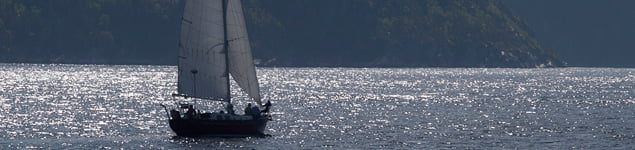

**Endişenizi azaltın**  
Yolculuğa çıkarken çoğumuz tatlı bir gerginlik yaşarız. Hamile olduğunuzda bu gerginliğin çok daha fazla olduğunu fark edebilirsiniz. Ancak bu stresten kurtulmanın yolu dokuz ay boyunca eve kapanmak değildir. Bazı basit öneriler ile endişelerinizi azaltabilirsiniz.

Örneğin havalanına ya da terminale geç kalma endişelerini fazlasıyla yaşıyor olabilirsiniz. Bu kez her zaman çıktığınızdan daha erken terk edin evinizi. Varacağınız yere yarım saat önce varmanız ve orada dükkanlara ya da yolculara bakarak zaman geçirmeniz geç kalma korkuları yaşamanızdan daha iyidir. Yanınıza hafif ve kolayca taşıyabileceğiniz kadar bagaj alın. Hamile kalmadan önce taşıdığınızdan daha az şey taşıyabileceğinizi unutmayın.

**Enerjinizi üst düzeyde tutmaya çalışın**  
Hamilelik özellikle başlarında ve sonda neredeyse halsizlik ile eş anlamlıdır. Hamile kalmadan önce dağlara tırmanan, müze müze gezen, bisiklet ile tepelerde dolanan son derece aktif biri bile olsanız hamilelik dönemi kendinizi rölantiye almanız gereken bir süreçtir. İş gezileri belki ertelenemez ama turistik amaçlı gezilerinizin sayısını azaltabilir ya da hamileliğinizin ortalarına denk getirebilirsiniz. Tatilde sürekli gezmek ve aktivitede bulunmak zorunda değilsiniz. kendinize dinlemke ve enerji toplamak için zaman ayırın. Uykunuzdan asla taviz vermeyin.

**Yediklerinize dikkat edin**  
Uzun süre aç kalmaya dayanıklı olabilirsiniz ama unutmayın sizin aç kalmanız demek bebeğinizin de aç kalması anlamına gelir. Bu nedenle öğün kaçırmamaya dikkat edin. Özellikle yaz günlerinde bol sıvı almaya özen gösterin ancak bilmediğiniz ve açıkta satılan ya da musluktan akan suyu içmeyin. Mutlaka bildiğiniz bir markanın şişelenmiş suyunu tercih edin. Yanınızda her zaman şişe su taşıyın. Ama suyu sadece taşımayın; İÇİN. Sıvı eksikliği yani dehidratasyon hoş olmayan bir durumdur.

Yolculuk sırasında yemek düzeniniz değişebilir. Ancak varacağınız yere ulaştığınızda yeniden bir düzen oluşturun. Dengeli beslenmeye gayret gösterin. Abur cubur’a itibar etmemeye çalışın ancak yanınızda yüksek enerjiye sahip atıştırabileceğiniz şeyler olması yararlıdır.

**Tuvaleti ihmal etmeyin**  
Hamilelik sırasında özellikle erken dönemlerde ne kadar sık tuvalete gittiğinize inanamayabilirsiniz. Seyahat sırasında tuvalet ihtiyacınızı gidermede güçlük yaşayabilirsiniz. Dışarıdan lüks görünen pek çok restoran, kafe gibi mekanın tuvaletlerinin tahmin ettiğinizden daha pis olduğunu fark etmişsinizdir. Bu nedenle temiz bir tuvalet bulduğunuzda fırsatı kaçırmayın.O anda acil gereksiniminiz olmasa bile idrarınızı yapmaya çalışın. Bir daha ne zaman temiz tuvalet bulabileceğiniz belli olmaz.

Tuvalet ihtiyacınız geldiğinde bazen yetişemeyecek gibi olursunuz. Bu durumda fazla zaman kaybetmemek açısından giyisileriniz önemlidir. Çok zor açılan bir tulum giydiğinize pişman olabilirsiniz. Bu nedenle kolay çıkartılabilen bir pantolon ya da etek giymeyi tercih edin. Tulum hamilelikte çok şık dursa bile her zaman fonkisyonel değildir. Acil bir durumda tulumun askılarının yerlere değmesi herhalde hoşunuza gitmezdi.

**Rahatınıza düşkün olun!  
**Harhangi bir yerde uzun süre oturmak bacaklarınızdaki kan dolaşımını etkiler ve ayak ile bileklerde şişmelere neden olabilir. Bu durum her türlü araç ile yolculukta ortaya çıkar. Bu nedenle yolculuklarda her 1.5-2 saatte bir mola verip ya da araç içinde ayağa kalkıp koridorda yürüyüş yapmalı ve kan dolaşımınızı canlandırmalısınız. Bu kısa yürüyüşler sırasında bacaklarınıza germe egzersizleri de yaptırabilirsiniz. Yolculuk sırasında otururken de bazı germe hareketleri yaparak uzun süreli oturmanın olumsuz etkilerini azaltabilirsiniz. Bunun için oturur pozisyondayken bacaklarınızı iyice ileriye doğru uzatın, topuklarınız merkez olacak şekilde ayağınızı yavaşça kendinize doğru kuvvetice çekerek baldır kaslarınızı gerin. Daha sonra ayak bileklerinizi sağa sola çevirin ve parmalarınızı açıp kapatın.

Hamilelik sırasında yapılan uçak yolculuklarında uzun süre rahatsız bir pozisyonda hareketsiz oturmak tromboz (damar içindekan pıhtısı) ve varis riskini arttırır. Uçuş süresince özel varis çorabı giymek bacaklarınızdaki kan dolaşımını destekler ve şişmiş damarları rahatlatır. Eğer yanınızdaki koltuk boşsa ya da uçak içinde yan yana iki boş koltuk bulabilirseniz uzun oturmak suretiyle ayaklarınızı kaldırabilirsiniz. Uçaktaki kabin basıncı ayaklarınızda şişmeye neden olabilir. Ayakkabılarınızı çıkararak kendinizi daha iyi hissedebilirsiniz. Yürüyüş sırasında rahat ve sağlıklı olmasa da uçuş süresince terlik giymeniz rahatlamanıza yardımcı olacaktır.

Rahat ve düz topuklu bir ayakkabı özellikle uzun yürüyüşler için şarttır. Her türlü olasılığa karşı yanınızda benzer özelliklere sahip bir çift ayakkabı daha bulundurun. Ayakkabı vurmaları için özel olarak üretilmiş yastıklardan bulundurmanız yararlı olabilir.

**Mantar enfeksiyonu olmamaya bakın!**  
Hamilelik sizi mantar enfeksiyonlarına karşı zayıf hale getirir. Sıcak, nemli ortamlar durumu genelde daha da kötüleştirir. Dar giymek ile mantar enfeksiyonu arasındaki ilişki tartışmalı olsa da siz yine de bol ve rahat şeyler giymeye gayret gösterin. Dar kesimli kot ve pantolonları evde bırakın. Benzer şekilde sentetik giysilerden de uzak durmalısınız.

Seyahate çıkmadan önce gerekli olabilecek ve hamilelikte güvenli bir şekilde kullanabileceğiniz ilaçların bir listesini doktorunuzdan isteyin ve bunları mutlaka yanınızda bulundurun. Doktorunuzun haberi ve onayı olmadan hiç bir ilacı kullanmayın, hiçbir aşı yaptırmayın

**Tehlikeden uzak durun!**  
Su kayağı, snowboarding, kayak, rüzgar sörfü, yamaç paraşütü gibi ekstrem sporlar favoriniz olabilir ama bu tür aktiviteler hamilelik için hiç de uygun değildir. Düşme riskinizin yüksek olduğu her türlü spor ve fiziksel aktiviteden uzak durmalısınız. Dalma sporu da hamilelikte yasak olan sporlardandır. Suyun dibinden yukarıya çıkarken oluşabilecek hava kabarcıkları hem sizi hem de bebeğinizi risk altına sokar. Çok masum görünse bile eğlence parkları da hamileler için uygun değildir. Aniden hızlanıp yavaşlayan trenler ya da çarpışan otomobiller fetusa zarar verebilir.
