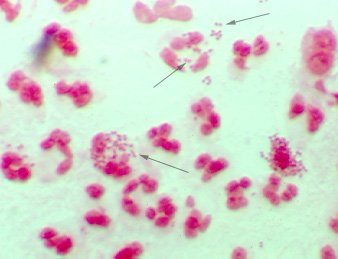

Neisseria gonorrhoeae (gonokok) adı verilen bakterinin yol açtığı bir enfeksiyondur. _**Cinsel yolla bulaşan hastalıkların en sık görülenidir.**_

A.B.D.’de her 30 saniyede bir kadının bel soğukluğuna yakalandığı ileri sürülmektedir. Bu kişiler 3-5 gün süren kuluçka dönemi süresince ileri derecede bulaştırıcı olmaktadırlar. Gonoreli bir erkek ile ilişki kuran her kadın enfekte olmaz. Sadece %60-90 kadında enfeksiyon gelişir. Kadından erkeğe bulaşma ise daha zordur.

Gonoreli bir kadınla ilişkide bulunan erkeklerin %20-40’ı enfekte olur.

Kadınlarda en çok rahim ağzında yerleşir.

Dokuların yapısı nedeni ile vajina dokusunda gonore bakterisi yerleşemez. Rahim ağzı (serviks) dışında sırasıyla ürethtra ve vajinanın hemen girişinde her ki yanda yer alan bartholin bezlerini tutar. Kadınların %80’inden fazlası asemptomatik kalır yani hiçbir belirti olmaz. Bu kuluçka döneminin değişken olabileceğinin belirtisidir. Gonoreye neden olan diplokoklar

Bel soğukluğuna neden olan gonokoklar

**Belirtileri**   
Bel soğukluğunun en sık yarattığı yakınma vajinal akıntıdır. Bu akıntı sarı-yeşil renkli ve kötü kokuludur. Sümüğümsü bir yapısı vardır. Beraberinde nadiren kaşıntı da olabilir. Bu tabloya idrar yaparken yanma da eşlik edebilir. Akıntıdan sonra en sık görülen yakınma ise kasık ağrısıdır.Genelde her iki tarafta da ağrı olur. Öğleden sonra ve akşam çıkan ateş görülebilir. Bartholin bezi tutulmuş ise vajina girişinde oldukça ağrılı bir şişlik yani bartholin absesi olabilir. Mikroorganizma kan dolaşımına geçer ise eklemlerde de enfeksiyona neden olabilir.Eklem ağrıları ve şişlikleri görülür. Tek bir eklemde belirtiler olmaz. Ağrılar gezici tiptedir. Bir eklem düzelir belirtiler bir diğerinde başlar. Buna gezici eklem ağrıları adı verilir. Nadiren gonokoka bağlı boğaz enfeksiyonları gelişebilir. Doğum esnasında anneden bebeğe geçerek yenidoğanın gözlerinde konjuktivite yol açabilir.

Gonorenin en önemli komplikasyonu pelvik iltihabi hastalıktır. Enfeksiyonun tüplere ve yumurtalıklara kadar ilerlemesidir. Kısırlık dahil pekçok komplikasyon yaratır.

**Tanı**  
Servikal ve vajinal akıntının incelenmesi ile konur. Vajen kültürü alınmasının en faydalı olduğu durum gonoredir. Kültürde gonokokların üretilmesi tanı için yeterlidir.Klinik olarak tanı konmuş olsa bile bunun kültür ile doğrulanması gerekir.

**Tedavi**  
Bel soğukluğu tedaviye son derece duyarlı bir hastalıktır. Antibiyotik tedavisi ile genelde iyileşme sağlanır. Antibiyotik kullanımından bir hafta sonra kültürler tekrarlanarak enfeksiyonun geçtiği teyid edilmelidir.
