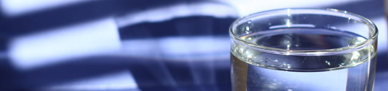

Su… Hayat kaynağı…Hepimiz suyun hayat için ne kadar önemli olduğunu biliyoruz. Sadece insan için değil bizim bilebildiğimiz her türlü yaşam formu için su kaçınılmaz bir gereklilik. Bu nedenle suyun olmadığı yerde hayatın da olamayacağına inanıyoruz. Uzay araştırmalarında dünya dışında başka hiç bir gezegende su saptanamadığı için hayat olmadığı sonucuna varıyoruz. Okullarda kimya dersinde en önce suyun formülünü öğreniyoruz. Suyun iki hidrojen ve bir oksijen atomundan meydana geldiğini öğrenip her ikisi de yanıcı ve yakıcı olan bu maddelerin nasıl olup ta ateşi söndürdüğüne hayret ediyoruz.

Ama belki de bilmediğimiz ya da bildiğimiz halde dikkat etmediğimiz başka gerçekler de var suyla ilgili: Suyun insan için en önemli besin maddesi olduğu ya da vücudumuzun yeryüzündeki diğer tüm maddelerden daha fazla su içerdiği gibi.

Erişkin bir insan vücudunun %55-75’ini su oluşturur. Bu suyun yaklaşık üçte ikisi hücrelerin içinde, geri kalanı ise hücre aralarında ve kanda bulunur. Kaslar yağdan daha fazla su içerir. Bu nedenle ne kadar zayıfsanız vücudunuzdaki su oranı da o kadar fazladır. Su vücudumuzun her bölümünde bulunur. Kanın %80’den fazlası, kas dokusunun %73’ü, yağın %25’i ve hatta kemiklerin %22’i sudan meydana gelmektedir.

**Suyun vücudumuzdaki görevleri nelerdir?**  
Su vücutta gerçekleşen tüm kimyasal reaksiyonlar için gerekli ortamı sağlar. Bu kimyasal reaksiyonlar sonucu ortaya çıkan ürünler,atık maddeler ve besin maddeleri de suda çözünerek taşınır.

Su yaşamın devamı ve sağlığın idamesi için şart olan bir maddedir. Organizmada gerekleşen hemen hemen her fonkisyonda görev alır. En önemli görevleri:

*   Vücut sıcaklığının ayarlanması
*   Besin maddeleri ve oksijenin taşınması
*   Atık maddelerin hücrelerden uzaklaştırılması
*   Eklemlerin düzgün işlev görmesinin sağlanması
*   Cildin nem ve elastikiyetinin sağlanması
*   Sindirimin kolaylaştırılması
*   Organ ve dokuların korunmasının sağlanmasıdır.

Hücrelerimizi çevreleyen suyun sadece yüzde ikisini kaybettiğimizde yaklaşık %20’lik bir enerji kaybına uğrarız. Sadece bu bile suyun insan yaşamı için ne kadar önemli olduğunu anlamak için yeterlidir.

Su tüm canlılar için olduğu gibi insan içinde en önemli yaşamsal maddedir. Bir insan hiçbir şey yemeden 1 hafta kadar hayatını devam ettirebilir. Oysa hiç su içmeden en fazla 3 gün hayatta kalabilir. Eğer normal bir sıcaklıkta ve rüzgarsız ortamda hiç hareket etmeden sabit bir şekilde durabilirsek bu süre bir kaç gün daha uzayabilir. İnsanların açlığı uzun süre tolere edebilmelerine karşın susuzluğa karşı dayanıksız olmalarının sebebi son derece açıktır. Çünkü insan vücudu suyu depolayamaz. Var olan suyun tamamına yakını aktif olarak kullanılmaktadır.

Vücut su kaybettiğinde eğer yeterli su alımı yoksa elinde kalan suyu koruyabilmek için inanılmaz bir mücadeleye girer. Metabolizmasını yavaşlatır hatta idrar çıkışını çok azaltır ve neredeyse hiç idrar çıkartmaz.

Vücuttaki su miktarının azalması dehidrasyon olarak adlandırılır. Normalde bir insan günde yaklaşık 2 litre yani 10 bardak kadar su kaybeder. Su kaybı sadece terleme ya da idrar yoluyla olmaz. Nefes alıp verirken de önemli oranda su buhar şeklinde kaybedilir. Bunu en iyi soğuk havalarda ya da soğuk bir cam veya aynaya üflediğinizde fark edebilirsiniz. Öte yandan dışkı da önemli bir su kaybı faktörüdür. Günlük kaybedilen bu miktar fazla sıcak olmayan bir havada ve spor yapılmadığı zaman kaybedilen miktardır. Normal vücut fonksiyonları sonucunda yitirilen bu su mutlaka yerine konulmalıdır ve bunun için en iyi yöntem direkt olarak su içmektir.

Dehidrasyon zaman zaman çok ciddi boyutlara ulaşabilir. Şiddetli dehitratasyon varlığında kişinin hastaneye yatırılması ve açığının damardan verilen sıvılarla kapatılması gerekebilir. Ancak hafif dehidrasyon bile zaman kaybedilmeden önüne geçilmesi gereken acil bir durumdur. Su eksikliği kişinin konsantrasyon kapasitesini etkiler, enerjisini azaltır ve organların normal şekilde çalışmasını engeller.

Dehidrasyonun en erken bulgusu ağız ve boğaz kuruluğudur. Ancak pek çok kişi bu bulguların farkına varmaz. Bu nedenle susama hissi uyanmadan önce yeteri kadar su içmek önemlidir. dehidrasyonun bulguları şunlardır:

*   Ağızda ve boğazda kuruluk
*   Susuzluk
*   Baş dönmesi
*   Kaslarda kramplar
*   Ciltte kuruluk
*   Başağrısı
*   Bulantı
*   Ani geç kaybı ve halsizlik
*   İdrar renginin koyulaşması ve miktarının azalması

**Ne kadar su içmek gereklidir?**  
Normal bir erişkinin günde ortalama 10-12 bardak su içmesi gereklidir. Bazı durumlarda bu miktar artar:

*   Aşırı sıcak ya da soğuk havalarda vücut sıcaklığını sağlamak için
*   Egzersiz sonrası ter ile atılan suyu yerine koymak için
*   Hamilelikte hem artan kan miktarı hem de gelişmekte olan bebek nedeniyle
*   Emziren kadınlarda süt üretimi nedeniyle
*   Ateş, ishal, kusma gibi durumlarda dehidrasyon adı verilen kuru kalma durumunu engelemek amacıyla normalden daha fazla su içilmelidir.

Halk arasındaki yaygın ama yanlış bir inanış ishal olunduğunda su alınmaması gerektiğidir. İshalin nedeni su fazlalığı değil barsaklardaki patolojilerdir. Bu nedenle ishal durumunda kaybedilen su yerine konmaz ise hayati sonuçlar ortaya çıkabilir. İshal olan bebeklere yeteri kadar su verilmemesi ülkemizdeki **bebek ölümlerinin** en önemli sebeplerinden birisidir.

Yeteri kadar su içildiğinde fazla su idrar olarak atılır. Bu durumda idrarınızın rengi açık ve berraktır. Su alımı kaybı karşılamadığında ise idrar miktarı azalır, rengi koyulaşır ve daha konsantre hale gelir. Bu durumda beyne ulaşan sinyaller susuzluk hissetmenize ve su kaybını kısıtlayıcı bazı hormonların salınmasına neden olur.

İnsanlar için tek kaynak içilen su değildir. Günlük beslenme içinde yer alan pek çok madde su içerir. Elmanın yaklaşık %84’ü, üzümün %81’i, sütün %50’si, ya da örneğin domates çorbasının %80’inden fazlası aslında sudur. Ancak bu besinlerin içinde bulunan bazı maddeler idar söktürücü etki gösterebileceğinden sadece besinler ile alınan su hiçbir zaman yeterli olamaz.

**Hamilelik ve su**  
Bebek beklemek kadın hayatının en eğlenceli ve heyecan verici deneyimlerinden birisidir. Ancak hamilelikte görülen bazı yakınmaların tolere edilmesi güç olabilir. Bunlardan en önemlileri kabızlık, idrar yolu enfeksiyonları ve hemoroidlerdir. Yeterli sıvı alımı dışkının yumuşamasını sağlayarak kabızlığı ve dolayısıyla hemoroid oluşumunu engeller.Öte yandan su tutulumu ve şişlikler de çoğu zaman rahatsızlık verici durumlardır. Bu yakınmaları en aza indirmenin yolu yeterli miktarda su içmekten geçer. Sanılanın aksine fazla su içilmesi su tutulumuna neden olmaz.

Sıvı alımı başından sonuna kadar hamileliğin her döneminde son derece önemlidir. Yeterli bir hidrasyon yani sıvı alımı kendinizi enerjik hissetmenize yardımcı olacağı gibi cilt kuruluğu gibi problemlerin de görülmesini engeller. Ayrıca yeterli sıvı aldığınızda hem sizin hem de bebeğinizin kanındaki elektrolit dengesi kolaylıkla sağlanabilir.

Hamilelikte salgılanan hormonlar kişinin sıvıları kullanım şeklini değiştirir. Hamileliğinizin sonlarına doğru kan hacminiz yaklaşık 1.5 katına çıkar. Hamilelik döneminde solunum yolu ile akciğerlerinizden kaybettiğiniz su miktarı da hamilelik öncesine göre daha fazladır.

Bebeğinizin içinde bulunduğu amniyon sıvısı her 3 saatte bir kendini yenilemektedir. Yetersiz su alımına bağlı dehidrasyon durumunda amniyon sıvısının miktarı azalabilir.

Hamilelikte dehidrasyonun bir başka olumsuz etkisi de erken doğum ağrılarıdır. dehidrasyon durumunda salgılanan bazı hormonlar doğum kasılmalarını başlatan hormonu taklit ederek erken doğum kasılmalarına neden olabilirler. Erken doğum tehtidi tedavisinde ilk yapılan işlemin damar yolu açarak sıvı verilmesi olduğunun hatırlanması sıvı alımının önemini belirtmek açısından dikat çekicidir. Çoğu zaman hafif kasılmalar sadece sıvı verilmesi ile kaybolur gider.

Su vücudun taşıma sistemidir. Besin maddelerini ve oksijeni kan yolu ile bebeğinize taşıyan sudan başkası değildir. Su aynı zamanda hamilelikte sık görülen ve erken doğum ile düşüklere neden olabilen idrar yolu enfeksiyonlarının önlenmesinde de aktif rol alır. Yeteri kadar su içerseniz idrarınız seyrelmiş olur ve enfeksiyon şansınız azalır.

Sağlıklı bir hamilelik geçirmek için günde en az 8-10 bardak su içmelisiniz. Aktif çalışan bir kişiyseniz ya da egzersiz yapıyorsanız almanız gereken miktar biraz daha fazladır. Her 1 saatlik egzersiz için 1 bardak fazla su içmelisiniz.

Meyve suları günlük sıvı alımınızda tercih edebileceğiniz maddelerdir ancak bunların fazla miktarda kalori içerdiğini unutmayın. Su hiç kalori içermeyen nadir maddelerdendir. Kahve, çay, kola gibi kafein içeren maddeler idrar söktürücü etki gösterdiklerinden günlük sıvı alımında herhangi bir değer taşımazlar. Bunlar aldığınız miktardan daha fazla idrar çıkartmanıza ve sonuçta su kaybetmenize neden olurlar.

**Yeterli su alımı için öneriler**  
Su içmek için susamanızı beklemeyin. Bu şekilde davrandığınızda su alımınızın yeterli olmadığından emin olabilisiniz.

*   Her öğünde mutlaka bir badak su için
*   Sabah kalktıktan sonra öğlen yemeğine kadar en az 2 bardak su için, aynı şekilde öğlen ve akşam üzeri arasında da iki bardak içmeye çalışın
*   Yatmadan önce mutlaka bir bardak su içme alışkanlığını edinin
*   Yürüken bir çeşme gördüğünüzde mutlaka su için
*   Abur cubur yemek yerine su içmeyi deneyin. Gazete okurken ya da televizyon seyrederken su için
*   Suyun tadından (ya da tatsızlığından) hoşlanmıyorsanız içine bir iki damla limon ya da portakal suyu ekleyerek tatandırmayı deneyin.
