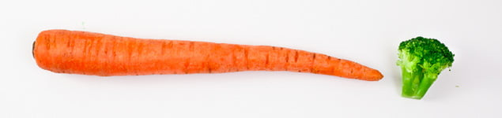

Vejeteryan diet denildiğinde hayvansal gıdaların dahil olmadığı bir beslenme şekli anlaşılır. Son zamanlarda bazı çevrelerde giderek popülerite kazanan bu beslenme tarzını benimseyen kadınlar hamilelikleri süresince de buna devam etmeyi isterler. Ancak vejeteryan beslenme şeklinin hamilelikteki etkileri konusunda çeşitli görüşler vardır. Genel kanı bilinçli şekilde ve uygun kombinasyonlar ile uygulandığında hamilelik açısından çok büyük bir risk oluşturmayacağıdır.

**Vejeteryanizm nedir?**  
İnsan biyolojik olarak etobur mu yoksa otobur mudur? sorusu vejeteryanlar ve karşıtları arasında sıkça tartışılan bir konudur. Biyolojik olarak insan etoburlara pek benzememektedir, öte yandan modern sayılabilecek insanın ortaya çıkışından beri dietinde et ve hayvansal ürünlerin olduğu da bilinmektedir. İnsan sindirim sistemi otoburlara da benzememektedir. Bu nedenle insan omnivaröz yani hem etobur hem de otobur olarak kabul edilmektedir. Aslında etobur olarak bilinen pekçok hayvanın da dönem dönem bitkileri yediği bilinen bir gerçektir. Öte yandan otobur hayvanların hayvansal gıda tükettiği pek görülmemiştir.

Vejeteryan sözcüğü ilk kez 1847 yılında İngiltere’de Joseph Brotherton tarafından kullanılmıştır. Genel kanının aksine İngilizce’de sebze anlamına gelen “vegetable” sözcüğünden gelmez. Vejeteryan sözcüğünün kökeni Latince taze ve hayat dolu anlamına gelen “vegatus” sözcüğünden gelmektedir.

1847 yılından önce et yemeyen kişiler bilinen en eski vejeteryan olan antik Yunan bilim adamı Pisagor’a ithafen Pisagorian olarak tanımlanmaktaydı.

**Tanımlar**  
Vejeteryanlık içinde pekçok alt grubu barındıran bir tarzdır. Hayvansal gıda yememe eğilimi ne kadar katı ise potansiyel sağlık riskleri de o derece yükseketir.

*   **Semi-vejeteryan:** Dietinde hayvansal gıda olarak sadece balık, kümes hayvanları, yumurta ve mandıra ürünleri bulunur.
*   **Lakto-ovo vejeteryan:** Sadece mandıra ürünleri ve yumurta bulunur.
*   **Lakto vejeteryan :** Sadece mandıra ürünleri bulunur
*   **Ovo vejeteryan :** Sadece yumurta bulunur.
*   **Vejan :** Katı vejeteryan: Sadece bitkisel gıdalarla beslenir. Her türlü hayvansal gıda reddedilir.
*   **Pescetarian :** Sadece balık bulunur
*   **Frutarian:** Vejan ile aynıdır ancak sadece bitkilerin öldürülmesini gerektirmeyen besinleri yer. Örneğin elma bitkiyi öldürmeden koparılabilir ama örneğin havuç yenemez.

**Neden vejeteryan olunur?**  
Bunun pekçok değişik nedeni vardır. En sık karşılaşılan neden basitçe kişinin et sevmemesidir. Et yağlı ve sindirimi zor bir besin maddesidir. Özellikle kırmızı etin sağlık açısından zararlı olabileceği bilinmektedir.Bu nedenle bazı kişiler et yememeyi tercih ederler.

Vejeteryanlığın altında yatan temel neden ise filozofiktir. Başka bir canlının hayatına son verme fikri vejeteryanlara korkunç gelmekte ve bu nedenle başka bir canlının öldürülmesinden duydukları rahatsızlık nedeni ile vejeteryan olmaktadırlar. Bunun en üç örneği frutarianizmdir.

Bir diğer neden ise dini inançlardır.Bu özellikle uzak doğu dinlerinde belirgindir. Eski dönemlerde hayvanın sütü ile uzun süre büyük insan popülasyonlarının beslenebilmesi ve kısa süreli beslenme sağlayan eti nedeni ile bu kaynakların tükenmesi korkusu bu alışkanlığın temelidir.

**Hamilelik ve vejeteryan diet**  
Hamilelik enerji ve protein başta olmak üzere vücudun besin gereksinimlerinin arttığı bir dönemdir. Hamilelikte vejeteryan beslenme şeklinin hem olumlu hem de olumsuz etkileri vardır. En önemli olumlu etkisi bu tür beslenme şeklinin yüksek oranda fiber (lif) içermesidir. Yüksek lif kabızlık başta olmak üzere hamilelikte sık karşılaşılan bazı sindirim sistemi sorunlarının daha hafif seyretmesini sağlar. Vejeteryan beslenme şekli daha az kalori ve yağ içerdiği için kilo kontrolü daha kolay olur.

**Protein**  
Proteinler tüm organizmaların temel yapıtaşlarından biridir. Proteinler amino asit adı verilen birimlerden oluşur. Doğada 20 tür aminoasit vardır. Bunlardan bir kısmı vücutta üretilebilirken esansiyel amino asitler adı verilen diğerleri üretilemez ve dışarıdan alınması gerekir. Hayvansal proteinler tüm amino asitleri içerdikleri için “tam proteinler” olarak adandırılırken bitkisel proteinler “tam olmayan” proteinlerdir. Bunun tek istisnası soyadır. Ancak 2000 yılında yapılan bir araştırma soya ağrılıklı vejeteryan beslenen kadınların erkek bebeklerinde hipospadias adı verilen ve idrar yapılan deliğin penis ucunda değil de yanlarda olduğu bir anomalinin 5 kat fazla görüldüğünü ortaya koymuştur.

Yeterli protein almak için et yemek şart değildir. Süt ve süt ürünleri ile yumurta tüketilmesi gerekli olan proteinleri sağlar.

[**Demir**](http://www.mumcu.com/html/article.php?sid=253)  
Demir hamilelikte gereksinimi artan temel minerallerden biridir. Demirin ana kaynağı et, balık ve kümes hayvanlarıdır. Bunun yanısıra bazı sebzeler de demir içerir ancak bunlarda bulunan demir fomunun emilimi düşük olduğundan biyoyararlılığı son derece düşüktür.

[**Kalsiyum**](http://www.mumcu.com/html/article.php?sid=198)   
Hamilelikte kritik öneme sahip minerallerden bir diğeri de kalsiyumdur. Bebeğin kemik ve diş gelişimi için gereklidir. Kalsiyum temel olarak süt ve süt ürünlerinden alınır. Lakto ovo vejeteryanların hamilelikteki kalsiyum alımı dietlerinde et bulunduranlara yakındır.

**D Vitamini  
**Bu vitamin kalsiyumun emilimi için gereklidir. Vücutta güneş ışığı yardımıyla üretilir. Pekçok süt ürüni D vatimini ile zenginleştirilmiştir.

[**Folik asit**](http://www.mumcu.com/html/article.php?sid=137)Vejeteryan beslenme şeklinin hamilelikteki önemli yararlarından birisi de yüksek oranda folik asit içermesidir. Folik asit bebeğin sinir sistemi gelişimi açısından son derece önemlidir. Pekçok yeşil sebze yüksek miktarlarda folik asit içerir.

**B12 vitamini**  
Bu vitamin hücre bölünmesi ve protein sentezi için gereklidir. Bitkilerde bulunmaz sadece hayvanlarda vardır. Yumurta ve süt ile yeterli miktarlarda alınabilir.

**Çinko**  
Çinko eksikliğinin doğumda komplikasyonlarının olasılığını arttırdığı bilinmeketedir. Yapılan bazı çalışmalarda vejeteryan hamilelerde çinko düzeylerinin daha düşük olduğu gösterilmiştir. Bitkisel kökenli besin maddelerinde de bulunmakla birlikte hayvansal gıdalardaki çinko daha etkili şekilde emilmektedir.

**Sonuç**  
Vejeteryanlik dikatli planlandığı taktirde hamile bir kadın ve bebeği için yüksek risk taşımaz. Ancak burada vejeteryanlığın alt grupları oldukça önem kazanmaktadır. Organizmanın sağlıklı işleyebilmesi için hayvansal kökenli besin maddelerine de gerek vardır. Vejan ya da frutarian beslenme şekli insanlar için uygun olmadığı gibi hamilelerin de kesinlikle kaçınması gereken bir alışkanlıktır. Lakto ovo vejeteryanizm ya da semi vejeteryanizm beraberinde dışarıdan verilen vitamin ve mineraller ile hamilelikte devam ettirilebilir.
