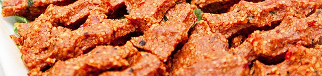

Evet hamilelik döneminde çiğ ya da az pişmiş et yemek kesinlikle sakıncalıdır. Bunun en önemli nedeni toksoplazma ve salmonella başta olmak üzere bazı bakteri ve parazitlerin bulaşma olasılığıdır.

Bir tür gıda zehirlenmesi olan salmonella enfeksiyonu oldukça rahatsızlık verici bir durumdur. Şiddetli bulantı, kusma, ishal ve yüksek ateş temel belirtileridir. Hamilelerde sıvı kaybı çok daha ciddi sonuçlar doğurabileceği için çoğu zaman hastanede yatırılarak tedavisi gerekir. Bebek üzerinde direkt bir etkisi olmamakla beraber sizin genel durumunuzu bozarak bebeğinizi de indirekt olarak etkileyebilir. Salmonella en sık tavuk eti ve yumurtadan bulaşır.

Toksoplazmozis ise kediler tarafından taşınan bir parazittir. Enfekte olan kedinin dışkısı ile de bulaşabilmesine rağmen en sık çiğ et ve iyi yıkanmamış sebzelerden bulaşır. Hamilelikte aktif bir enfeksiyon düşük, erken ya da ölü doğum, veya bebekte anomaliye neden olabilir. Çoğu zaman grip benzeri bir tablo ile atlatılır ve kişi toksoplazma olduğunu fark etmez. Tanı yapılacak olan kan testi ile konur. Enfeksiyon birkez geçirildiğinde bağışıklık kazanılır ve yeniden enfeksiyon olmaz. Bebekte en ciddi hasarı ilk aylarda ortaya çıktığında yaratır. Toksoplazmozis için herhangi bir aşı yoktur.

Nadir görülmesine rağmen ciddi sonuçlar doğurabilen toksoplazma ve diğer enfeksiyonlardan korunmak için eğer bağışıklığınız yoksa hamileliğiniz sırasında bazı noktalara dikkat etmelisiniz.

*   Hamileliğiniz sırasında çiğ olarak tüketilen salam, sucuk, jambon, çiğköfte gibi besin maddelerinden uzak dumaya çalışın
*   Eti çok iyi pişirin
*   Çiğ eti dolapta saklarken suyunun başka maddeler ile temas etmemesine özen gösterin
*   Çiğ ete dokunmayın ya da eldiven giyin
*   Çiğ ete dokunduktan sonra ellerinizi yıkayın
*   Çiğ et kestiğiniz bıçakla başka birşey kesmeyin
*   Çiğ et kestiğiniz kesme tahtası vb. materyali çok iyi yıkamadan başka birşey kesmek için kullanmayın
