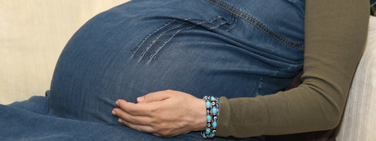

Hamile bir kadının belki de en önemli gurur kaynaklarından biri de gebelik sırasında büyüyen karnıdır. Pek çok kadın tanıdığı ya da tanımadığı herkesin karnına bakarak hamile olduğunu anlayacağı günü iple çeker. Karnı büyümeye başlayan hamileyi gören bir kişinin karnını göstererek bebek ile ilgili birkaç tatlı söz söylemesi genelde gurur okşayıcıdır. Öte yandan bunun tam tersi de doğrudur. Karnı nispeten küçük olan bir kadın hamile olduğunu bilen bir kişinin karnının küçük olduğunu söylemesi ile adeta yıkılır. Arkadaşlar arasında “bebek nerede”, “karnın çok küçük”, “bebek küçük mü olacak” şeklinde yapılan espriler anne adayında moral açısından çöküntüye neden olabilir. Oysa karnın büyüklüğü pek çok değişik faktörün etkisindedir ve her zaman bebeğin büyüklüğünü yansıtmayabilir.

Bir kadının dışarıdan bakıldığında hamile olduğu en erken 16. hafta civarında ve ancak çıplakken anlaşılabilir. Giyinik durumda ise büyüyen karın 20. haftalar civarında fark edilebilir. Hatta biraz iri yapılı kadınlar bol kıyafetler giyerek hamileliklerinin son dönemlerine kadar durumlarını gizleyebilirler. Gebelikte karın büyüklüğünü sağlayan temel faktör bebeğin içinde bulunduğu uterus yani rahimdir. Hamilelik öncesinde yaklaşık 70-80 gram ağrılığında ve armut şeklinde olan rahim bebekle birlikte büyümeye başlar ve gebeliğin sonunda ağrılığı yarım kiloyu geçer. Rahim hamilelikten önce leğen kemiklerinin arkasında yerleşmiştir ve karın üzerinden elle hissedilemez. Hamilelik 12. haftaya ulaştığında büyümesine devam eden rahim kasıktaki tüy çizgisi civarına yükselir ve ilk kez leğen kemiklerinin üzerine çıkar. Bir başka deyişle gebeliğin ilk üç aylık döneminde pantolonların dar gelmesi bebeğe ve gebeliğe bağlı karın büyümesine değil annenin aldığı kilolara bağlıdır.

Büyüyen karın dışarıdan fark edilmeye başlayınca hamile kadınlar da kendilerini diğer hamile kadınlar ile kıyaslamaya başlarlar. Bunun sonucunda aynı gebelik haftalarında olmalarına rağmen kiminin karnı büyük kiminin daha küçük olduğu için endişeler de ortaya çıkar. Bu endişe özellikle karnı küçük olanlarda belirgindir. Hamile kadınların karnı toplumun o kadar ilgisini çeker ki karnın şekline bakarak bebeğin cinsiyetini tahmin etmek bir gelenek haline gelmiştir. Oysa karın şeklini ve büyüklüğünü belirleyen bebeğin cinsiyeti değildir. Pek çok faktör bu konuda etkili olabilir hatta bunlardan en önemlisi kadının genel vücut yapısıdır. Gebelikten önce zayıf olan kadınların karın duvarları ve karın bölgesindeki cilt altı yağ tabakası da ince olduğundan karın daha erken dönemde belirginleşir ve daha büyük ve sivri görünebilir. Bunun tam tersi şekilde iri yapılı, geniş kalça ve karına sahip kadınlarda ise karnın belirginleşmesi daha uzun zaman alabilir. Obez yani şişman kadınlarda ise gebeliğin sonlarına kadar kadının hamile olduğu anlaşılmayabilir. Zayıf bir kadında dıştan karın büyüklüğüne bakarak bebeğin boyutlarını tahmin etmek daha kolay ve gerçekçidir. Tüm bu bilgilerin sonucunda sadece karın büyüklüğüne bakarak bebeğin gelişimini ve büyüklüğünü değerlendirmenin hatalı sonuçlar verebileceği açıktır. Bebeğin durumunu değerlendirmede önemli kriterlerden birisi rahimin tepe noktasının karın içindeki yerleşimidir. Rahimin tepe noktası 22-24. haftalar civarında yaklaşık göbek deliği hizasındayken haftaların ilerlemesiyle birlikte yukarıya doğru ilerler. Uterusun karın içindeki yüksekliğine bakarak gebelik haftası tahmin edilebilir. Eskiden gebelik takipleri sırasında gebeliğin haftasını saptamak için leğen kemiklerinin ortada birleştiği yerden rahimin tepe noktasına kadar olan mesafenin mezura ile ölçülmesi sıkça kullanılırken günümüzde ultrasonun yaygın kullanıma girmesi ile bu yöntem de terk edilmiştir. Bebeğin tahmini kilosunu ve büyüklüğünü değerlendirmede en etkili yöntem ultrasonografidir. Ancak bu teknikte de yanılma payının olduğu gözden kaçırılmamalıdır.

Hamilelik öncesinde aynı boy ve kiloda olan, hamileliğin aynı haftalarında bulunan ve hamileliğin başından beri aynı miktarda kilo alan kadınlarda bile karın büyüklük ve şekli normalde birbirinden farklıdır. Kişilerin karın adeleleri, karın cilt altı yağ tabakası, daha önceden doğum yapıp yapmadığı, bebeğin içinde bulunduğu amniyon sıvısının miktarı gibi pek çok faktörün yanısıra bebeklerin kiloları arasındaki değişiklikler de annelerinin karınlarının birbirinden farklı olmalarına neden olur. Nasıl ki normal erişkinlerin kiloları birbirinden farklı olabiliyor ise anne karnında gelişimini sürdüren bebeklerin ağrılık ve büyüklükleri de birbirinden farklı olabilir. Önemli olan bebeğin büyükük ve tahmini ağrılığının o gebelik haftası için belirlenen alt ve üst sınırlar içinde yer alması yani normal olmasıdır.  
Çok ince ve küçük karınlı bir kadın iri bir bebek doğurabileceği gibi büyük karınlı bir anne adayından da minyon bir bebek dünyaya gelebilir.

Son olarak çoğul gebeliklerde doğal olarak karın büyüklüğü içerideki bebek sayısı ile doğru orantılıdır. Ne kadar çok bebek varsa karın o kadar büyüktür.

Büyüyen karının kadında yarattığı en önemli değişiklik ise çatlaklardır. Hızla büyüyen karın deride gerilme ve çatlaklara neden olabilir. Çatlak oluşumunda en önemli faktörlerden birisi kişinin genetik yapısıdır. Bu sıvı içerek derinin elastikiyetini arttırmak çatlak oluşumuna karşı alınabilecek en basit önlemdir. Bunun dışında çatlak oluşumunu önlemek amacıyla cildi nemlendiren pek çok krem ve losyon her zaman işe yaramasa da kullanılabilir.

Hamilelik sırasında karın büyürken ortaya çıkan gerilmenin doğal sonucu olarak göbek deliğinde de gerilme meydana gelir. Gebelik 20 hafta civarına ulaştığında hem arkadan rahimin baskısı hem de gerilme nedeni ile göbek deliğinde hassasiyet meydana gelebilir. Ayrıca büyümesi sırasında karnı kaplayan kaslarda hafif bir ayrılma meydana gelebilir. Bu ayrılma da göbek deliğinde hassasiyete neden olabilir.

Gebelik ve rahim büyümeye devam ettikçe hassasiyet azalır ancak göbekte meydana gelen değişimler devam eder. Hamilelik öncesinde çukur bir göbek deliği olsa bile bu düzleşebilir. Hatta gebeliğin sonlarına doğru göbek deliği dışarıya doğru çıkıntı yapabilir. Bazı kadınlar zaten şiş olan karınlarındaki bu ek çıkıntıyı eğlenceli bulurken bazı kadınlar da özellikle ince kıyafetler giyildiginde dışarıdan belli olmaması için küçük bir yara bandı ile bastırmayı tercih ederler. Böyle bir uygulamanın herhangi bir zararı yoktur.

Gebelik sırasında karında görülen bir başka değişiklik ise orta hat boyunca uzanan koyu renkli çizgidir. Linea nigra adı verilen bu çizgi esmer tenlilerde daha belirgindir. Linea nigraya yol açan faktörler tam olarak bilinmemekle birlikte bu çizgi doğumdan bir süre sonra kaybolur.
