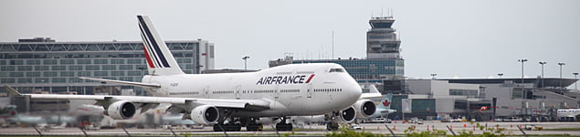

Otomobil kadar olmasa da günümüzün modern insanı zaman zaman uçak seyahati yapmak durumunda kalır. Hamile iken uçak yolculuğu yapmaksa çoğu kez kadınlarda endişe yaratır. Uçak firmalarının hamile olduğunu beyan eden kadınlardan uçabilir raporu istemesi ise bu korkuları şiddetlendirir. Oysa hamilelikte uçak yolculuğu kanama, şeker hastalığı, yüksek tansiyon ya da erken doğum öyküsü gibi yüksek risk faktörlerinin olmadığı durumlarda son derece güvenlidir.

Hamilelikte seyahat etmek için en keyifli dönem 14 ile 27’nci haftalar arası yani ikinci trimesterdır. Bu dönemde sabah bulantıları geride kalmış, uyku hali kaybolmuş, düşük olasılığı azalmış ve hamileliğe alışıldığı için artık olay keyif verici bir hal almıştır. Gezmek, dolaşmak, ve hamileliğin keyfine varmak için tüm şartlar uygundur

**Üçüncü trimesterda uçmak güvenli midir?**  
Herhangi bir tıbbi komplikasyon yoksa, karnınızda ikiz ya da üçüz bebek taşımıyorsanız ya da daha önceden erken doğum yapmadıysanız hamileliğinizin 36.haftasına kadar kabin basıncı ayarlı uçaklar ile yolculuk yapabilirsiniz. 36. haftadan sonra pek çok havayolu şirketi hamile kadınları uçaklarına kabul etmemektedir. Bunun nedeni anne ya da bebek açısından ortaya çıkabilecek olan riskler değil olası bir doğum durumunda havayolu şirketinin havadayken yaşanacak olan bir doğum nedeniyle risk almak istememeleridir.

Bilet acentaları rezervasyon sırasında size hamile olup olmadığınızı ya da beklenen doğum tarihinizin ne zaman olduğunu sormazlar ancak uçağa binmek üzere kapıya yöneldiğinizde tatsız bir süprizle karşılaşabilirsiniz. Eğer beklenen doğum tarihinize 1 hafta ya da daha az kalmış ise havayolu şirketi sizi uçağa almama hakkın sahiptir. Uçağa biniş sırasında sorun yaşamamak ve hatta uçuşu kaçırmamak için doktorunuzdan uçak yolculuğu yapmanızda bir sakınca olmadığında dair rapor alıp bunu tüm uçuşlarınız sırasında yanınızda taşımanız uygun bir davranış olacaktır. Bu raporda muayene olduğunuzun ve 72 saat içinde doğumun başlayabileceğine ilişkin bir bulguya rastlanmadığının belirtilmesi özellikle hamileliğinizin son dönemlerindeyseniz yararlı olabilir.

Her havayolu şirketinin kendine ait politikaları ve yaklaşımları vardır. Rezervasyon yaptırırken durumunuzu belirtmeniz ve seyahatinize engel herhangi bir yaklaşım olup olmadığını araştırın.Bu konu ile ilgili olarak Türk Hava Yolları’nın resmi internet sitesinde açıkladığı hamile yolcu taşıma politikası şu şekildedir:

*   7 ayını ( 28 hafta ) bitirmiş hamile yolcularımız kendi doktorundan aldığı “**Uçakla Seyahatinde Sakınca Yoktur**” ibaresi yer alan bir rapor ile seyahat edebilirler.
*   Bu raporun tarihi 7 günden eski olamaz.
*   7 aya (28 hafta) kadarki hamile yolcuların seyahatinde yolcu beyanı esastır.

 

Hamileliğiniz sırasında uçak yolculuğuna çıkarken dönüş zamanında kaç haftalık olacağınızı ve yeni bir rapor gerekip gerekmediğini kontrol etmeyi unutmayın.

Dikkate almanız gereken tek nokta havayolu şirketlerinin politikaları olmamalıdır. Uçak yolculukları genelde rahatsız koltuklarda yapılan sıkıcı seyahatlerdir. Hamilelik döneminde yolculuk esnasında çok daha çabuk sıkılabilirsiniz. Hamileliğinizin son dönemlerinde çokmecbur kalmadıkça uçak yolculuğundan kaçınmanızı öneririm.Özellikle yurtdışı uçuşlarda gittiğiniz yerdeki sağlık koşullarını ve sunulan hizmeti de araştırmalı ve aklınızın bir köşesinde tutmalısınız. Gittiğiniz yerde aniden sancılarınız başlar ise yeterli bir sağlık hizmeti alabileceğinizden emin olmalı eğer olanağınız varsa bu tür hastane ve merkezlerin adres ve telefonlarını yanınızda bulundurmalısınız.

**Hava alanına girerken geçtiğim kapı ve dedektörler bebeğime zarar verir mi** sorusu çok sıkkarşılaştığımız sorulardan birisidir. Bu sorunun cevabı HAYIR’dır. Hava alanlarının girişindeki dedektörler metal dedektörüdür ve X ışını ile çalışmazlar. Bu nedenle bu kapılardan güvenle geçebilirsiniz.

**Uçaktaki kabin basıncı bebeğinize zarar vermez.** Bir çok ticari havayolu şirketi uçaklarındaki kabin basıncını belirli bir seviyede tutmak zorundadır. Bu yasal bir zorunluluktur. Yapılan incelemelerde kabin basıncının bebeğe zarar verebileceği yönünde bir kanıt bulunamamıştır. Gerçekte asıl sorun kabin basıncı olmayan küçük uçaklar ile yapılan yolculuklarda yaşanmaktadır. Kabin basıncı sağlanmadığında örneğin 10.000 feet yükseklikte uçarken sanki yüksek bir dağın zirvesinde gibi olursunuz. Bu yükseklikte oksijen basıncı çok azalmıştır ve vücudunuz sizin ve bebeğiniz için yeterli oksijeni sağlayabilmek için daha fazla çalışmak zorundadır.

**Uçak yolculuğu sırasında nelere dikkat etmelisiniz?**  
Harhangi bir yerde uzun süre oturmak bacaklarınızdaki kan dolaşımını etkiler ve ayak ile bileklerde şişmelere neden olabilir. Bu nedenle her 1.5-2 saatte bir ayağa kalkıp koridorda yürüyüş yapmalı ve kan dolaşımınızı canlandırmalısınız. Bu kısa yürüyüşler sırasında bacaklarınıza germe egzersizleri de yaptırabilirsiniz. Yolculuk sırasında otururken de bazı germe hareketleri yaparak uzun süreli oturmanın olumsuz etkilerini azaltabilirsiniz.

Bunun için oturur pozisyondayken bacaklarınızı iyice ileriye doğru uzatın, topuklarınız merkez olacak şekilde ayağınızı yavaşça kendinize doğru kuvvetice çekerek baldır kaslarınızı gerin. Daha sonra ayak bileklerinizi sağa sola çevirin ve parmalarınızı açıp kapatın.

Hamilelik sırasında yapılan uçak yolculuklarında uzun süre rahatsız bir pozisyonda hareketsiz oturmak tromboz (damar içindekan pıhtısı) ve varis riskini arttırır. Uçuş süresince özel varis çorabı giymek bacaklarınızdaki kan dolaşımını destekler ve şişmiş damarları rahatlatır.

Eğer yanınızdaki koltuk boşsa ya da uçak içinde yan yana iki boş koltuk bulabilirseniz uzun oturmak suretiyle ayaklarınızı kaldırabilirsiniz. Uçaktaki kabin basıncı ayaklarınızda şişmeye neden olabilir. Ayakkabılarınızı çıkararak kendinizi daha iyi hissedebilirsiniz. Yürüyüş sırasında rahat ve sağlıklı olmasa da uçuş süresince terlik giymeniz rahatlamanıza yardımcı olacaktır.
