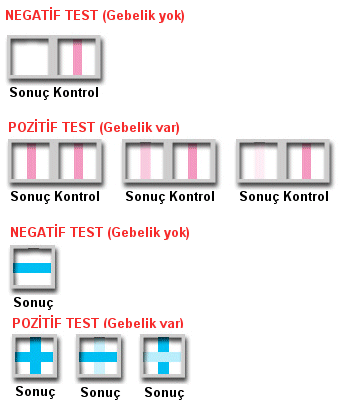

**ÖNEMLİ NOT:** **İdrarda yapılan gebelik testleri** **ilişkiden hemen sonra** **sonuç vermez. Testin doğru sonuç vermesi için çoğu zaman adet gecikmesi olması gereklidir. Yani hamilelik süphesi olan ilişkiden sonra yaklaşık 14 gün geçmesi gerekir.**

Hamile olduğundan şüphelenen ve adet gecikmesi yaşayan pekçok kadın eczaneden kolayca temin ettiği gebelik testi ile hamile olup olmadığını öğrenmeye çalışır. Bu hem son derece ucuz, hem kolay hem de özel bir yöntemdir. Özeldir çünkü testi uygulayan kadından başka kimse sonucu bilemez. Pekçok kadın için bu önemli bir özelliktir. Kadın hamile olup olmadığını herkesten önce öğrenmek ve bu özel anı doyasıya yaşamak ister. Tam tersi şekilde istenmeyen bir gebelikten korkan kadın da hamile olup olmadığını başkalarının bilmesini istemeyebilir.

Her yıl tüm dünyada milyonlarca gebelik testi satılmaktadır. Evde yapılan gebelik testi anlamında “home pregnancy test” (HPT) olarak adlandırılan bu yararlı kitler her zaman doğru sonuç vermeyebilir. Hatalı pozitif ya da hatalı negatif sonuçlar kişide hem psikolojik hem de fiziksel travmaya neden olabilir. Bu nedenle gebelik testi kitlerini kullanırken çok dikkatli olmak gerekir.

Öte yandan e-posta ile gelen pekçok sorudan HPT’lerin ne zaman ve nasıl kullanılması gerektiği ile ilgili yeterli bilgiye sahip olunmadığı sonucu çıkmaktadır.

**HPT gebeliği nasıl saptar?**

Bir gebelik oluştuğunda herhangi bir testin bu gebeliği saptayabilmesi için hCG adı verilen hormonun varlığı temel şarttır. hCG yalnızca gebelikte salgılanan bir hormondur ve salgılanabilmesi için döllenmiş yumurtanın blastokist aşamasına ulaşıp rahim içine yerleşmesi gerekir. Bu genelde yumurtlamayı takiben 6-10 gün içinde meydana gelen bir olaydır. Teorik olarak hCG döllenmeyi takip eden 9. gün civarında salgılanmaya başlar. Hormonun kanda yeterli düzeye ulaşıp idrarla da atılması için ek zamana gerek vardır. Çok erken dönemlerde hormon kanda yükselmeye başlamasına rağmen idrarl atılması gecikebilir. Normalde gebe olmayan bir kadında kandaki hCG düzeyi mililitrede 10 milienternasyonel üniteden (mIU) daha düşüktür

**HPT’nin hassasiyeti ne demektir?**  
HPT’nin hassasiyeti idrarda saptayabildiği en düşük miktardaki hCG değeri anlamına gelir. Bugün piyasada satılan pekçok gebelik testinin hassasiyeti 20-50 mIU/mL arasındadır. Yani hCG değeri 20-50 mIU/mL’nin altındaysa test sonuç vermez. Oysa kan testi hCG değerini tam olarak yansıtır.Bu nedenle kan testi daha adet gecikmesi ortaya çıkmadan sonuç verebilir.

Testin duyarlılığı yani hassasiyeti ne kadar yüksekse yani ölçebildiği hCG düzeyi ne kadar düşükse gebeliği erken dönemde gösterme olasılığı da o kadar yüksektir.

**HPT nasıl yapılır?**  
Her gebelik testinin kendine ait özellikleri olabilir. Bu nedenle eczaneden test aldığınızda kullanma talimatını mutlaka okuyunuz.

Test için en uygun örnek orta akım idrarıdır. Yani idrar yapmaya başlayıp biraz idrarı boşa akıttıktan sonra idrar örneği almanız daha uygundur. Testin özelliğine göre idrarınızı bir kaba alıp damlalık ile damlatmanız, idrar kabına batırmanız ya da direkt olarak idrarınızı yaparken testi akan idrara tutmanız uygulanabilecek yöntemlerdir.

**HPT en erken ne zaman sonuç verir?**  
“_Arkadaşımla ilişkide bulundum daha sonra hemen gidip gebelik testi aldım sonuç negatif çıktı. Kesinlikle hamile olmadığımdan emin olabilirmiyim?_” şeklinde sorular e-posta ya da telefon ile bana yöneltilen sorular arasında sıkça yer almaktadır. Bu kadar erken dönemde gebelik olup olmadığını ancak Tanrı bilebilir.

Daha öncede belirttiğim gibi gebelik testinde gebeliğin saptanabilmesi için embryonun rahim içine yerleşmiş olması gerekir. Bu nedenle test en erken yumurtlamadan sonraki 8-9. günde saptanabilir. Ancak yumurtlamanın geç olması, embryonun beklenenden daha geç yerleşmesi gibi nedenler ile bu dönemde yapılan idrar testi genelde negatif çıkar. Bu dönemde yapılan gebelik testinin negatif çıkması hatalı negatif anlamına gelmez ve hamile olmadığınızı göstermez. En akılcı ve ekonomik yaklaşım adet kanamasını beklemek eğer gecikme olursa test yapmaktır.

2001 Ekim ayında JAMA dergisinde yayınlanan geniş kapsamlı bir araştırmada adet gecikmesinin olduğu günde yapılan idrarda gebelik testinin duyarlılığının %90 olduğu saptanmıştır ([JAMA. 2001;286-1759-1761](http://jama.ama-assn.org/issues/v286n14/abs/jbr10110.html)). Geriye kalan %10 olguda daha henüz embryo rahime bile yerleşmemiştir. Yine aynı çalışmaya göre bu testlerin duyarlılığı en fazla adet gecikmesinden 1 hafta sonra olmakta ve %97’ye kadar çıkmaktadır.

Bu nedenle adet gecikmesinin takip eden 1-2 günde yapılan test negatif çıktığında mutlaka 1 hafta sonra test yeniden yapılmalıdır.

**Testi yapmadan önce idrar ne süre ile tutulmalıdır?**  
Testi yaptığınız gün ne kadar geçse idrar tutmanız gereken süre o kadar azdır. Örneğin beklediğiniz adet kanaması 1 hafta geçmiş ise idrar tutmadan herhangi bir zamanda testi yapabilirsiniz. Öte yandan adet kanamasını beklediğiniz gündeyseniz ya da adet kanamanız 1-2 gün geciktiyse bu durumda 4 saat idrar yapmayıp daha sonra testi yapmalısınız.

**Test nasıl yorumlanır?**  
Piyasada satılan değişik markalardaki idrar testleri birbirinden farklıdır. Bu nedenle kullndığınız testin kullanma talimatını mutlaka dikatlice okuyunuz.

Genelde idrar testlerinde 3 tane pencere bulunur. Bunlardan birine idrar örneği damlatılırken yan yana bulunan iki pencereye bakılarak test yorumlanır. Bu pencerelerden birisi testin doğru şekilde yapılıp yapılmadığınız gösterir (kontrol penceresi). Diğer pencere ise pozitif ya da negatif sonucu verir. Pozitif sonuç varlığında bu penceresinde ya bir çizgi ya da artı işareti çıkar. Sonuç penceresindeki çizginin renginin açık ya da koyu olması anlamını değiştirmez. Bu her durumda pozitif sonuç demektir. Bazı testlerde ise sonuç peceresinde artı ya da eksi işareti belirir. Artı pozitif sonucu yani gebeliği, eksi ise gebelik olmadığını gösterir.

Gebelik testinin sonucu okunurken testin kullanma kılavuzunda belirtilen zaman süresince beklenmelidir. Bazı durumlarda test negatif olmasına rağmen bir süre daha beklendiğinde hafif bir çizgi ortaya çıkabilir. Bu şüpheli sonucu belirtir. Ya hamile olmanıza rağmen hCG değeri testin saptayabileceği düzeylere ulaşmamıştır ya da hamiel değilsinizdir ancak test reaksiyon vermektedir. Her iki durumda da testin 1-2 gün sonra tekrar edilmesi ya da kanda gebelik testi yapılması uygundur. İdeal olan testin kullanma kılavuzunda belirtilen zaman sonrasında sonucu yorumlamaktır.

**Test neden hatalı sonuç verir?**  
Testin hatalı negatif sonuç vermesinin temel nedeni duyarlılığının kandaki düşük düzeydeki hCG değerlerini saptamaya yetmemesidir. Testin erken yapılması bunda en önemli faktördür. Testin bozuk ya da son kullanım tarihinin geçmiş olması da bir diğer etkendir.

Hatalı pozitif sonuçlar ise daha nadir görülür. Bu gibi durumlarda bazen idrardaki başka bir hormona (örneğin LH) çapraz reaksiyon gelişebilir. Bir başka neden de kimyasal gebeliklerdir. Çok erken dönemde test pozitif çıkmasına rağmen daha sonra klinik olarak gebelik fark edilemeden embryo canlılığını yitirir ve kan hCG değerleri düşmeye başlar.

İnfertilite tedavilerinde yumurta çatlatmak amacıyla yapılan hCG enjeksiyonları sonrasında da hatalı pozitif sonuçlar görülebilir. Bu nedenle test son hCG enjeksiyonundan 10-14 gün sonra yapılmalıdır.

Testin hatalı pozitif sonuç vermesi oldukça nadirdir.Bu nedenle pozitif sonuç varlığında ek incelemeye gerek duyulmazken negatif olması mutlaka gebe olunmadığı anlamına gelmez

**Kullanılan ilaçlar ya da enfeksiyonlar hatalı sonuçlara neden olabilir mi?**  
İçinde hCG içermeyen ilaçlar hatalı sonuca neden olmaz. Kısırlık tedavisinde kullanılan yumurtlama uyarıcı ilaçlar da dahil olmak üzere hiç bir antibiyotik, ağrıkesici, doğum kontrol hapı testin hatalı sonuç vermesine neden olmaz ya da gebelik varlığında testin pozitifleşme sürecini geciktirmez. Benzer şekilde tütün ürünleri ve alkol de HPT’lerin doğru sonuç vermesini engellemez.

**Uyarılar**  
Her türlü adet gecikmesi mutlaka değerlendirilmesi gereken önemli bir sağlık sorunudur. Testin negatif çıkması durumunda eğer adet kanamanız hala daha başlamadıysa mutlaka[jinekoloğunuzla](http://www.mumcu.com/html/article.php?sid=297) görüşmelisiniz.

Testin pozitif olması normal bir gebelik olduğu anlamına gelmez. Bu nedenle gebeliğin varlığını teyit etmek ve dış gebelik başta olmak üzere bazı erken gebelik komplikasyonlarına yenik düşmemek için kontrol şarttır. Öte yandan adet gecikmesi olan bir kadında testin negatif sonuç vermesi gebeliğin ilerlemesine neden olacaktır. Bu sırada gebelikte kullanılmaması gereken maddeleri kullanmanız ya da gebelik için uygun olmayan davranışlarda bulunmanız bebeğinize zarar verebilir. Bunun istenmeyen bir gebelik olması durumunda ise sonlandırılması için yasal sınır aşılabilir.

Her adet gecikmesi durumunda test pozitif ya da negatif olsun mutlaka doktorunuzla görüşmelisiniz.
