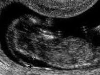
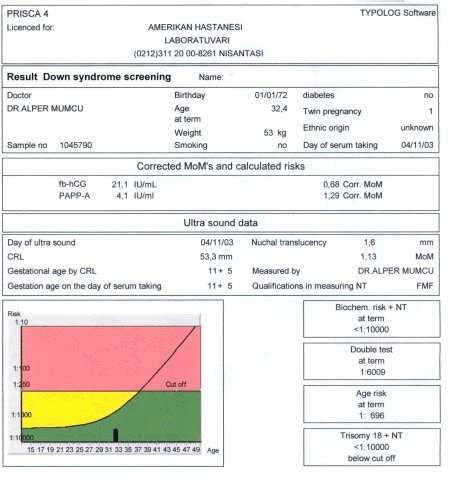

Her hamile kadın karnında kromozomal bozukluk taşıyan bir bebek taşıma riski ile karşı karşıyadır. Herhangi bir inceleme yapmadan bu riski kabaca tahmin etmeye çalışırken bazı parametreler göz önüne alınır.

**Anne yaşı**

Anne adayının yaşı arttıkça bebekte kromozom bozukluğu görülme riski artar.

**Gebelik yaşı**

Bebekte kromozom bozukluğu görülme riski ilerleyen gebelik yaşı ile birlikte artar. Anomalili bebeklerin çok büyük bir kısmında gebeliğin erken dönemlerinde düşük olur.

**Önceki hamileliklerde anomalili bebek öyküsü**

Daha önceki hamilelikte kromozom bozukluğuna sahip bir bebek olması şimdiki gebelikte anne yaşına göre hesaplanan riskte artışa neden olur.

Kromozomal anomaliye sahip bebekleri daha doğmadan anne karnında tespit edebilmek gebelik takibi ile uğraşan jinekologların en büyük hayallerinden biridir. Bu hayal tarama testlerinin gelişmesi ile kısmen gerçekleşmiştir.

Yıllar içerisinde bu testlerin giderek yaygınlaşması ve yeni testlerin ortaya çıkması oldukça sevindiricidir. 1970’lerin sonlarına doğru alfa fetoprotein taramasının nöral tüp defektlerinin taranması amacıyla kullanıma girmesini takiben 1980’li yılların sonunda aynı testin Down sendromunun taranmasında da işe yarayabileceği fikri oluştu. Zaman içinde alfa fetoproteinle birlikte diğer bazı testlerin birarada değerlendirilmesinin Down sendromunun saptanmasında daha etkili olduğu fark edildi ve üçlü test fikri ortaya atıldı. Dahası üçlü testin sadece Down sendromu değil Trizomi 18 adı verilen bir başka kromozom anomalisi açısından da yüksek risk altındaki kadınları belirlediği fark edildi. Tüm dünyada yapılan birçok çalışma üçlü testin Down Sendromlu bebeklerin %60-70’ini hamileliğin ortalarında saptayabildiğini ortaya koydu. Ancak bilim adamları bunlarla yetinmedi. Amaç daha erken dönemde anomalili bebekleri tespit etmek ve bu gebelikleri sonlandırmak olduğu için çalışmalar, anomali riskini daha erken dönemde ve daha yüksek duyarlılıkla saptayabilecek testlerin geliştirilmesine yöneltildi. Bu çalışmaların sonucunda ikili test ya da ilk trimester tarama testi adı verilen kavram ortaya atıldı.

**İLK TRİMESTER TARAMA TESTİ NEDİR?**  
11-14 testi olarak da bilinen ilk trimester tarama testi Down sendromu ve Trizomi 18 adı verilen kromozomal anomaliye sahip bebekleri gebeliğin çok erken dönemlerinde saptamaya yönelik bir tarama testidir. Tüm tarama testlerinde olduğu gibi bu test de tanı koydurmaz. Sadece hastalık açısından yüksek risk altındaki bebekleri işaret eder ve bu bebeklerde kesin tanıya götüren tanısal testlerin yapılmasını sağlar. Bir başka deyişle testin yüksek risk göstermesi bebekte anomali olduğunun kanıtı olmadığı gibi, riskin düşük çıkması da bebeğin tamamen sağlıklı olduğunu garanti etmez.

İlk trimester tarama testinin üçlü test ile karşılaştırıldığında bazı avantajları vardır. Bunlardan en önemlisi testin daha erken dönemde yapılması sonucu olası bir olumsuzluk durumunda gebeliğin daha erken ve risksiz şekilde sonlandırılmasına olanak tanır. Dahası duyarlılığı üçlü teste göre daha yüksektir ve Down sendromu ile trizomi 18 olgularının %90’ının tanımasına yardımcı olur.

**11-14 TESTİ NASIL YAPILIR?**  
11-14 testi temel olarak iki ayrı incelemenin birarada değerlendirilmesi ile yapılır. Bunlar:

1.  Bebeğin ensesinin arkasında bulunan sıvı kısmın kalınlığının ultrason ile ölçülmesi (fetal ense kalınlığı)
2.  Anneden alınan kan örneğinde gebelik hormonu olan **beta-hCG**‘nin serbest kısmının (free beta-hCG) ve **PAPP-A** (gebeliğe özgü plazma proteini-A, pregnancy associated plasma protein-A) adı verilen bir diğer proteinin ölçülmesidir

Bu ölçümler tek başlarına yapıldığında duyarlılıkları düşükken bir arada değerlendirildiklerinde başarı şansı %90’a kadar çıkmaktadır.

**FETAL ENSE KALINLIĞI**  
Fetal ense kalınlığı, ultrasonografide bebeğin boynunun arka kısmında koyu renkli olarak görünen kısmı anlatmak için kullanılan bir terimdir. Terimin ingilizcedeki orijinal şekli “nuchal translucency”dir. Gebelik ilerleyip bebek büyüdükçe ense kalınlığı da giderek artar. Bu nedenle ölçüm 11-14. haftalar arasında yapılabilir ve büyük dikkat gerektirir. Ölçüm yapılırken yapılacak milimetrik bir hata risk oranlarında büyük değişikliğe neden olabilir.

Yapılan çok sayıda araştırmada 11 ile 14. gebelik haftaları arasındaki fetal ense kalınlığı ile Down sendromu başta olmak üzere bazı kromozom anomalileri arasında sıkı bir ilişki olduğu ortaya konmuştur. Değişik araştırmalarda sadece belirtilen zaman diliminde fetal ense kalınlığının ölçülmesi ile Down sendromlu bebeklerin %40-70’inin saptanabildiği ortaya konmuştur. Ancak bu bebeklerin annelerinin, ileri yaş gebelikleri ya da daha önceki gebeliklerinde kromozom anomalili bebek doğurma öyküsü nedeni ile incelemeye alınan zaten yüksek riski gebeler olduğu akılda tutulmalıdır.

Düşük risk grubundaki kadınlarda yapılan çalışmalar ise çelişkili sonuçlar vermiştir. Bu çelişkinin altında yatan neden ölçümü yapan kişiler arasında, hatta aynı kişinin ölçüm yapması durumunda bile iki ölçüm arasında ortaya çıkan farklılıklardır. Ek olarak artmış fetal kalınlığın tanımı ile ilgili de fikir birliği uzunca bir süre sağlanamamıştır. Fetal ense kalınlığı ölçülürken ultrasonun hangi kesitinin kullanılması gerektiği de uzunca bir süre tartışma konusu olmuş, farklı kesitlerin duyarlılığının daha yüksek olduğu ileri sürülmüştür.

Günümüzde yaygın olarak kabul edilen görüşe göre gebeliğin 11-14. haftaları arasında bebeğin baş-popo uzunluğunun ölçüldüğü kesitte ense kalınlığının 3 milimetreden fazla olması artmış fetal ense kalınlığı olarak kabul edilmektedir.

 

Transvajinal ultrasonografide  
fetal ense kalınlığı ölçümü

Fetal ense kalınlığı sadece kromozom anomalilerinde artmaz. Araştırmalarda artmış fetal ense kalınlığının diğer bazı genetik bozukluklarla birlikte temel olarak bebeğe ait kalp anomalilerinde de arttığı gösterilmiştir. Bebeğe ait kalp anomalileri ikinci trimesterda yapılan detaylı ultrasonografi ile saptanmaktadır. Kromozom bozukluğu olan bebeklerin %50-90’ında kalp ve büyük damarlarda da anomali olmaktadır. Bu nedenle kromozomal bozukluklarda meydana gelen ense kalınlığı artışının temel nedeninin aslında eşlik eden bir kalp anomalisi olduğu düşüncesi ileri sürülmüştür.

Fetal ense kalınlığının normalden fazla olabildiği durumlar şunlardır:

*   Kromozomal bozukluklar: Trizomi 13, trizomi 18, trizomi 21 (down sendromu), Turner sendromu (45, X0)
*   Kalp anomalileri
*   Akciğer anomalileri (diyafram hernisi)
*   Böbrek anomalileri
*   Karın duvarı anomalileri (omfalosel)
*   Bazı genetik hastalıklar (Arthrogryposis, Noonan sendromu, Smith-Lemli-Opitz sendromu, Stickler sendromu, Jarco-Levine sendromu ve bazı iskelet anomalileri

Fetal ense kalınlığı ölçümünün kromozomal bozuklukların erken dönemde saptanmasında tek başına kullanılmasının bazı sakıncaları vardır. Pekçok anomalili gebeliğin düşükle sonuçlandığı göz önüne alındığında hatalı pozitif test sonrası yapılacak olan koriyon villus örneklemesi normal olan bir bebekte düşük riskini arttıracaktır. Öte yandan hücrelerin bazılarının normal bazılarının da anormal olduğu mozaisizm varlığında villus örneklemesinde sadece anormal olan hücrelerin görülmesi hayatını normal olarak sürdürebilecek bir bebeğin yaşamına son verilmesine neden olacaktır. Bunlara ek olarak erken dönemde yapılan koriyon villus örneklemesi daha ileriki dönemlerde yapılan amniyosenteze göre hem daha zor hem de daha pahalı bir incelemedir. Bunlardan çok daha önemlisi öçümü yapan kişinin deneyimidir. Ölçülen değerler milimetrenin onda biri düzeyinde olduğundan yapılacak en ufak bir hata risk değerlerinde önemli değişikliklere neden olacaktır. Tüm bu nedenlerle tek başına yapılan fetal ense ölçümünün maliyet-etkinlik oranı tatminkar değildir.

Fetal ense kalınlığı ile trizomi görülme riski arasındaki ilişki şu şekildedir.

**Fetal ense kalınlığı  
(milimetre)**

**Trizomi 13, 18 veya 21  
görülme riski  
(%)**

3

6

4

31

5

49

6

48

7

71

8

54

9

50

**PAPP-A ve SERBEST beta-hCG TESTİ**  
PAPP-A sadece gebeliğe ait olan bir tür proteindir. HCG ise yine sadece gebelikte salgılanan bir hormonudur. Bu kimyasal maddelerin belirli gebelik haftalarında belirli düzeylerde olması gerekir. Yapılan araştırmalarda anomaliye sahip bebeklerde PAPP-A düzeyinin normalden daha az, serbest beta-hCG düzeyininin ise daha fazla olduğu görülmüştür. Gebeliğin 11-14. haftalarında alınan kan örneğinde ölçülen bu iki kimyasal maddenin düzeyleri bir bilgisayar programına girilir ve program bir risk tahmininde bulunur. Parametreler arasına fetal ense kalınlığı da eklendiğinde tahminin başarılı olma şansı çok daha yüksektir.

Normal bir ikili test raporu

**HATALI POZİTİF VE HATALI NEGATİF TEST NE DEMEKTİR?**  
Tarama testi sonucu saptanan risk o yaş grubundaki kadınlar için normal kabul edilen riskten daha az ise test negatif olarak kabul edilir. Riskin daha yüksek çıkması durumunda ise pozitif testten söz edilir.

Risk yüksek çıktığı halde yapılan ileri incelemeler sonucu bebeğin normal olması durumunda hatalı pozitif durum söz konusudur. Tam tersi şekilde testin normal risk gösterdiği ancak bebeğin anomalili olduğu durumlar ise hatalı negatif olarak tanımlanır.

İlk trimester taramalarında testin duyarlılığı ve hatalı pozitif oranları tabloda gösterilmiştir.

 

Anomaliyi yakalama oranı (%)

Hatalı pozitif oranı  
(%)

**DOWN SENDROMU**  
serbest hCG + PAPP-A  
serbest hCG + PAPP-A+Ense kalınlığı

74  
91

5  
5

**TRİZOMİ 18**  
serbest hCG + PAPP-A+Ense kalınlığı

96

1.1

Bebeğin cinsiyetinin test sonuçları üzerindeki etkileri de pekçok araştırmaya konu olmuştur. Aralık 2002’de yayınlanan bir çalışma kız bebeklerde serbest beta-hCG’nin daha yüksek olabildiğini ortaya koymuştur.

İlk trimester tarama testi ile elde edilen veriler genelde tek bebeğin bulunduğu hamilelikler ile ilgilidir ancak 2003 yılının şubat ayıında yayınlanan çok yeni bir araştırmada PAPP-A ölçümlerinin bebekteki Down Sendromu ve Trizomi 18 varlığını göstermede tek gebeliklerde olduğu kadar ikiz gebeliklerde de çok etkili olduğu gösterilmiştir. Aynı çalışmada ölçümün duyarlılığının trizomi 18 olgularında daha yüksek olduğu saptanmıştır.

Tüp bebek ve mikroenjeksiyon tedavileri ile hamile kalan kadınlarda ise hatalı pozitiflik oranı biraz daha yüksektir. Ancak bu konudaki araştırmalar yeterli olmayıp kesin bir kanıya varabilmek için daha fazla çalışmaya gerek duyulmaktadır.

**POZİTİF TEST VARLIĞINDA NE YAPILMALIDIR?**  
İkili testin pozitif çıkması mutlaka bebekte kromozom bozukluğu olduğu anlamına gelmez. Pozitif test sadece o bebekte riskin yüksek olduğunu ve tanıya yönelik ileri tetkikler yapılması gerektiğini belirtir. İleri tetkikler ile kastedilen detaylı ultrasonografi, koriyon villus örneklemesi ve amniyosentezdir. Sizin için hangi testin uygun olacağına doktorunuzla birlikte karar vermeniz gerekir.

**NEGATİF TEST NE ANLAMA GELİR?**  
Testte riskin düşük bulunması yani negatif olması bebekte kromozom bozukluğu olmadığını garanti etmez. Sadece genel popülasyonda aynı yaş grubundaki kadınlar ile kıyaslandığında bebekteki riskin daha fazla olmadığını gösterir. Ayrıca ikili test sadece kromozom bozuklukları açısından riski belirler. Nöral tüp defektleri açısından bir risk belirlemez. Bu riski belirlemek için 16-20. haftalarda üçlü test yapılabilir. Bununla birlikte nöral tüp defektlerinin önemli bir kısmı ultrasonografi ile saptanabildiğinden ikili test yapılan kişilerde ikinci trimesterda üçlü test yapılması yerine sadece detaylı ultrason yapılmasının yeterli olacağını öne süren görüşler de mevcuttur. Bilimsel çevrelerde bu konuda henüz bir fikir birliği oluşmamıştır.

Amerikan Obstetrisyenler ve Jinekologlar Birliği (ACOG) doğum zamanında anne yaşının 35 ya da daha ileri olması durumunda tarama testleri yerine genetik danışmanlık ile birlikte amniyosentez veya koriyon villus örneklemesi gibi tanı koydurucu testlerin yapılmasını önermektedir. Bunun nedeni tarama testlerinin sadece risk belirlemesi, durumun varlığı ya da yokluğunu kesin olarak ortaya koymamasıdır. Öte yandan ikili test ya da üçlü test sadece bir grup kromozom anomalisi açısından risk belirlemekte, bu yaş grubunda normalden daha fazla görülen diğer anomaliler hakkında fikir vermemektedir.
