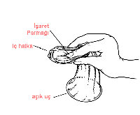
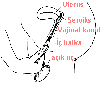
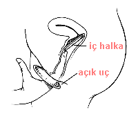
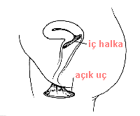

Bundan 30 yıl kadar önce kadınlar açısından cinsel devrim dendiğinde kadınların sadece diledikleri zaman hamile kalmaları hakkına sahip olmaları kastediliyordu oysa günümüzde cinsel yolla bulaşan hastalıkların ve özellikle AIDS’in güncelliği kadınlar açısından bu hastalılardan korunmanın da önemini ortaya koymakta.

Doğum kontrolü ve cinsel yolla bulaşan hastalıklardan korunmada erkekler biraz daha farklı, çünkü kullanabilecekleri yöntem sayısı çok kısıtlı. Bununa bereber erkekler bu yöntemleri kullanmada oldukça isteksiz. Özellikle bizim gibi toplumlarda prezervatif kullanımı bir türlü arzu edilen düzeylere çıkartılamıyor. Tük erkeğinin “atın ölümü arpadan olsun” ya da “bana birşey olmaz” mantığı hemen her zaman baskın çıkıyor. Üstelik bu düşünce kişilerin eğitim düzeyinden de çok fazla etkilenmiyor. Oysa türk erkeklerine de birşeyler olabiliyor ve bu olan şey neticede yine kadınları etkiliyor. Son yıllarda Türkiye’de cinsel yolla bulaşan hastalıkların sayısında görülen artış konu ile ilgili kadın doğum uzmanı, dermatolog ve ürologların dikkatinden kaçmıyor. Üstelik bu hastalıkların kısırlık başta olmak üzere uzun dönemde yarattığı pek çok komplikasyon maddi ve manevi açıdan büyük sorun teşkil ediyor.

Erkeklerin doğum kontrolü ve hastalıklardan korunmadaki isteksizliği sadece Türkiye’ye özgü değil. Pek çok gelişmiş toplumda da benzeri düşünce tarzı hakim. Bu nedenle araştırmalar daha çok kadınların kullanabileceği yöntemler üzerinde yoğunlaşmakta. Erkeklerin kullabileceği doğum kontrol haplarıyla ilgili çalışmalar son hızıyla devam etse de kimse bu yöntemin de istenilen düzeyde kullanılacağı konusunda iyimser değil.

Öte yandan istenmeyen gebeliklerin önlenmesi ile birlikte cinsel yolla bulaşan hastalıklara karşı korunma konusundaki tek etkili yöntem prezervatif. Erkeklerin prezervatif kullanma konusundaki isteksizliği uzun zamandan beri araştırmacıları kadınların kullanabileceği ve hamileliğin yanı sıra AIDS başta olmak üzere bu tür hastalıklara karşı koruyucu bir yöntem bulmaya zorluyor. Bugün için her iki amaca da hizmet eden tek bir ürün var.

Kadın prezervatifi olarak adlandırılan bu ürün Amerika Birleşik Devletlerinde **Reality**, Türkiye’nin de dahil olduğu diğer ülkelerde ise **Femidom** ticari adı ile piyasada bulunuyor. ABD’de ilk kez satışa sunulduğu 1992 yılından beri tüm dünyada 18 milyondan fazla satılan kadın prezervatifi kısa bir zaman öncesinde Türkiye’de de piyasaya sunuldu. Amerikan Gıda ve İlaç Dairesi (FDA) ürünün gebeliklerin ve cinsel yolla bulaşan hastalıkların önlenmesinde kullanımını 1994 yılında onayladı.

**Kadın prezervatifi nedir?**  
Kadın prezervatifi doğum kontrolündeki bariyer yöntemlerinden birisidir. Yaklaşık 15 santimetre uzunluğunda poliüretandan yapılmış bir kese ya da kılıf şeklinde olan kadın prezervatifi ilişki öncesinde vajina içerisine yerleştirilir. Kılıfın vajina içinde kalan ucu kapalı, diğer ucu ise açıktır.

Kondomun her iki ucunda yarı sert ve kolay büklebilen bir halka bulunur. Kapalı uçta bulunan halka kondomun yerinde durmasını sağlarken, açık taraftaki halka peri bölgesini ve penis kökünü korurken kondomun ilişki sırasında vajina içine kaçmasını engeller. Kondom yapısındaki maddenin özelliğine bağlı olarak yerleştirildikten hemen sonra vücut sıcaklığı ile yumuşayarak vajina duvarına yapışır. Kondomun içi silikon temeli bir kayganlaştırıcı ile kaplıdır. Kadın kondomu spermleri öldüren spermisidler içermez.

**Nasıl kullanılır?**  
Kadın prezervatifinin yerleştirilmesi diyafram yerleştirilmesine benzer. Kapalı uçtaki halka orta, işaret ve baş parmaklar ile bükülerek vajina içerisine sokulur ve daha sonra işaret parmağı ile sonuna kadar itilir. Bu sırada kondomun kendi etrafında bükülmediğinden emin olmak gerekir. Kondomun dışta kalan kısmı ilişki sırasında genital bölgelerin temas etmesini engellediğinden genital siğilere karşı erkek prezervatifinden daha fazla koruyuculuk sağlar.

  
1

  
2

  
3

  
4

İlişki sonrasında kondom dikatli bir şekilde çıkartılmalı ve atılmalıdır. Aynı kondom birden fazla sefer kullanılmamalıdır. Eğer ilişki sırasında dışarıda kalan uç vajina içine kaçarsa ilişkiye hemen son verilmeli, kondom vajinadan çıkartılmalı ve yeni bir kondom taktıktan sonra ilişkiye devam edilmelidir.

**Kadın prezervatifinin koruyuculuğu ne kadardır?  
**Kadın prezervatifinin iki amacı vardır. Bunlardan birincisi istenmeyen bir gebeliğin önüne geçilmesi, ikincisi ise cinsel yolla bulaşan hastalıklara karşı korunmadır.

Ne yazik ki istatistikler çok umut verici değildir. Piyasaya ilk sürüldüğünde başarızılık oranının 1 yılın sonunda %13 olması beklenirken bu oran ilk 6 ayda görülmekte bir yılın sonunda ise %26 civarında olmaktadır. Yani hamilelikten korunma amacıyla sadece kadın prezervatifi kullanan her 4 kadından biri bir yılın sonunda hamile kalmaktadır. Erkek prezervatiflerinde bu oran %12 civarındadır.

Cinsel yolla bulaşan hastalıklar açısından bakıldığında ise kondom belirli bir koruyuculuk sağlamakla birlikte erkek prezervatifleri kadar etkili olamamaktadır. Bunda en önemli neden prezervatifin latkesten değil poliüretandan üretilmiş olmasıdır. Bununla birlikte kondom yerleştirilirken elin vajinal akıntılar ile temas etmesi hastalık bulaşma şansını yükseltmektedir. Bu nedenle kondom yerleştirilirken ya eldiven kullanılmalı ya da eller mutlaka iyice yıkanmalıdır.

**Avantaj ve dezavantajları nelerdir?  
**Kadın prezervatifinin en önemli avantajı erkeğin prezervatif kullanmaktan kaçındığı durumlarda kadının kendini hastalıklara karşı koruyabileceği yegane yöntem olmasıdır. _**Prezervatif dışında hiçbir doğum kontrol yöntemi cinsel yolla bulşan hastalıklara karşı koruma sağlamaz.**_ Adet dönemlerinde kullanılabilmesi, ilişkiden çok önce (en fazla 8 saat önce) takılabilmesi de erkek prezervatifine karşı önemli bir avantaj. Poliüretandan üretildiği için lateks alerjisi olan kadınlar da kullanabilirler.

Fiyatının erkek prezervatifine göre daha pahalı olması ve ilişki sırasında rahatsız edici bir ses çıkartması ise dezavantajları. Bu ses kayganlaştırıcı kullanılarak bir miktar azaltılabilir. Bir başka dezavantajı ise nadiren de olsa ilişki sırasında vajina içine kaçabilmesi. Kondomu doğru şekilde yerleştirebilmek için tecrübe gerektirmesi de kolaylıkla takılabilen erkek prezervatifleri karşısında önemli bir dezavantaj.

Tüm faktörler birarada değerlendirildiğinde kadın prezervatifinin diğer doğum kontrol yöntemleri ve özellikle erkek prezervatifleri kadar yaygınlaşmasını beklemek biraz hayalcilik gibi oluyor. Ancak özellikle birden fazla sayıda partneri olan ve erkek tarafının prezervatif takmayı istemediği durumlarda oldukça önemli bir alternatif olarak da yerini koruyor

Kadınları cinsel hastalıklardan da koruyacak yöntemler ile ilgili çalışmalarar devam ediyor. Son zamanlarda ilgi jel şeklinde olan ve vajina içine sıkıldıktan sonra sertleşerek tüm vajina içini kaplayan bir madde üzerinde yoğunlaşmış durumda. Ancak bu yöntemin piyasada yerini alması için daha uzunca bir zamana gereksinim varmış gibi görünüyor.
